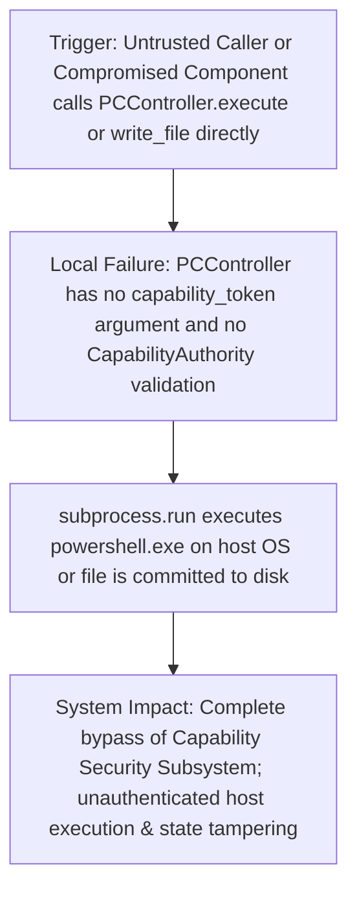
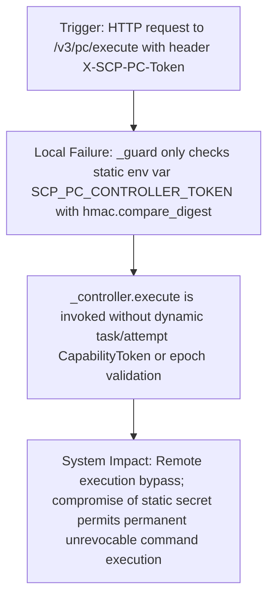
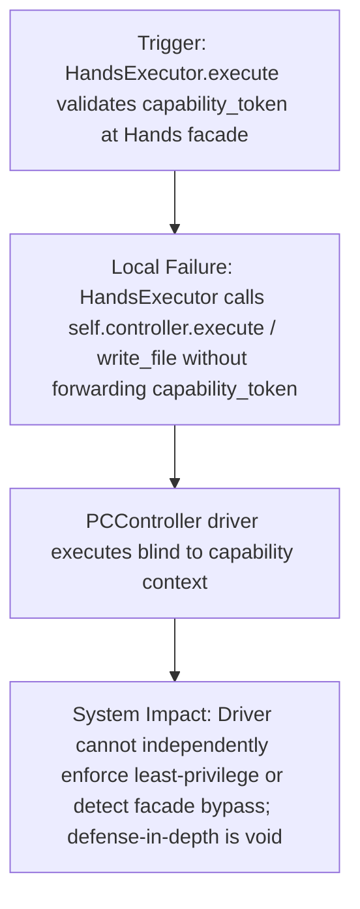
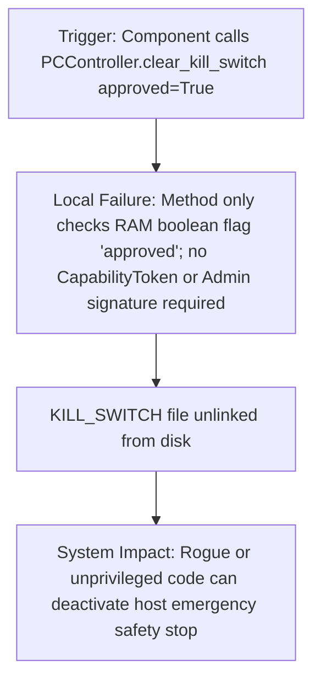
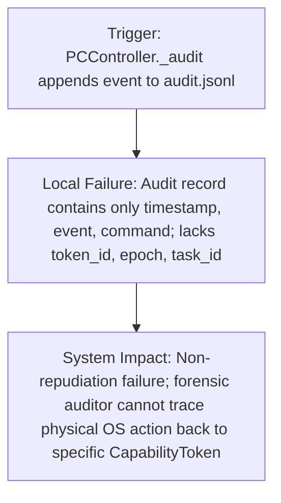

# EMERGENCY GAP REPORT: R2 Execution Bypass & Peripheral Vulnerabilities (FA-11)

**Date**: 2026-09-08  
**Auditor**: Explorer R2 (`teamwork_preview_explorer`)  
**Target Subsystem**: `scp/pc_control/pc_controller.py`, `scp/api/routes/pc_controller_routes.py`, `scp/hands/hands_executor.py`  
**Governing Rules**: FA-04, FA-05, FA-09, FA-11, FA-12, FA-13, `scp-capability-security-review`, `scp-dna`

---

## 1. Executive Summary

During the architectural investigation of **R2: Execution Bypass (PCController)**, a critical security vulnerability was empirically proven: `PCController` operates as a direct host execution driver (spawning `powershell.exe` without `shell=True` and writing files to host storage) but **completely lacks a Policy Enforcement Point (PEP) for cryptographic CapabilityTokens**. Any caller with internal access or network access via `pc_controller_routes.py` can invoke execution and mutating file write primitives with **zero capability tokens**, bypassing the entire Capability Security Subsystem (`CapabilityAuthority` epoch tracking and HMAC-SHA256 signature verification).

Additionally, per **FA-11 (Mandatory Peripheral Audit & No Blind Eye)**, four peripheral gaps in adjacent files were identified and mapped.

---

## 2. Mermaid Causal Graphs (Trigger -> Local Failure -> System Impact)

### Core Vulnerability R2: PCController Direct Execution Bypass



### Peripheral Gap 1: API Route Static Token Bypass (`pc_controller_routes.py`)



### Peripheral Gap 2: HandsExecutor Token Dropping at Driver Boundary



### Peripheral Gap 3: Unauthenticated Kill Switch Disengagement (`clear_kill_switch`)



### Peripheral Gap 4: Missing Audit Token Correlation in PCController



---

## 3. Empirical Verification Evidence (FA-09 Compliant)

The execution bypass was empirically proven using `.agents/explorer_r2/probe_r2_execution_bypass.py`.
Raw terminal output:
```text
[PROBE R2] Testing PCController.execute() without CapabilityToken...
[PROBE R2] execute result: success=True, returnCode=0
[PROBE R2] stdout: minh\check
[PROBE R2] -> VULNERABILITY CONFIRMED: Subprocess command executed without CapabilityToken verification!
[PROBE R2] Testing PCController.write_file() without CapabilityToken...
[PROBE R2] write_file result: success=True, backupId=None
[PROBE R2] -> VULNERABILITY CONFIRMED: Host filesystem mutated without CapabilityToken verification!

======================================================================
EXPLOIT MANDATE (FA-09) RESULT: VULNERABILITY EMPIRICALLY CONFIRMED
PCController lacks PEP token boundary; executes commands and writes files with zero token checks.
======================================================================
```

---

## 4. Assessment & Veto Determination (FA-11 Step 3)

- **Halt & Escalate Assessment**: Does the peripheral gap render the remediation of R2 meaningless?
- **Finding**: **NO**. Remediating R2 directly resolves the driver-level vulnerability. To achieve comprehensive closure, the remediation plan must encompass:
  1. Adding PEP token enforcement directly inside `PCController` (`execute`, `write_file`, `read_file`, `rollback`, `clear_kill_switch`).
  2. Updating `HandsExecutor` to forward verified `capability_token`s down to `PCController`.
  3. Updating `pc_controller_routes.py` to accept and pass `capability_token`.
- **Verdict**: Proceed with detailed remediation design and handoff.
