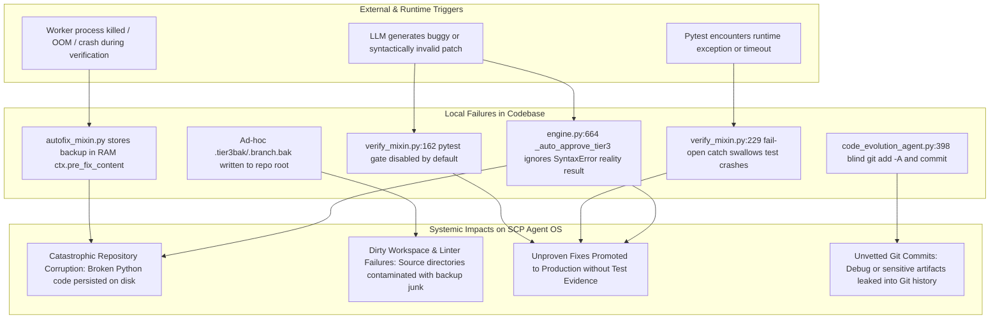

# EMERGENCY GAP REPORT: Peripheral Security & Architectural Gaps in AutoFix & Cognitive Loop

**Reporter**: Explorer R6 (`teamwork_preview_explorer`)  
**Timestamp**: 2026-09-08T12:35:00Z  
**Context**: Investigation of R6: AutoFix Rollback (Cognitive loop perfect isolation)  
**Mandate**: FA-11 (Mandatory Peripheral Audit & No Blind Eye)

---

## 1. Causal Graph (Mermaid)

---

## 2. Detected Out-of-Scope Gaps

### GAP-01: `verify_mixin.py` Pytest Gate Disabled and Fails Open
- **Location**: `scp/autofix/engine_parts/verify_mixin.py:162, 229-231`
- **Trigger**: Execution of post-patch verification in AutoFix.
- **Local Failure**: 
  1. Pytest is gated behind `if os.environ.get("SCP_AUTOFIX_RUN_PYTEST", "0") == "1":` which defaults to `"0"` (OFF).
  2. Pytest is called with `str(filepath)` (a `.py` source file), not test files.
  3. Any exception in pytest execution is caught and logged: `logger.debug(f"[WORLD-CLASS-GATE] pytest verify fail-open: {_pytest_err}")`.
- **System Impact**: Patches that completely break the test suite are accepted and promoted as fixed.
- **Escalation**: Blocker for Autonomous 24/7 self-healing. Must be flipped to Fail-Closed.

### GAP-02: Volatile In-Memory Backup without Crash Durability
- **Location**: `scp/autofix/engine_parts/autofix_mixin.py:324, 1210`, `scp/core/code_evolution_agent.py:241, 365`
- **Trigger**: Process death, SIGKILL, OOM, or machine reboot during testing.
- **Local Failure**: Backups exist only in Python variable memory (`ctx.pre_fix_content: str`, `backup: str`).
- **System Impact**: Target files on disk remain half-patched or corrupted. Restarting SCP does not restore original code.
- **Escalation**: Requires `data/shadow/active/<tx_id>/` filesystem-level journaled snapshots.

### GAP-03: Tier-3 Auto-Approve Ignores Reality Test Failure
- **Location**: `scp/autofix/engine.py:657-684`
- **Trigger**: Tier-3 auto-patch results in a `SyntaxError` or reality failure.
- **Local Failure**: Code catches `SyntaxError`, sets `_reality_test_result = f"FAIL:SyntaxError:{...}"`, but never calls rollback and returns `result` with `action="fixed"`.
- **System Impact**: Syntax-broken code is deployed into production with `tier3_auto_approved = True`.
- **Escalation**: Immediate fix required: check `_reality_test_result` and fail-closed rollback.

### GAP-04: Contamination of Source Tree with Ad-Hoc Backups
- **Location**: `scp/autofix/engine_parts/autofix_mixin.py:1144`, `scp/autofix/engine.py:625`, `scp/autofix/speculative_branching.py:11`
- **Trigger**: Any fix attempt.
- **Local Failure**: Writes `.tier3bak`, `.tier3bak.<uuid>`, `.branch{i}.bak` directly beside source code in `scp/`.
- **System Impact**: Violates Clean Workspace rule, triggers linter warnings, confuses git status.
- **Escalation**: All backup files must be confined to `data/shadow/`.

### GAP-05: Unvetted Blind Git Commits in Evolution Agent
- **Location**: `scp/core/code_evolution_agent.py:398-409`
- **Trigger**: `_auto_mode_enabled()` is True and tests pass.
- **Local Failure**: Runs `git add -A` and `git commit` directly.
- **System Impact**: Unstaged files, temporary debug scripts, `.env` files, or intermediate artifacts are committed to Git.
- **Escalation**: Disallow `git add -A`; only stage the explicitly touched target files.

---

## 3. Recommended Remediation Order
1. Build `ShadowSnapshotManager` at `scp/autofix/shadow_snapshot.py` to enforce atomic filesystem-backed snapshots in `data/shadow/`.
2. Flip `verify_mixin.py` and `post_fix_verify.py` to Fail-Closed.
3. Wire `_auto_approve_tier3` and `code_evolution_agent.py` to abort and rollback on any reality test / pytest failure.
