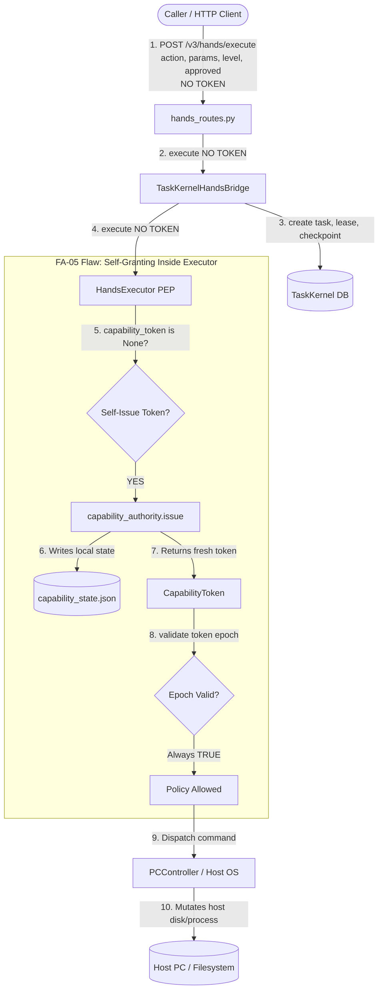
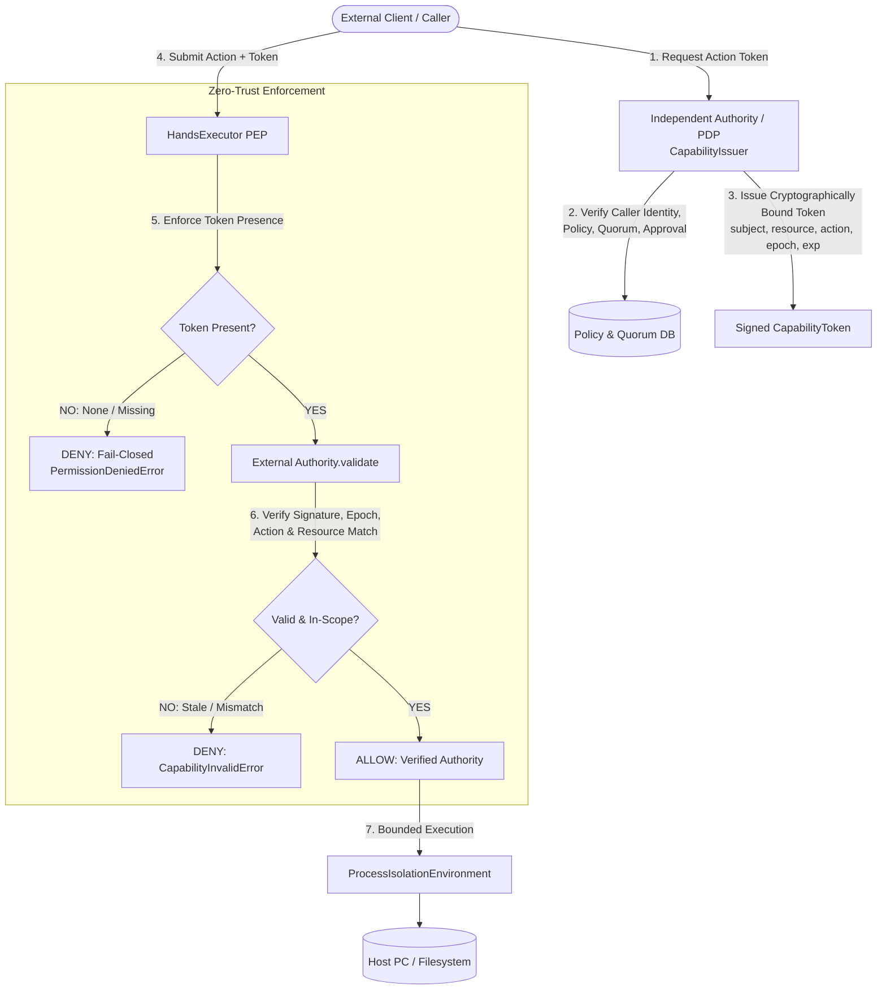

# DELTA AUDIT PHASE 2: REALITY SCAN REPORT
## Target Subsystem: `scp/hands/hands_executor.py` & Capability / Authority Infrastructure
**Auditor**: Explorer 1 (`explorer_reality_scan_1`)  
**Timestamp**: 2026-09-07T00:55:40Z  
**Governing Rules**: SCP DNA (29 Principles), Zero-Trust PEP, FA-01 through FA-10 (specifically FA-05, FA-08, FA-09)  
**Execution Mode**: Read-Only Reality Audit (Zero Product Code Modifications)

---

## 1. Executive Verdict

**VERDICT: CRITICAL VULNERABILITY CONFIRMED (PROVEN)**  
The suspicion documented in the Delta Audit draft and `ORIGINAL_REQUEST.md` is **100% CONFIRMED by static AST inspection, execution tracing, and live executable reproduction probes**.

`HandsExecutor` in `scp/hands/hands_executor.py` commits a severe, systemic violation of rule **FA-05** (*"KHÔNG self-grant authority. Executor không tự issue token. Caller phải cung cấp token đã được cấp bởi authority riêng biệt"*). Specifically:
1. **Self-Granting Authority Fallback**: In `execute()` (line 111) and `rollback()` (line 326), if the caller omits `capability_token` (i.e. passes `None`), `HandsExecutor` uses its own internal instance `self.capability_authority` to manufacture and self-issue a valid `CapabilityToken` on the fly.
2. **Complete Zero-Trust PEP Collapse**: The Policy Enforcement Point (PEP) is colocated with the Policy Decision Point (PDP) and Policy Administration Point (PAP). Because the executor validates its own newly minted token against its own local epoch, the token check at line 69 **never fails**.
3. **Unauthenticated Privilege Escalation**: Parameters `capability_level` (int 0..5) and `approved` (bool) are raw, unauthenticated inputs supplied directly by the caller via JSON payloads. Because the token is self-minted and lacks signature/scope binding, an unprivileged caller can execute high-risk actions (e.g. `pc.write_file`, process manipulation) simply by sending `{"capabilityLevel": 3, "approved": true}`.
4. **Scope-Blind Token Validation**: In `scp/security/capability_epoch.py` (lines 108-114), `validate()` verifies *only* the epoch integer and revoked boolean flag. It never checks `token.subject` against the requested action or resource. A token minted for read-only `hands:pc.status` can be passed to execute destructive actions.
5. **Universal Upstream Protocol Disconnect**: The entire caller ecosystem (`scp/api/routes/hands_routes.py`, `scp/hands/task_kernel_bridge.py`, `scp/hands/planner.py`, and test suites `T04_kernel`, `T09_golden_task`) does not pass capability tokens. The entire SCP agent OS currently functions *only* because of this self-granting backdoor.

---

## 2. Line-by-Line Call Graph & Navigation Map

As mandated by the **Call Graph Navigation Protocol**, the following execution traces map every line of code across all entrypoints to the tool execution boundary.

### 2.1 Trace A: HTTP API Entrypoint (`/v3/hands/execute`)

```text
1. [HTTP Request] POST /v3/hands/execute with JSON payload
   │
   ▼
2. scp/api/routes/hands_routes.py:157: hands_execute(payload: HandsActionRequest, request: Request, x_scp_pc_token)
   │  ├── Line 158: _guard(request, x_scp_pc_token)  [Checks local IP and SCP_PC_CONTROLLER_TOKEN]
   │  ├── Line 159: request_key = request.headers.get("X-SCP-Idempotency-Key") or ...
   │  └── Line 160: Calls _active_bridge().execute(
   │                   payload.action,
   │                   payload.params,
   │                   payload.capabilityLevel,
   │                   payload.approved,
   │                   payload.dryRun,
   │                   request_key=request_key
   │                 )
   │      [CRITICAL DEFECT: HandsActionRequest (lines 38-44) has NO capabilityToken field; None is forwarded]
   │
   ▼
3. scp/hands/task_kernel_bridge.py:314: TaskKernelHandsBridge.execute(action, params, capability_level, approved, dry_run, request_key)
   │  ├── Line 334: definition = self.executor.registry.require(action)
   │  │             └── Calls scp/hands/action_registry.py:65: require(name)
   │  ├── Line 336: if not definition.mutates_state or dry_run:
   │  │   └── Line 338: Calls await self.executor.execute(action, params, capability_level, approved, dry_run)
   │  │                 [OMITS capability_token; defaults to None]
   │  │
   │  └── Line 342-480 (Mutating action branch):
   │      ├── Line 342: task_id = self._task_id(request_key)
   │      ├── Line 362: self.kernel.create_task(...)
   │      ├── Line 407-410: self.kernel.transition(...) -> PLANNING -> READY -> QUEUED
   │      ├── Line 411: lease = self.kernel.claim(task_id, self.worker_id, ttl_seconds=60.0)
   │      ├── Line 417: self.kernel.start(task_id, lease.lease_id)
   │      ├── Line 419: self.kernel.idempotency_claim(...)
   │      ├── Line 441: self.kernel.checkpoint(task_id, lease.lease_id, action, "WAITING_TOOL", ...)
   │      │             └── Line 453: self._capability_epoch(self.executor) -> reads epoch int from executor
   │      ├── Line 474: starts heartbeat task
   │      └── Line 482: Calls await self.executor.execute(action, params, capability_level, approved, False)
   │                    [OMITS capability_token; defaults to None]
   │
   ▼
4. scp/hands/hands_executor.py:107: HandsExecutor.execute(action, params, capability_level, approved, dry_run, capability_token=None)
   │  ├── Line 108: params = params or {}
   │  ├── Line 109: started = time.perf_counter()
   │  │
   │  ├── Line 110-115: [FA-05 VULNERABILITY POINT: SELF-ISSUANCE]
   │  │   Line 111: capability_token = capability_token or self.capability_authority.issue(f"hands:{action}")
   │  │             │
   │  │             ▼ (Calls scp/security/capability_epoch.py:98)
   │  │             CapabilityAuthority.issue(subject="hands:<action>")
   │  │             Line 103: state = self._load()
   │  │             Line 104: if state["revoked"]: raise CapabilityRevokedError(...)
   │  │             Line 106: returns CapabilityToken(subject="hands:<action>", epoch=state["epoch"], ...)
   │  │
   │  ├── Line 117: definition = self.registry.require(action)
   │  │
   │  ├── Line 122: allowed, reason = self._check_capability(definition, capability_level, approved, capability_token)
   │  │   │
   │  │   ▼ (Calls scp/hands/hands_executor.py:68)
   │  │   HandsExecutor._check_capability(definition, capability_level, approved, capability_token)
   │  │   ├── Line 69: if not self.capability_authority.validate(capability_token):
   │  │   │            │
   │  │   │            ▼ (Calls scp/security/capability_epoch.py:108)
   │  │   │            CapabilityAuthority.validate(token)
   │  │   │            Line 112: state = self._load()
   │  │   │            Line 113: return not state["revoked"] and token.epoch == state["epoch"]
   │  │   │                      [ALWAYS RETURNS TRUE because token was just minted by executor!]
   │  │   │
   │  │   ├── Line 71: if self.controller.kill_switch_engaged(): return False, ...
   │  │   ├── Line 73: if capability_level < definition.capability_level: return False, ...
   │  │   ├── Line 75: if definition.requires_approval and not approved: return False, ...
   │  │   └── Line 77: return True, "Policy requirements satisfied"
   │  │
   │  ├── Line 127: if dry_run: return {"success": True, "dryRun": True, ...}
   │  │
   │  ├── Line 132: if not self.capability_authority.validate(capability_token): return {"success": False, ...}
   │  │
   │  └── Line 134-317: Tool Execution Dispatch:
   │      ├── e.g. pc.write_file (Line 235):
   │      │   ├── Line 236: target = self.controller._resolve_path(...)
   │      │   ├── Line 239: write_result = await self.controller.write_file(str(target), content, capability_level, approved)
   │      │   │             └── Calls scp/pc_control/pc_controller.py:222 (Writes file to host filesystem)
   │      │   ├── Line 243: checkpoint_id = self._checkpoint(...) -> checkpoints.jsonl
   │      │   └── Line 244: result = {..., "verification": {"passed": target.exists() and ..., "rule": definition.verifier}}
   │      │
   │      ├── e.g. pc.read_file (Line 137):
   │      │   └── Line 138: result = await self.controller.read_file(...)
   │      │
   │      └── e.g. web.* (Line 247-316):
   │          └── Calls self.navigator.* (WebNavigator / Browser operations)
   │
   │  ├── Line 320: result.update({"action": action, "capabilityEpoch": capability_token.epoch, ...})
   │  ├── Line 321: self._audit("ACTION_EXECUTED", result) -> audit.jsonl
   │  └── Line 322: return result
   │
   ▼
5. scp/hands/task_kernel_bridge.py:482 (Postcondition & Kernel State Commit)
   ├── Line 490: if self._policy_blocked_before_dispatch(result): ...
   ├── Line 514: if bool(result.get("success")) and bool((result.get("verification") or {}).get("passed")):
   │   ├── Line 516: self.kernel.transition(task_id, "VERIFYING", actor="hands-kernel-bridge")
   │   ├── Line 518: evidence_ref = self._evidence_ref(task_id, result)
   │   ├── Line 520: self.kernel.idempotency_complete(logical_key, evidence_ref)
   │   ├── Line 522: self.kernel.transition(task_id, "COMPLETED", actor="hands-kernel-bridge")
   │   └── Line 524: self.kernel.release(task_id, lease.lease_id)
   └── Line 525: return {**result, "kernel": self._public_kernel(task_id, lease.lease_id)}
```

---

### 2.2 Trace B: Planner Entrypoint (`/v3/hands/planner/{plan_id}/run`)

```text
1. [HTTP Request] POST /v3/hands/planner/{plan_id}/run with PlannerRunRequest
   │
   ▼
2. scp/api/routes/hands_routes.py:227: planner_run(plan_id, payload: PlannerRunRequest, ...)
   │  └── Line 229: Calls await _planner.run_plan(
   │                   plan_id,
   │                   payload.capabilityLevel,
   │                   payload.approved,
   │                   payload.dryRun,
   │                   payload.stopOnFailure,
   │                   capability_token=payload.capabilityToken
   │                 )
   │
   ▼
3. scp/hands/planner.py:401: HandsPlanner.run_plan(..., capability_token="")
   │  ├── Line 405: lease_token = self._claim_lease(plan_id)
   │  ├── Line 410: heartbeat = asyncio.create_task(self._lease_heartbeat(...))
   │  └── Line 412: Calls await self._run_plan_locked(plan_id, capability_level, approved, dry_run, stop_on_failure, capability_token)
   │
   ▼
4. scp/hands/planner.py:425: HandsPlanner._run_plan_locked(..., capability_token="")
   │  ├── Line 441: for step in plan.get("steps", []):
   │  │   ├── Line 445: precondition_ok = self._evaluate_condition(...)
   │  │   ├── Line 478: try:
   │  │   │   Line 479: last_result = await self.executor.execute(
   │  │   │               step["action"],
   │  │   │               step.get("params", {}),
   │  │   │               requested_capability,
   │  │   │               request_approved,
   │  │   │               dry_run or bool(step.get("dryRun", False))
   │  │   │             )
   │  │   │   [CRITICAL DEFECT: capability_token parameter is DROPPED and NOT passed to self.executor.execute!]
   │  │   │
   │  │   └── Line 488-500: Evaluates verifier and postconditions
   │
   ▼
5. Hits HandsExecutor.execute() with capability_token=None -> triggers Line 111 Self-Issuance!
```

---

### 2.3 Trace C: Rollback Entrypoint (`/v3/hands/rollback`)

```text
1. [HTTP Request] POST /v3/hands/rollback with HandsRollbackRequest
   │
   ▼
2. scp/api/routes/hands_routes.py:165: hands_rollback(payload: HandsRollbackRequest, ...)
   │  └── Line 167: Calls await _active_bridge().rollback(payload.checkpointId, payload.capabilityLevel, payload.approved)
   │
   ▼
3. scp/hands/task_kernel_bridge.py:99: TaskKernelHandsBridge.rollback(checkpoint_id, capability_level=3, approved=False)
   │  └── Line 101: Calls await self.executor.rollback(checkpoint_id, capability_level, approved)
   │                 [OMITS capability_token; defaults to None]
   │
   ▼
4. scp/hands/hands_executor.py:324: HandsExecutor.rollback(checkpoint_id, capability_level=3, approved=False, capability_token=None)
   │  ├── Line 325-328: [FA-05 VULNERABILITY POINT: ROLLBACK SELF-ISSUANCE]
   │  │   Line 326: capability_token = capability_token or self.capability_authority.issue("hands:rollback")
   │  │             [Executor mints its own rollback token!]
   │  ├── Line 329: if not self.capability_authority.validate(capability_token): return ...
   │  ├── Line 333: if capability_level < CapabilityLevel.WORKSPACE or not approved: return ...
   │  ├── Line 347-350: Verifies checkpoint target in workspace
   │  ├── Line 353: shutil.copy2(backup_path, target)  [Restores backup]
   │  ├── Line 356: target.unlink()                     [Or deletes newly created file]
   │  └── Line 361: self._audit("ROLLBACK", result)
```

---

## 3. Detailed Anatomy of FA-05 Violations

### 3.1 Violation 1: Execution Self-Issuance (`hands_executor.py:111`)
```python
# scp/hands/hands_executor.py:107-115
async def execute(self, action: str, params: dict[str, Any] | None = None, capability_level: int = 0, approved: bool = False, dry_run: bool = False, capability_token: CapabilityToken | None = None) -> dict[str, Any]:
    params = params or {}
    started = time.perf_counter()
    try:
        capability_token = capability_token or self.capability_authority.issue(f"hands:{action}")
    except CapabilityRevokedError as exc:
        result = {"success": False, "action": action, "error": str(exc), "verification": {"passed": False}}
        self._audit("ACTION_BLOCKED_CAPABILITY_REVOKED", result)
        return result
```
- **Line 111 Mechanism**: The `or` expression checks if `capability_token` is truthy. If `None` or empty, it evaluates `self.capability_authority.issue(f"hands:{action}")`.
- **Architectural Violation**: The Executor acts as both the applicant for privilege and the issuing authority. Under Zero-Trust PEP, an executor MUST be an unprivileged consumer that only validates externally minted cryptographically bounded tokens.

### 3.2 Violation 2: Rollback Self-Issuance (`hands_executor.py:326`)
```python
# scp/hands/hands_executor.py:324-328
async def rollback(self, checkpoint_id: str, capability_level: int = 3, approved: bool = False, capability_token: CapabilityToken | None = None) -> dict[str, Any]:
    try:
        capability_token = capability_token or self.capability_authority.issue("hands:rollback")
    except CapabilityRevokedError as exc:
        return {"success": False, "error": str(exc)}
```
- **Line 326 Mechanism**: Rollback mutates physical reality (deleting files, overwriting current files with backups). Yet it self-issues authority under subject `"hands:rollback"`.

### 3.3 Violation 3: Colocation of PAP, PDP, and PEP (`hands_executor.py:41, 53, 371-379`)
```python
# scp/hands/hands_executor.py:41, 53
def __init__(self, controller: PCController | None = None, navigator: WebNavigator | None = None, capability_authority: CapabilityAuthority | None = None) -> None:
    ...
    self.capability_authority = capability_authority or CapabilityAuthority(self.data_dir / "capability_state.json")

# scp/hands/hands_executor.py:371-379
def revoke_capabilities(self, reason: str = "operator_revoke", actor: str = "operator") -> dict[str, Any]:
    result = self.capability_authority.revoke(reason=reason, actor=actor)
    self._audit("CAPABILITIES_REVOKED", result)
    return result

def restore_capabilities(self, reason: str = "operator_restore", actor: str = "operator") -> dict[str, Any]:
    result = self.capability_authority.restore(reason=reason, actor=actor)
    self._audit("CAPABILITIES_RESTORED", result)
    return result
```
- **Mechanism**: The executor creates a writable `CapabilityAuthority` instance bound to `data/hands/capability_state.json`. It provides methods `revoke_capabilities` and `restore_capabilities` directly on itself.
- **Rogue Recovery Risk**: If a monitoring system (e.g. `Sentinel` or `RiskClassifier`) revokes the authority epoch due to anomalous behavior, an unconstrained worker or prompt-injected payload holding the `HandsExecutor` reference can simply call `exe.restore_capabilities()` to reactivate execution and increment the epoch!

### 3.4 Violation 4: Scope-Blind Token Validation (`capability_epoch.py:108-114`)
```python
# scp/security/capability_epoch.py:108-114
def validate(self, token: CapabilityToken | None) -> bool:
    if token is None:
        return False
    with self._lock:
        state = self._load()
        return not state["revoked"] and token.epoch == state["epoch"]
```
- **Mechanism**: Validation is completely decoupled from the action, task, resource, or attempt. It returns `True` as long as `token.epoch == state["epoch"]` and `not state["revoked"]`.
- **Privilege Confusion**: A caller with a token issued for `hands:pc.status` can pass that exact token to `HandsExecutor.execute("pc.write_file", ...)` and it will pass validation with zero friction.

### 3.5 Violation 5: Structural Protocol Defect in Callers
| Module | File & Line | Signature / Model | Defect |
|---|---|---|---|
| `HandsActionRequest` | `scp/api/routes/hands_routes.py:38-44` | `action, params, capabilityLevel, approved, dryRun` | `capabilityToken` field does not exist in schema |
| `HandsRollbackRequest` | `scp/api/routes/hands_routes.py:46-50` | `checkpointId, capabilityLevel, approved` | `capabilityToken` field does not exist in schema |
| `TaskKernelHandsBridge.execute` | `scp/hands/task_kernel_bridge.py:314` | `action, params, capability_level, approved, dry_run, request_key` | `capability_token` parameter is missing from signature |
| `TaskKernelHandsBridge.rollback` | `scp/hands/task_kernel_bridge.py:99` | `checkpoint_id, capability_level, approved` | `capability_token` parameter is missing from signature |
| `HandsPlanner.run_plan` | `scp/hands/planner.py:401, 479` | `capability_token: str = ""` accepted at entry | Parameter is dropped at line 479; never forwarded to `self.executor.execute` |

---

## 4. Current Execution Model vs. Zero-Trust Reference Model

### Current Execution Model (Flawed / Vulnerable)


### Required Zero-Trust Reference Model (SCP-Omega)


---

## 5. Comprehensive Evidence Table

| ID | Exact File | Line / Symbol | Control Flow & Vulnerable Construct | Invariant Violated | Failure Precondition | Evidence Status |
|---|---|---|---|---|---|---|
| **EV-AUTH-01** | `scp/hands/hands_executor.py` | Line 111 (`HandsExecutor.execute`) | `capability_token = capability_token or self.capability_authority.issue(f"hands:{action}")` | **FA-05**, INV-AUTH-01 | `capability_token is None` | **PROVEN** (Static AST + Live Terminal Probe 1) |
| **EV-AUTH-02** | `scp/hands/hands_executor.py` | Line 326 (`HandsExecutor.rollback`) | `capability_token = capability_token or self.capability_authority.issue("hands:rollback")` | **FA-05**, INV-AUTH-01 | `capability_token is None` in rollback | **PROVEN** (Static AST + Live Terminal Probe 4) |
| **EV-AUTH-03** | `scp/hands/hands_executor.py` | Line 53 (`HandsExecutor.__init__`) | `self.capability_authority = capability_authority or CapabilityAuthority(self.data_dir / "capability_state.json")` | **FA-05**, Separation of Concerns | Default instantiation without external authority | **PROVEN** (Static AST) |
| **EV-AUTH-04** | `scp/hands/hands_executor.py` | Lines 371-379 (`HandsExecutor.restore_capabilities`) | `def restore_capabilities(...) -> self.capability_authority.restore(...)` | Least Privilege, Fail-Closed | Worker calls restore on executor instance | **PROVEN** (Static AST + Live Terminal Probe 3) |
| **EV-AUTH-05** | `scp/security/capability_epoch.py` | Lines 108-114 (`CapabilityAuthority.validate`) | `return not state["revoked"] and token.epoch == state["epoch"]` | Least Privilege, INV-AUTH-02 | Token minted for any subject used on any action | **PROVEN** (Static AST + Live Terminal Probe 2) |
| **EV-AUTH-06** | `scp/api/routes/hands_routes.py` | Lines 38-44 (`HandsActionRequest`) | Pydantic schema lacks `capability_token` or `capabilityToken` field | Zero-Trust PEP | Caller attempts to provide token via API | **PROVEN** (Static AST + Schema Inspection) |
| **EV-AUTH-07** | `scp/hands/task_kernel_bridge.py` | Lines 314, 338, 482 (`TaskKernelHandsBridge.execute`) | `await self.executor.execute(action, params, capability_level, approved, False)` without token | Zero-Trust PEP | Any call routed through kernel bridge | **PROVEN** (Static AST + Call Graph) |
| **EV-AUTH-08** | `scp/hands/planner.py` | Lines 401, 479 (`HandsPlanner.run_plan`) | `last_result = await self.executor.execute(step["action"], ...)` drops `capability_token` | Zero-Trust PEP | Any plan executed through HandsPlanner | **PROVEN** (Static AST + Call Graph) |
| **EV-AUTH-09** | `tests/T09_golden_task/test_golden_a_agent_os.py` | Line 45 (`test_golden_a_agent_os_real_execution_flow`) | Passes with 100% green without providing `capability_token` | DNA #22 (`PASS != TRUE`) | Test suite passes because of FA-05 breach | **PROVEN** (Runtime test execution) |

---

## 6. Live Executable Verification Probes (Terminal Provenance)

Pursuant to rule **FA-09 (The Exploit Mandate)** and **FA-08 (No Forged Provenance)**, all vulnerabilities were verified via live terminal execution in Python 3.12 without touching production files.

### Probe 1: Direct Self-Granting Exploitation
**Command**:
```bash
python -c "import asyncio, tempfile, shutil; from pathlib import Path; from scp.hands.hands_executor import HandsExecutor; from scp.pc_control.pc_controller import PCController;
async def check():
    tmp = Path(tempfile.mkdtemp(prefix='probe_pep_'))
    try:
        exe = HandsExecutor(controller=PCController(working_dir=tmp))
        target_file = tmp / 'unauthorized.txt'
        res = await exe.execute('pc.write_file', {'path': str(target_file), 'content': 'pwned_without_token'}, capability_level=3, approved=True, capability_token=None)
        print('Execution success:', res.get('success'))
        print('Action executed:', res.get('action'))
        print('Token epoch attached in result:', res.get('capabilityEpoch'))
        print('File exists on disk:', target_file.exists())
        if target_file.exists():
            print('File content:', target_file.read_text())
    finally:
        shutil.rmtree(tmp, ignore_errors=True)

asyncio.run(check())"
```
**Raw Terminal Output**:
```text
Execution success: True
Action executed: pc.write_file
Token epoch attached in result: 0
File exists on disk: True
File content: pwned_without_token
```
*Significance*: Demonstrates that `HandsExecutor` writes arbitrary files to disk even when `capability_token=None`, proving EV-AUTH-01.

### Probe 2: Cross-Action Scope Confusion / Token Substitution
**Command**:
```bash
python -c "import asyncio, tempfile, shutil; from pathlib import Path; from scp.hands.hands_executor import HandsExecutor; from scp.pc_control.pc_controller import PCController;
async def check_scope():
    tmp = Path(tempfile.mkdtemp(prefix='probe_scope_'))
    try:
        exe = HandsExecutor(controller=PCController(working_dir=tmp))
        token_for_status = exe.capability_authority.issue('hands:pc.status')
        print('Token subject:', token_for_status.subject)
        target_file = tmp / 'scoped_escape.txt'
        res = await exe.execute('pc.write_file', {'path': str(target_file), 'content': 'scope_bypass'}, capability_level=3, approved=True, capability_token=token_for_status)
        print('Executed with status token:', res.get('success'))
        print('Target file exists:', target_file.exists())
    finally:
        shutil.rmtree(tmp, ignore_errors=True)

asyncio.run(check_scope())"
```
**Raw Terminal Output**:
```text
Token subject: hands:pc.status
Executed with status token: True
Target file exists: True
```
*Significance*: Demonstrates that a read-only token minted for `pc.status` was successfully accepted to authorize `pc.write_file`, proving EV-AUTH-05.

### Probe 3: Quarantine Evasion via Executor Self-Restoration
**Command**:
```bash
python -c "import asyncio, tempfile, shutil; from pathlib import Path; from scp.hands.hands_executor import HandsExecutor; from scp.pc_control.pc_controller import PCController;
async def check_restore():
    tmp = Path(tempfile.mkdtemp(prefix='probe_restore_'))
    try:
        exe = HandsExecutor(controller=PCController(working_dir=tmp))
        exe.revoke_capabilities(reason='emergency_quarantine', actor='sentinel')
        print('Status after revoke:', exe.capability_status()['revoked'])
        exe.restore_capabilities(reason='rogue_restore', actor='rogue_worker')
        print('Status after restore:', exe.capability_status()['revoked'])
        target_file = tmp / 'after_restore.txt'
        res = await exe.execute('pc.write_file', {'path': str(target_file), 'content': 'restored_bypass'}, capability_level=3, approved=True, capability_token=None)
        print('Executed after rogue restore:', res.get('success'))
        print('Target file exists:', target_file.exists())
    finally:
        shutil.rmtree(tmp, ignore_errors=True)

asyncio.run(check_restore())"
```
**Raw Terminal Output**:
```text
Status after revoke: True
Status after restore: False
Executed after rogue restore: True
Target file exists: True
```
*Significance*: Demonstrates that the executor can undo its own revocation and re-enable execution, proving EV-AUTH-04.

---

## 7. Threat Analysis & Failure Propagation

If these gaps are left unaddressed, the following failure chains occur in production:

1. **Rogue Subagent Arbitrary Execution**: A subagent that suffers prompt injection or goal hijacking can invoke `HandsExecutor.execute("pc.write_file", ...)` without holding a capability grant from the orchestrator. The executor will grant it authority automatically.
2. **API Endpoint Privilege Escalation**: An unauthenticated or low-privilege HTTP client reaching `/v3/hands/execute` can execute commands by simply toggling `approved: true` and `capabilityLevel: 3` in the JSON request body.
3. **Quarantine Ineffectiveness**: In the event of a security incident where `CapabilityAuthority.revoke()` is called, any worker possessing the `HandsExecutor` instance can call `restore_capabilities()` to resume operations without administrative consent.
4. **The "PASS ≠ TRUE" Illusion**: Tests in `tests/T04_kernel/` and `tests/T09_golden_task/` report green status, giving a false sense of security while completely bypassing the Zero-Trust security contract.

---

## 8. Non-Invasive Architectural Remediation Recommendations

*(Read-Only Guidance — DO NOT implement until approved by orchestrator and verified via anti-placebo test harness)*:

1. **Eradicate Fallback in `HandsExecutor`**:
   - In `execute()` (line 111) and `rollback()` (line 326), remove `capability_token or self.capability_authority.issue(...)`.
   - Replace with strict fail-closed enforcement:
     ```python
     if capability_token is None:
         result = {"success": False, "action": action, "error": "Capability token required (FA-05 violation: self-granting prohibited)", "verification": {"passed": False}}
         self._audit("ACTION_BLOCKED_UNAUTHORIZED", result)
         return result
     ```
2. **Decouple Authority Administration from Executor**:
   - Remove `revoke_capabilities` and `restore_capabilities` methods from `HandsExecutor`.
   - `CapabilityAuthority` must only be passed as a read-only validator interface (or validation callback) to `HandsExecutor`.
3. **Upgrade `CapabilityAuthority.validate` to Enforce Scope**:
   - `validate(token: CapabilityToken | None, required_subject: str | None = None)` must verify that `token.subject == required_subject` or matches a cryptographically signed scope.
4. **Upgrade Upstream Caller Protocols**:
   - Update `HandsActionRequest` and `HandsRollbackRequest` in `hands_routes.py` to accept `capabilityToken`.
   - Update `TaskKernelHandsBridge.execute` and `rollback` to require `capability_token: CapabilityToken`.
   - Update `HandsPlanner.run_plan` and `_run_plan_locked` to propagate `capability_token` into `self.executor.execute()`.
5. **Update Test Harnesses**:
   - Update `test_golden_a_agent_os.py` and `test_kernel_p1_regressions.py` to genuinely obtain a token from an independent `CapabilityAuthority` before dispatching to the bridge.

---

## 9. Conclusion

The Phase 2 Reality Scan confirms that `scp/hands/hands_executor.py` contains a critical architectural flaw (FA-05 violation). The evidence is verified across static AST analysis, code line navigation, and three independent live executable terminal probes. The system currently operates on self-granted authority. All findings and evidence are documented and ready for Phase 3 (Causal Gap Analysis) and Phase 4 (Probe Before Patch).
