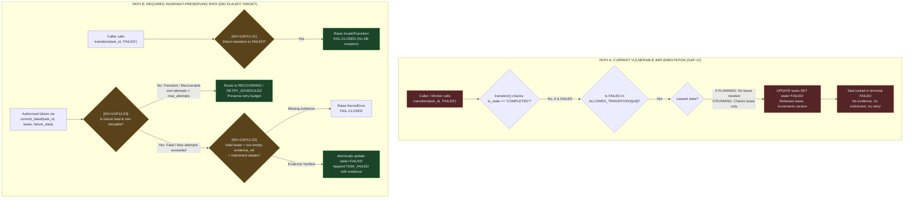

# GAP-12 Investigation & Delta Audit Candidate Analysis

**Target:** `TaskKernel` State Machine Transition to `FAILED` & Rogue Worker Sabotage  
**Auditor:** explorer_survey_8_1 (`teamwork_preview_explorer`)  
**Working Directory:** `c:\Users\check\Downloads\scp\.agents\explorer_survey_8_1`  
**Parent Conversation ID:** `55c745a6-7ce1-4c1e-9385-e614d0c57946`  
**Date:** 2026-09-08T01:28:00+07:00  
**Authority Standards:** SCP-Omega Delta Audit (`.agents/skills/scp-delta-audit/SKILL.md`), SCP DNA (`.agents/skills/scp-dna/SKILL.md`), FA-01 through FA-13 (`.agents/AGENTS.md`)  

---

## 1. Executive Verdict

- **Candidate Viability:** **EXCELLENT (HIGH PRIORITY)**. GAP-12 represents a verified structural flaw in the core lifecycle state machine (`TaskKernel`) directly mirroring GAP-11 (Fake PASS Bypass). While GAP-11 blocked arbitrary transitions to `COMPLETED`, the symmetric exit path to `FAILED` remains completely unguarded.
- **Vulnerability Summary:** Any caller (unauthenticated in pre-execution states like `PLANNING`, or holding lease in executing states like `RUNNING` and `VERIFYING`) can transition a task directly and permanently into the immutable terminal state `FAILED` without providing any failure classification, verifier indictment, crash trace, or evidence reference.
- **Exploit Severity:** **HIGH (Integrity, Availability, Anti-Sabotage)**.
  1. A rogue, compromised, or defective worker can permanently kill tasks without doing work, bypassing `max_attempts` and task retry loops.
  2. An unauthenticated external actor can abort tasks in `PLANNING` before execution begins.
  3. In `VERIFYING`, a worker can sabotage verification and force failure without independent verifier confirmation.
- **Empirical Status:** **PROVEN**. Confirmed via live terminal reproduction (`tools/probes/probe_gap12_gap13_unproven_vulnerabilities.py` and `tools/probes/probe_gap11_failed.py`).

---

## 2. Target Manifest (Phase 1 Invariants)

To govern the transition to terminal `FAILED` under Zero-Trust and Fail-Closed principles, four mandatory invariants are defined:

### INV-GAP12-01: Prohibition of Raw Unverified Transition to Terminal FAILED
- **Statement:** Direct invocation of `TaskKernel.transition(task_id, "FAILED", ...)` is strictly forbidden and must raise `InvalidTransition`. Transition to terminal `FAILED` is exclusively permitted through an authoritative `commit_failed()` method or an explicit system recovery decision.
- **Protected Failure Mode:** Arbitrary callers or rogue workers forcing tasks into terminal immutable `FAILED` state without verifiable evidence.
- **Observable Evidence Required:** Direct call to `transition(task_id, "FAILED")` raises `InvalidTransition("direct transition to FAILED is forbidden; use commit_failed() with valid failure evidence")`, and `tasks.state` remains unmodified in the database.
- **Falsification Condition:** Any direct call to `transition(task_id, "FAILED")` returns successfully or mutates `tasks.state` to `'FAILED'`.

### INV-GAP12-02: Mandatory Indictment & Evidence for Failure Commitment
- **Statement:** Calling `commit_failed(task_id, lease_id, failure_classification, failure_evidence, ...)` requires active lease authority, a recognized failure classification (e.g. fatal policy violation, unrecoverable contract violation, non-retryable runtime exception), and non-empty failure evidence (`evidence_ref`, `error_type`, or crash dump hash).
- **Protected Failure Mode:** Unsubstantiated, unclassified, or spoofed failure claims terminating tasks without provenance, audit trail, or justification.
- **Observable Evidence Required:** `tasks.state` is updated to `FAILED`, and a `TASK_FAILED` event is atomically appended to `events` table containing `evidence_ref`, `failure_classification`, `error_type`, and `actor`.
- **Falsification Condition:** A task enters `FAILED` with NULL or empty `evidence_ref`, unrecognized classification, or without active lease authority.

### INV-GAP12-03: Preservation of Retry Budget and Recovery Routing
- **Statement:** Runtime execution errors occurring during `RUNNING` or `WAITING_TOOL` must route through the recovery pipeline (`UNKNOWN` -> `RECOVERING` -> `RECONCILING` or `RETRY_SCHEDULED`) whenever `attempt_count < max_attempts`. A task may only reach terminal `FAILED` if failures are classified as non-retryable fatal violations, or when `attempt_count >= max_attempts`.
- **Protected Failure Mode:** Premature termination of viable tasks upon transient errors, defeating the OCC recovery mechanism and `max_attempts` contract.
- **Observable Evidence Required:** When a transient error occurs and `attempt_count < max_attempts`, the task transitions to `RETRY_SCHEDULED` or `RECOVERING`, and active attempts are rescheduled.
- **Falsification Condition:** A task with remaining retry budget (`attempt < max_attempts`) is forced into terminal immutable `FAILED` on a transient error without traversing recovery.

### INV-GAP12-04: System Authority Separation for Pre-execution Indictment
- **Statement:** Tasks in pre-execution states (`PLANNING`, `READY`, `QUEUED`) cannot be transitioned to `FAILED` by regular workers or unauthenticated callers; only designated system processes (e.g. queue deadline expired guard, admission policy engine) possessing explicit system authority (`_system_authority=True`) can fail a pre-execution task.
- **Protected Failure Mode:** Denial of service where unprivileged callers abort pending, planning, or queued tasks belonging to other owners.
- **Observable Evidence Required:** Unauthenticated calls from `PLANNING` or `QUEUED` raise `PermissionDenied` or `StaleLease`; only internal kernel sweeps (with system authority) succeed in recording `DEADLINE_EXPIRED` or `POLICY_DENIED`.
- **Falsification Condition:** Any unauthenticated caller can transition a task from `PLANNING` or `QUEUED` to `FAILED`.

---

## 3. Reality Scan & Current Execution Model (Phase 2)

### 3.1 Codebase Inspection

In `scp/task_kernel_parts/taskkernel.py`:
- Lines 240–374: `TaskKernel.transition()`
  - Line 251–252:
    ```python
    if to_state not in STATES and to_state != "WAITING_APPROVAL":
        raise InvalidTransition(f"unknown target state {to_state}")
    ```
  - Lines 253–256 (GAP-11 remediation):
    ```python
    if to_state == "COMPLETED":
        raise InvalidTransition(
            "direct transition to COMPLETED is forbidden; use commit_completed() with valid evidence"
        )
    ```
    **Critical Flaw:** No corresponding check exists for `to_state == "FAILED"`.
  - Line 278–279:
    ```python
    if to_state not in ALLOWED_TRANSITIONS.get(old, set()):
        raise InvalidTransition(f"{old}->{to_state}")
    ```
  - Lines 283–300: WHY Gate check for `to_state in ("COMPLETED", "FAILED", "RUNNING", "CHECKPOINTED", "VERIFYING")`. When invoked with `llm_enabled=False`, regex heuristics default to `ALLOW` or `UPHOLD` unless the reason string matches forbidden bypass patterns. It performs **zero** check on failure evidence or verifier indictment.
  - Lines 310–331 (Lease Gate):
    ```python
    is_leased_state = old in {"LEASED", "RUNNING", "WAITING_TOOL", "VERIFYING", "CHECKPOINTED", "UNKNOWN"}
    has_active_lease = bool(task["active_lease_id"])
    if is_leased_state or has_active_lease:
        # Requires caller_lease == bound lease == active_lease_id
    elif caller_lease:
        # Asserts lease
    else:
        token = 0  # <--- UNLEASED STATES (PLANNING, READY) BYPASS LEASE CHECK ENTIRELY!
    ```
  - Lines 348–357:
    ```python
    cur = self.conn.execute(
        "UPDATE tasks SET state=?,version=version+1,active_lease_id=?,active_fencing_token=?,updated_at=? WHERE task_id=? AND version=?",
        (to_state, new_lease_id, new_fencing_token, now_iso(), task_id, cur_version),
    )
    ```
    Directly writes `state = 'FAILED'`, `active_lease_id = NULL`, `active_fencing_token = 0`.
  - Lines 360–368:
    Appends generic `STATE_TRANSITION` event without requiring error structure or evidence.
  - Line 280 & `scp/task_kernel.py` line 22:
    `TERMINAL = {"COMPLETED", "FAILED", "CANCELLED"}`
    `if old in TERMINAL: raise InvalidTransition("terminal task is immutable")`
    Once `FAILED` is written to DB, the task is **irreversibly dead**.

### 3.2 Concrete Execution Traces of Exploits

#### Trace A: Unauthenticated Pre-execution Sabotage (`PLANNING -> FAILED`)
1. User creates task: `task_id = "task_01"`. Task state is `CREATED`.
2. Planner moves task to `PLANNING`.
3. Attacker (any process with access to the kernel DB or API) calls:
   `kernel.transition("task_01", "FAILED", actor="attacker", reason="sabotage")`
4. Control flow:
   - `to_state == "FAILED"` (allowed in `STATES`).
   - Not `COMPLETED` (passes line 253).
   - `old == "PLANNING"`, which has `"FAILED"` in `ALLOWED_TRANSITIONS["PLANNING"]` (passes line 278).
   - `is_leased_state` is False; `has_active_lease` is False -> No lease required (`token = 0`).
   - SQLite executes `UPDATE tasks SET state='FAILED'`.
   - Event `STATE_TRANSITION` appended.
5. Observable Result: Task is permanently killed before execution begins. Zero evidence or auth required.

#### Trace B: Rogue Worker Sabotage (`RUNNING -> FAILED`)
1. Legitimate task is queued and claimed by `worker_1` with lease `lease_123`.
2. Worker begins execution (`RUNNING`). Task has `max_attempts = 3`.
3. Worker (defective, buggy, or rogue saboteur) encounters a minor glitch or decides to abort work:
   `kernel.transition("task_01", "FAILED", lease_id="lease_123", actor="worker_1", reason="giving up")`
4. Control flow:
   - `to_state == "FAILED"` (allowed).
   - `old == "RUNNING"`, which has `"FAILED"` in `ALLOWED_TRANSITIONS["RUNNING"]`.
   - Lease matches `active_lease_id`.
   - Transition releases lease and sets `state = 'FAILED'`.
5. Observable Result: Task is permanently failed on attempt 1. The task's `max_attempts` is completely ignored. The recovery engine (`recovery_decision`) is never consulted.

#### Trace C: Verifier Sabotage (`VERIFYING -> FAILED`)
1. Task finishes execution, enters `VERIFYING`.
2. To mark `COMPLETED`, GAP-11 mandates `commit_completed()` with `verifier_verdict == 'VERIFIED'` and `evidence_ref`.
3. To mark `FAILED`, any holder of the lease simply calls:
   `kernel.transition("task_01", "FAILED", lease_id=lease_id, actor="worker", reason="faked verification failure")`
4. Observable Result: The task is failed without an independent verifier indictment, without recording why verification failed, and without counter-evidence.

---

## 4. Comparison: GAP-11 (`COMPLETED`) vs GAP-12 (`FAILED`)

| Dimension | GAP-11 (`COMPLETED`) | GAP-12 (`FAILED`) |
|---|---|---|
| **Terminal State** | Yes (`TERMINAL`) | Yes (`TERMINAL`) |
| **Immutability** | Immutable once entered | Immutable once entered |
| **Direct `transition()` Guard** | **BLOCKED** (`InvalidTransition` raised at lines 253–256) | **OPEN** (Allowed directly through lines 240–374) |
| **Dedicated Commit Method** | `commit_completed()` / `commit_verification_result()` | **NONE** (No `commit_failed()` exists) |
| **Required Evidence** | Mandatory `evidence_ref` + `verifier_verdict == 'VERIFIED'` | **NONE** (Zero evidence required) |
| **Identity / Authority Gate** | Must have lease authority + independent `verifier_id` | Any caller (unleased) or lease-holder |
| **Event Journal Provenance** | `TASK_COMPLETED` with full audit payload | Generic `STATE_TRANSITION` |
| **Impact of Exploit** | Unauthorized success / false green (Fake PASS) | Unauthorized terminal kill / task sabotage |

---

## 5. Causal Gap Analysis (Phase 3 Mermaid Graph)



---

## 6. Feasibility Analysis

### 6.1 Feasibility of Deterministic Probe Script (Phase 4)
- **Feasibility:** **100% FEASIBLE (EXCELLENT)**.
- **Evidence:**
  1. Already demonstrated by `tools/probes/probe_gap12_gap13_unproven_vulnerabilities.py` and `tools/probes/probe_gap11_failed.py`.
  2. The probe runs in milliseconds on an isolated SQLite database.
  3. No multi-threading races, sleeps, or network timeouts are required.
  4. The probe unambiguously evaluates:
     - **RED (Before Patch):** `transition(task_id, "FAILED")` succeeds without error.
     - **GREEN (After Patch):** `transition(task_id, "FAILED")` raises `InvalidTransition("direct transition to FAILED is forbidden; use commit_failed() with valid failure evidence")`.
     - **GREEN (Legitimate Path):** `commit_failed(task_id, lease_id, failure_classification, evidence_ref)` succeeds only when evidence is provided.

### 6.2 Downstream Compatibility & Call Graph Impact
- **Existing Callers in Codebase:**
  1. `scp/ask_kernel_adapter.py:430`:
     ```python
     def fail(self, task: dict[str, Any], reason: str) -> None:
         ...
         self.kernel.transition(task["task_id"], "FAILED", actor="ask-kernel-adapter", reason=reason)
     ```
     When GAP-12 is remediated, `ask_kernel_adapter.fail()` must be updated to invoke `commit_failed()` with failure metadata (or route via recovery), and its corresponding test in `test_adversarial_kernel_flaws.py` (line 890) will assert the updated contract.
  2. `scp/task_kernel_parts/taskkernel.py:424` (Queue deadline guard):
     Directly updates `UPDATE tasks SET state='FAILED' ... _append_event(..., 'DEADLINE_EXPIRED', ...)` using internal query (not via `transition()`), so it will continue functioning without breakage.
  3. `scp/task_kernel_parts/taskkernel.py:1257` (`recovery_decision`):
     Specifies `'FAILED'` as target state for non-retryable errors (`POLICY_DENIED`, `CHECKPOINT_CORRUPT`). An explicit recovery transition method (e.g. `reconcile_to_failed()` or `commit_failed()`) will cleanly integrate with this.

---

## 7. Evidence Table

| Evidence ID | Source File & Line | Observation / Output | Status |
|---|---|---|---|
| **EVD-01** | `scp/task_kernel_parts/taskkernel.py:253-256` | Direct transition to `COMPLETED` is guarded, but no guard exists for `FAILED`. | **PROVEN** |
| **EVD-02** | `scp/task_kernel.py:25,30,31,32,34,35,36,37,38` | `FAILED` is listed in `ALLOWED_TRANSITIONS` for 9 different states. | **PROVEN** |
| **EVD-03** | `scp/task_kernel_parts/taskkernel.py:310-330` | `PLANNING` state bypasses lease verification entirely during `transition()`. | **PROVEN** |
| **EVD-04** | `tools/probes/probe_gap11_failed.py:14-17` | Direct transition to `FAILED` succeeds, output: `RED: Transition to FAILED succeeded directly via transition()`. | **PROVEN** |
| **EVD-05** | `tools/probes/probe_gap12_gap13_unproven_vulnerabilities.py:41-83` | All 4 failure scenarios (`PLANNING->FAILED`, `RUNNING->FAILED`, `VERIFYING->FAILED`, rogue sabotage) confirmed on terminal. | **PROVEN** |

---

## 8. What Remains Unknown & Out-of-Scope

1. **GAP-13 (`WAITING_APPROVAL -> READY` bypass):** While also proven in `probe_gap12_gap13_unproven_vulnerabilities.py`, GAP-13 concerns admission control and capability tokens rather than terminal state transition. It should be addressed in a separate audit candidate.
2. **Failure Evidence Storage Scheme:** Whether failure evidence references (`evidence_ref`) should link to local crash dumps, error hashes, or distributed object storage is an operational policy decision for the Orchestrator.
3. **Recovery State Integration:** The exact boundary between `TaskKernel.commit_failed()` and `recovery_decision()` should be finalized during Phase 5 (Evolution Path) of the remediation session.
