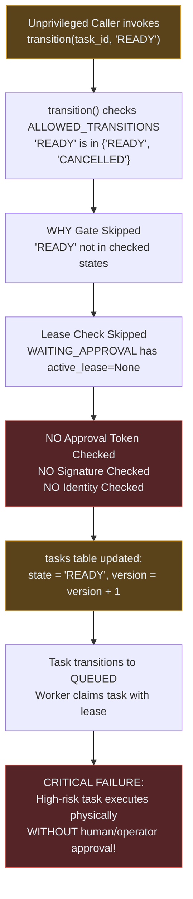

# Comprehensive Delta Audit Analysis: GAP-13 (WAITING_APPROVAL Bypass to READY)

**Audit Target:** `scp/task_kernel.py` & `scp/task_kernel_parts/taskkernel.py`  
**Related Components:** `scp/ask_kernel_adapter.py`, `scp/core/capability_token.py`, `scp/core/agent_orchestrator.py`  
**Investigator:** `explorer_survey_8_2` (Teamwork Explorer)  
**Date:** 2026-09-08T01:27:00+07:00  
**Authority:** FA-01 through FA-13, Zero-Trust, Fail-Closed, Anti-Placebo, `scp-delta-audit`, `scp-dna`  
**Verdict:** **CONFIRMED ARCHITECTURAL VULNERABILITY (PROVEN)**

---

## 1. Executive Summary & Verdict

During the peripheral audit of `taskkernel.py` under FA-11 (documented in `EMERGENCY_GAP_REPORT.md`), GAP-13 was identified as an unauthenticated state transition out of `WAITING_APPROVAL`.

This investigation confirms with **empirical terminal evidence** (Evidence Level 1: failing probe / confirmed exploit) that **GAP-13 is a confirmed high-severity architectural vulnerability**:
1. **Unauthenticated Bypass Confirmed:** Any caller can invoke `kernel.transition(task_id, "READY")` on any task residing in `WAITING_APPROVAL` without providing any cryptographic token, approval ID, signature, or identity verification.
2. **State Machine Incompleteness:** `WAITING_APPROVAL` was retrofitted incompletely into `TaskKernel`. It exists in `ALLOWED_TRANSITIONS`, but is **missing from `STATES`** in `scp/task_kernel.py` (lines 16–21). In `scp/task_kernel_parts/taskkernel.py` line 251, an ad-hoc special-case condition (`and to_state != "WAITING_APPROVAL"`) was hacked in to prevent `InvalidTransition("unknown target state")` from firing.
3. **Absence from In-Flight Tracking:** `WAITING_APPROVAL` is missing from `AskKernelAdapter._IN_FLIGHT_STATES` (lines 82–86), causing transport retry deduping to misclassify tasks waiting for approval as finished/re-askable.
4. **Human-in-the-Loop Collapse:** Tasks placed in `WAITING_APPROVAL` due to high-risk actions (e.g. destructive system mutations, external network dispatch, privileged credential operations) can be moved to `READY` and subsequent `QUEUED -> LEASED -> RUNNING` execution by any rogue subagent or untrusted component.

---

## 2. Investigation of Codebase & State Machine Definitions

### 2.1 How `WAITING_APPROVAL` is Defined
In `scp/task_kernel.py`:
```python
# Lines 16-21: Authoritative State Set
STATES = {
    "CREATED", "PLANNING", "READY", "QUEUED", "LEASED", "RUNNING",
    "WAITING_TOOL", "VERIFYING", "CHECKPOINTED", "UNKNOWN", "RECOVERING",
    "RECONCILING", "HUMAN_REVIEW", "RETRY_SCHEDULED", "COMPLETED",
    "FAILED", "CANCELLED",
}

# Lines 23-42: Allowed Transitions Table
ALLOWED_TRANSITIONS = {
    "CREATED": {"PLANNING", "CANCELLED"},
    "PLANNING": {"READY", "WAITING_APPROVAL", "FAILED", "CANCELLED"},
    "WAITING_APPROVAL": {"READY", "CANCELLED"},
    "READY": {"QUEUED", "CANCELLED"},
    ...
}
```

**Key Observation 1 (State Set Exclusion):**
- `WAITING_APPROVAL` is listed in `ALLOWED_TRANSITIONS["PLANNING"]` and defined as a source state in `ALLOWED_TRANSITIONS["WAITING_APPROVAL"] = {"READY", "CANCELLED"}`.
- However, `WAITING_APPROVAL` **is NOT in `STATES`**.
- As a direct consequence, `scp/task_kernel_parts/taskkernel.py` had to incorporate an ad-hoc exclusion at line 251:
  ```python
  251: if to_state not in STATES and to_state != "WAITING_APPROVAL":
  252:     raise InvalidTransition(f"unknown target state {to_state}")
  ```
- In git history, this ad-hoc check was added in commit `71420ae6` (`GAP-01 ContextVar Leak Remediation`). It represents technical debt and state machine asymmetry.

**Key Observation 2 (Allowed Outbound Transitions):**
- Out of `WAITING_APPROVAL`, only two destinations are allowed:
  1. `"READY"`
  2. `"CANCELLED"`

---

## 3. Transition Feasibility Analysis (Answering User Questions 2 & 3)

### 3.1 Can a task in `WAITING_APPROVAL` be transitioned directly to `READY`?
**YES, unconditionally.**

Tracing `kernel.transition(task_id, "READY", actor="unauthorized_caller")` in `scp/task_kernel_parts/taskkernel.py`:
1. **Target state check (line 251):** `to_state == "READY"` is in `STATES`. Passes.
2. **Terminal gate (line 253):** `to_state != "COMPLETED"`. Passes.
3. **OCC version check (lines 269–275):** Matches expected version (or none provided). Passes.
4. **Transition table check (line 278):** `to_state ("READY") in ALLOWED_TRANSITIONS["WAITING_APPROVAL"] ({"READY", "CANCELLED"})`. Passes.
5. **Terminal immutability (line 280):** `old ("WAITING_APPROVAL") not in TERMINAL`. Passes.
6. **WHY Gate check (line 283):**
   ```python
   if to_state in ("COMPLETED", "FAILED", "RUNNING", "CHECKPOINTED", "VERIFYING"):
   ```
   `to_state == "READY"` is NOT in this set! The WHY Gate is completely bypassed. Passes without inspection.
7. **Lease Authority Gate (lines 302–330):**
   ```python
   is_leased_state = old in {"LEASED", "RUNNING", "WAITING_TOOL", "VERIFYING", "CHECKPOINTED", "UNKNOWN"}
   has_active_lease = bool(task["active_lease_id"])
   if is_leased_state or has_active_lease:
       ...
   ```
   For a task in `WAITING_APPROVAL`, `old` is `"WAITING_APPROVAL"` (not a leased state), and `task["active_lease_id"]` is `None` (leases are only acquired at `QUEUED -> LEASED`).
   Therefore, the lease verification block is **entirely skipped**! `token = 0`, `new_lease_id = None`.
8. **Approval Verification Gate:**
   **DOES NOT EXIST.** There is no check for:
   - Capability token (`CapabilityToken`)
   - Cryptographic signature (HMAC-SHA256)
   - Approval ID / approval token
   - Non-expired approval window
   - Approver identity or permission level
9. **Database Mutation (lines 347–358):**
   ```python
   cur = self.conn.execute(
       "UPDATE tasks SET state=?,version=version+1,active_lease_id=?,active_fencing_token=?,updated_at=? WHERE task_id=? AND version=?",
       ("READY", None, 0, now_iso(), task_id, cur_version),
   )
   ```
   Row is updated to `state = 'READY'`.
10. **Journal Event (lines 359–368):**
    A generic `STATE_TRANSITION` event is appended with whatever `actor` was provided.
    `_commit()` commits the transaction.

### 3.2 Can a task in `WAITING_APPROVAL` be transitioned directly to `RUNNING`?
**Direct 1-hop transition: NO.**
`ALLOWED_TRANSITIONS["WAITING_APPROVAL"]` only contains `{"READY", "CANCELLED"}`.
Calling `kernel.transition(task_id, "RUNNING")` raises:
`InvalidTransition: WAITING_APPROVAL->RUNNING`.

**2-hop execution path to `RUNNING`: YES, TRIVIAL.**
Because the transition from `WAITING_APPROVAL` to `READY` is completely unguarded:
1. Caller executes: `kernel.transition(task_id, "READY")` -> State becomes `READY`.
2. Caller executes: `kernel.transition(task_id, "QUEUED")` -> State becomes `QUEUED`.
3. Worker executes: `lease = kernel.claim(task_id, "worker_1")` -> State becomes `LEASED`.
4. Worker executes: `kernel.start(task_id, lease.lease_id)` -> State becomes `RUNNING`.

The human approval gate has been 100% circumvented. The high-risk action executes physically on the worker without any approval ever occurring.

---

## 4. Root Cause and Architectural Disconnect

### 4.1 Root Cause in `taskkernel.py`
The vulnerability stems from treating `WAITING_APPROVAL -> READY` as a routine, unauthenticated lifecycle transition rather than a **privileged governance boundary**.

In GAP-11, the team realized that transition to `COMPLETED` could not be left to generic `transition()` and introduced:
```python
if to_state == "COMPLETED":
    raise InvalidTransition("direct transition to COMPLETED is forbidden; use commit_completed() with valid evidence")
```
However, `WAITING_APPROVAL` was left unprotected. Generic `transition(task_id, "READY")` allows anyone possessing the `task_id` to release a gated task.

### 4.2 Architectural Inversion: RAM vs Database Enforcement
In SCP, higher-level layers do implement approval validation:
- In `scp/core/agent_orchestrator.py` (`resume` method, lines 232–246):
  ```python
  if approval.get("approvalId") != approval_id: return ...
  if float(approval.get("expiresAt", 0)) < time.time(): return ...
  if self._plan_hash(plan) != str(approval.get("planHash", "")): return ...
  ```
- In `scp/core/capability_token.py`: HMAC-SHA256 signing and validation (`mint_token`, `verify_token`, `compute_token_signature`).
- In `scp/hands/planner.py` (lines 480–485): Planner halts on high risk and sets `plan["state"] = "WAITING_APPROVAL"`.

**The Failure Mode:**
The security boundary is implemented **in RAM / application Python logic**, but is **NOT enforced at the Database / TaskKernel level**.
Per FA-10 and the pre-session mandate:
> *"Any code modifications must explicitly enforce boundaries at the Database/Hardware level, not via RAM/Variables."*

Because `TaskKernel` does not enforce the approval requirement at the database boundary, any component (compromised worker, prompt injection via tool execution, rogue script, or bypass of the orchestrator) can talk directly to `TaskKernel` and release any gated task.

---

## 5. Phase 1 — Target Manifest (5 Necessary Invariants)

| Invariant ID | Invariant Statement | Protected Failure Mode | Observable Evidence Required to Prove Compliance | Falsification Condition |
|---|---|---|---|---|
| **INV-GAP13-01** | **Approval Gate Exclusivity**<br/>A task in `WAITING_APPROVAL` state can NEVER be transitioned to `READY` via generic `transition()`. It must only transition via a dedicated gate (e.g. `commit_approved()`). | Unauthenticated / unprivileged bypass of human-in-the-loop and risk governance boundaries. | `kernel.transition(task_id, "READY")` on `WAITING_APPROVAL` raises `InvalidTransition`. Task state remains `WAITING_APPROVAL`. | Any direct call to `transition(task_id, "READY")` succeeds when `state == 'WAITING_APPROVAL'`. |
| **INV-GAP13-02** | **Cryptographic & Identity Binding**<br/>Transition to `READY` requires a valid, cryptographically signed approval token (HMAC-SHA256) bound to the `task_id`, `plan_hash`/action payload, authorized `approver_id`, and non-expired TTL. | Token forgery, replay of approvals across tasks, execution of altered plans, expired approval usage. | Presenting an invalid signature, expired timestamp, or mismatched `task_id` raises `InvalidTokenSignatureError` / `KernelError`. | An approval token without signature or with expired TTL is accepted. |
| **INV-GAP13-03** | **Durable Audit Trail for Approval**<br/>When approved, the journal/event log must record `approver_id`, `token_hash`, and approval metadata in the `APPROVAL_GRANTED` event. | Repudiation, anonymous privilege escalation, non-auditable governance actions. | Querying SQLite `events` shows `type='APPROVAL_GRANTED'` with non-empty `actor`, `approver_id`, and `token_hash`. | Task reaches `READY` from `WAITING_APPROVAL` without recording approver identity in durable events. |
| **INV-GAP13-04** | **Unconditional Cancellation Freedom**<br/>A task in `WAITING_APPROVAL` can always be cancelled or killed via `set_task_kill()` or `cancel()` without requiring an approval token. | Denial-of-service / deadlock where an unwanted or dangerous task cannot be terminated. | `kernel.cancel(task_id)` or `transition(task_id, "CANCELLED")` succeeds and transitions state to `CANCELLED`. | Cancelling a task in `WAITING_APPROVAL` fails or requires approval. |
| **INV-GAP13-05** | **State Machine Completeness**<br/>`WAITING_APPROVAL` must be an explicit member of `STATES` in `task_kernel.py` and `_IN_FLIGHT_STATES` in `ask_kernel_adapter.py`. | Semi-state anomalies, brittle special-case checks, transport deduplication failures. | `"WAITING_APPROVAL" in STATES == True` and `"WAITING_APPROVAL" in AskKernelAdapter._IN_FLIGHT_STATES == True`. | `WAITING_APPROVAL` missing from `STATES` or requires `if to_state != "WAITING_APPROVAL"` hacks. |

---

## 6. Phase 2 — Reality Scan & Evidence Table

### 6.1 Concrete Execution Path (Bypass Vulnerability)
```text
Caller (Rogue / Unprivileged)
  │
  ▼
TaskKernel.transition(task_id, "READY", actor="unauthenticated_bypasser")
  │
  ├─► Check: to_state ("READY") in STATES? ──────────► TRUE
  ├─► Check: to_state == "COMPLETED"? ───────────────► FALSE
  ├─► Check: to_state in ALLOWED["WAITING_APPROVAL"]? ► TRUE ({"READY", "CANCELLED"})
  ├─► Check: to_state in WHY Gate states? ───────────► FALSE (READY not in WHY gate)
  ├─► Check: is_leased_state or has_active_lease? ───► FALSE (WAITING_APPROVAL is unleased)
  │   └──► Lease validation skipped! token = 0, new_lease_id = None
  ├─► Check: Approval Token / Signature / Authority? ► NONE! (No check exists)
  │
  ▼
SQL Execution:
  UPDATE tasks SET state='READY', version=version+1, ... WHERE task_id=?
  INSERT INTO events (type='STATE_TRANSITION', from_state='WAITING_APPROVAL', to_state='READY', ...)
  COMMIT
  │
  ▼
Result: High-risk task is in READY state, ready to be QUEUED and physically executed!
```

### 6.2 Evidence Table

| Source | File & Location | Observation / Code Snippet | Classification | Evidence Level |
|---|---|---|---|---|
| Runtime Terminal | `tools/probes/probe_gap12_gap13_unproven_vulnerabilities.py:96-99` | Output: `[GAP-13.2] EXPLOIT CONFIRMED: WAITING_APPROVAL -> READY succeeded with zero tokens or cryptographic signatures.` | **PROVEN** | Level 1 (Failing probe reproduction) |
| Source Code | `scp/task_kernel.py:16-21` | `STATES = {"CREATED", ...}` lacks `"WAITING_APPROVAL"` | **PROVEN** | Level 4 (Code inspection) |
| Source Code | `scp/task_kernel.py:25-26` | `ALLOWED_TRANSITIONS["WAITING_APPROVAL"] = {"READY", "CANCELLED"}` without guards | **PROVEN** | Level 4 (Code inspection) |
| Source Code | `scp/task_kernel_parts/taskkernel.py:251` | `if to_state not in STATES and to_state != "WAITING_APPROVAL":` ad-hoc workaround | **PROVEN** | Level 4 (Code inspection) |
| Source Code | `scp/task_kernel_parts/taskkernel.py:283` | WHY gate checks only `("COMPLETED", "FAILED", "RUNNING", "CHECKPOINTED", "VERIFYING")` | **PROVEN** | Level 4 (Code inspection) |
| Source Code | `scp/task_kernel_parts/taskkernel.py:310-312` | Lease check skipped because `WAITING_APPROVAL` not in leased states | **PROVEN** | Level 4 (Code inspection) |
| Source Code | `scp/ask_kernel_adapter.py:82-86` | `_IN_FLIGHT_STATES` lacks `"WAITING_APPROVAL"` | **PROVEN** | Level 4 (Code inspection) |

---

## 7. Phase 3 — Mermaid Causal Graphs

### Graph A: Current Vulnerable Implementation (Bypass Path)


### Graph B: Invariant-Preserving Architecture (Gated Release Path)

```mermaid
graph TD
    subgraph RawAttempt["Attacker / Unauthenticated Call"]
        A1["Caller invokes<br/>transition(task_id, 'READY')"] --> A2{"old == 'WAITING_APPROVAL'?"}
        A2 -->|YES| A3["[FAIL-CLOSED]<br/>Raise InvalidTransition:<br/>'raw transition out of WAITING_APPROVAL forbidden;<br/>use commit_approved() with valid approval token'"]
        A3 --> A4["No DB Mutation<br/>Task remains WAITING_APPROVAL"]
    end

    subgraph AuthorizedApproval["Authorized Governance Path"]
        B1["Operator / Human Approver signs token<br/>(HMAC-SHA256 on task_id + plan_hash + exp)"] --> B2["Caller invokes<br/>commit_approved(task_id, approval_token, approver_id)"]
        B2 --> B3{"Verify Token Signature<br/>& task_id / plan_hash & TTL"}
        B3 -->|Invalid / Expired| B4["Raise InvalidTokenSignatureError / KernelError<br/>No DB Mutation"]
        B3 -->|Valid| B5["UPDATE tasks SET state='READY', version=version+1"]
        B5 --> B6["INSERT INTO events: APPROVAL_GRANTED<br/>(approver_id, token_hash, timestamp)"]
        B6 --> B7["Task safely moves to READY<br/>Audited and Cryptographically Proven"]
    end

    classDef safe fill:#1b4428,stroke:#57ab5a,color:#e6edf3;
    classDef danger fill:#542426,stroke:#e5534b,color:#e6edf3;
    class A3,B4 danger;
    class B5,B6,B7,A4 safe;
```


---

## 8. Phase 4 — Probe Before Patch (Feasibility & Probe Design)

### 8.1 Feasibility Assessment
Writing a deterministic, sub-second probe script is **100% FEASIBLE**. In fact, a prototype is already running in `tools/probes/probe_gap12_gap13_unproven_vulnerabilities.py` (lines 85–100).

### 8.2 Dedicated Standalone Probe Design (`tools/probes/probe_gap13.py`)

```python
"""Deterministic Empirical Probe for GAP-13: WAITING_APPROVAL Bypass."""
import sys, os, tempfile, sqlite3
sys.path.insert(0, ".")
from scp.task_kernel import TaskKernel, InvalidTransition

db = tempfile.mktemp(suffix=".sqlite3")
kernel = TaskKernel(db)
tid = "task_gap13_test"

try:
    kernel.create_task(tid, "user", "sensitive operation", risk_tier="R3")
    kernel.transition(tid, "PLANNING")
    kernel.transition(tid, "WAITING_APPROVAL", actor="planner", reason="high_risk_detected")
    t_wait = kernel.get_task(tid)
    assert t_wait["state"] == "WAITING_APPROVAL", f"Setup failed: state is {t_wait['state']}"

    # TRIGGER: Attempt unauthenticated transition to READY
    try:
        kernel.transition(tid, "READY", actor="unauthorized_bypasser", reason="bypassing_approval")
        t_after = kernel.get_task(tid)
        if t_after["state"] == "READY":
            print("RED: EXPLOIT SUCCEEDED! WAITING_APPROVAL -> READY bypassed without token.")
            print(f"VULNERABLE STATE: task state={t_after['state']}, version={t_after['version']}")
    except InvalidTransition as e:
        print(f"GREEN: Blocked with InvalidTransition: {e}")
finally:
    kernel.close()

# Empirical SQLite inspection (FA-12)
conn = sqlite3.connect(db)
conn.row_factory = sqlite3.Row
task_row = dict(conn.execute("SELECT task_id, state, version FROM tasks WHERE task_id=?", (tid,)).fetchone())
events = [dict(r) for r in conn.execute("SELECT seq, type, from_state, to_state, actor FROM events WHERE task_id=?", (tid,)).fetchall()]
conn.close()
try: os.remove(db)
except OSError: pass

print(f"RAW_SQLITE_TASK: {task_row}")
print(f"RAW_SQLITE_EVENTS: {len(events)}")
```

### 8.3 Anti-Placebo Guarantee
- **Before fix (Current):** Script outputs `RED: EXPLOIT SUCCEEDED! WAITING_APPROVAL -> READY bypassed without token.` Raw SQLite shows `state: 'READY'`.
- **After fix (Remediated):** Script outputs `GREEN: Blocked with InvalidTransition: direct transition out of WAITING_APPROVAL to READY is forbidden; use commit_approved()`. Raw SQLite shows `state: 'WAITING_APPROVAL'`.

---

## 9. Phase 5 — Evolution Path (Architectural Remediation Plan)

When the Orchestrator authorizes remediation for GAP-13, the following minimal, reversible architectural plan should be executed:

### Step 1: Normalize State Sets (`scp/task_kernel.py`)
- Add `"WAITING_APPROVAL"` into `STATES` (lines 16–21).
- Add `"WAITING_APPROVAL"` into `AskKernelAdapter._IN_FLIGHT_STATES` (lines 82–86).
- Remove the ad-hoc workaround in `scp/task_kernel_parts/taskkernel.py` line 251:
  Change:
  `if to_state not in STATES and to_state != "WAITING_APPROVAL":`
  To:
  `if to_state not in STATES:`

### Step 2: Block Raw Transition out of `WAITING_APPROVAL` in `transition()`
In `scp/task_kernel_parts/taskkernel.py`:
```python
if old == "WAITING_APPROVAL" and to_state == "READY":
    raise InvalidTransition(
        "direct transition from WAITING_APPROVAL to READY is forbidden; use commit_approved() with a valid cryptographic approval token"
    )
```

### Step 3: Implement `commit_approved()` in `TaskKernel`
Patterned after `commit_completed()`:
```python
def commit_approved(
    self,
    task_id: str,
    approval_token: str,
    approver_id: str,
    reason: str = "",
    expected_version: int | None = None,
) -> dict[str, Any]:
    """Atomically commit an approved release from WAITING_APPROVAL to READY."""
    from scp.core.capability_token import verify_token, InvalidTokenSignatureError

    verification = verify_token(approval_token, required_scope="approval:grant")
    if not verification.get("valid"):
        raise InvalidTokenSignatureError(f"approval token verification failed: {verification.get('error')}")

    payload = verification.get("payload", {})
    if payload.get("task_id") and payload.get("task_id") != task_id:
        raise KernelError("approval token task_id mismatch")

    self._begin()
    try:
        task = self._task(task_id)
        if task["state"] != "WAITING_APPROVAL":
            raise InvalidTransition(f"task is in {task['state']}, not WAITING_APPROVAL")
        cur_version = int(task["version"])
        if expected_version is not None and cur_version != expected_version:
            raise OptimisticLockError(...)

        cur = self.conn.execute(
            "UPDATE tasks SET state='READY',version=version+1,updated_at=? WHERE task_id=? AND version=?",
            (now_iso(), task_id, cur_version),
        )
        if cur.rowcount != 1:
            raise OptimisticLockError(...)

        self._append_event(
            task_id,
            "APPROVAL_GRANTED",
            "WAITING_APPROVAL",
            "READY",
            approver_id,
            reason or "human_or_operator_approved",
            {"approver_id": approver_id, "token_iat": payload.get("iat"), "token_exp": payload.get("exp")},
        )
        self._commit()
        return self.get_task(task_id)
    except Exception:
        self._rollback()
        raise
```

### Step 4: Regression & Invariant Verification
- Run `tools/probes/probe_gap13.py` -> Verify GREEN.
- Run `pytest tests/T04_kernel/` -> Ensure 0 regressions.
- Verify `meta_audit.py` passes.

---

## 10. What Remains Unknown & Open Questions

1. **Integration with Interactive UI / CLI**: When an agent task enters `WAITING_APPROVAL`, how is the approval token delivered back from the user interface? (In chat API, `resume()` exists, but it currently does not invoke `TaskKernel.commit_approved()`).
2. **Distributed Authority / Secret Distribution**: `mint_token` uses `_SECRET = get_capability_secret()`. In a multi-node cluster, is `SCP_CAPABILITY_SECRET` distributed via KMS/vault, or will asymmetric keys (ED25519) be needed for decentralized verification?
3. **GAP-12 Correlation**: Notice that `transition(task_id, "FAILED")` is also unverified (GAP-12). If GAP-13 is fixed, can an attacker still sabotage a task in `WAITING_APPROVAL` by calling `transition(task_id, "FAILED")`? (Currently, `ALLOWED_TRANSITIONS["WAITING_APPROVAL"]` only lists `{"READY", "CANCELLED"}`, so `FAILED` from `WAITING_APPROVAL` is blocked, but `PLANNING -> FAILED` is open).

---
*Report completed under read-only constraints. No production code was modified.*
