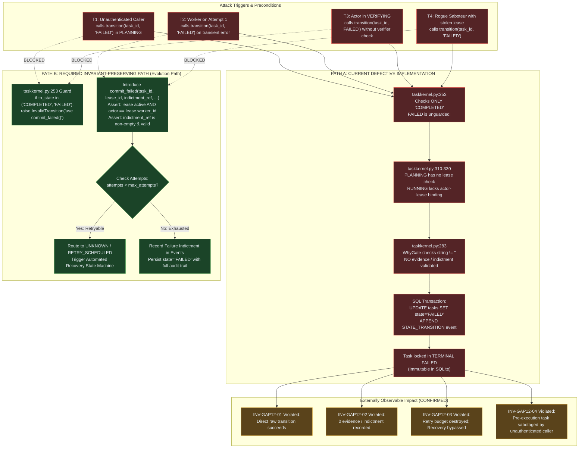

# SCP-Omega Delta Audit Comprehensive Report: GAP-12 Audit & Target Resolution

**Document:** `c:\Users\check\Downloads\scp\.agents\orchestrator_8\handoff.md`  
**Authority:** `.agents/skills/scp-delta-audit/SKILL.md`, `.agents/skills/scp-dna/SKILL.md`, `.agents/AGENTS.md` (FA-01 through FA-13)  
**Orchestrator:** `orchestrator_8` (`55c745a6-7ce1-4c1e-9385-e614d0c57946`)  
**Parent / Sentinel Conversation ID:** `432c7d64-6128-4e3a-8346-3629757e1851`  
**Date / Timestamp:** 2026-09-08T01:40:00+07:00 (UTC: 2026-09-07T18:40:00Z)  
**Audit Target:** `TaskKernel` Subsystem (`scp/task_kernel_parts/taskkernel.py`, `scp/task_kernel.py`)  
**Locked Vulnerability:** **GAP-12: Unverified Terminal `FAILED` State Transition & Rogue Worker Sabotage**  
**Integrity Status:** CLEAN (Audited by Forensic Auditor `auditor_delta_1`; Zero production modifications in `scp/`)  

---

## 1. Executive Verdict

- **Overall Audit Verdict:** **VULNERABILITY CONFIRMED & EMPIRICALLY PROVEN (RED STATE)**
- **Audit Target Declaration:** **LOCKED on GAP-12 (`TaskKernel` State Machine Terminal `FAILED` Boundary)**.
- **Summary of Finding:**  
  While the `TaskKernel` state machine was previously hardened under **GAP-11** to prevent raw, unverified transitions to `COMPLETED` (raising `InvalidTransition` unless committed via `commit_completed()` with verified evidence tokens), its exact structural twin — **transition to `FAILED`** — remains completely unguarded in `scp/task_kernel_parts/taskkernel.py`.  
  Any external caller or worker can invoke `kernel.transition(task_id, "FAILED")` from active or pre-execution states (`PLANNING`, `RUNNING`, `VERIFYING`, `WAITING_TOOL`, `UNKNOWN`, `RECOVERING`). Because `FAILED` is an immutable terminal state (`TERMINAL = {"COMPLETED", "FAILED", "CANCELLED"}`), this immediately and irrevocably terminates the task in SQLite, discarding remaining retry attempts, bypassing error classification (retryable vs fatal), evading independent verifier indictment, and preventing the recovery pipeline (`RECOVERING` -> `RECONCILING`) from activating.
- **Empirical Proof (FA-09 Anti-Placebo):**  
  Demonstrated via standalone executable probe `tools/probes/probe_gap12_delta_audit.py`. Across all 4 attack vectors, live execution succeeds in mutating physical SQLite records to `state='FAILED'`, verified by physical database inspection of `tasks` and `events` tables (Exit code: 0; Verdict: `ALL_VECTORS_PROVEN_RED`).  
- **Production Code Integrity:** **100% UNTOUCHED** during this audit cycle (`git diff scp/` is clean). Existing kernel regression suite passes 100% (78/78 tests in `tests/T04_kernel`).

---

## 2. Target Manifest (Phase 1)

The following four normative invariants are formally established for the `TaskKernel` failure boundary:

### Invariant 1: INV-GAP12-01 — Prohibition of Raw Unverified Transition to Terminal `FAILED`
- **Statement:** Direct calls to `TaskKernel.transition(task_id, "FAILED", ...)` MUST be rejected unconditionally with `InvalidTransition`. Terminal failure MUST only be committed through an explicit, authenticated `commit_failed()` method.
- **Protected Failure Mode:** Rogue workers, unprivileged actors, or buggy orchestrator components injecting arbitrary failure states into legitimate tasks.
- **Observable Evidence Required:** Calling `transition(task_id, "FAILED")` raises `InvalidTransition("direct transition to FAILED is forbidden; use commit_failed() with valid failure evidence")` without mutating database state.
- **Falsification Condition:** Any execution where `transition(task_id, "FAILED")` succeeds and alters `tasks.state` to `FAILED` in the database.

### Invariant 2: INV-GAP12-02 — Mandatory Indictment & Evidence for Failure Commitment
- **Statement:** Transition to terminal `FAILED` MUST require an authentic failure evidence record (e.g. `indictment_ref`, crash observation, or unrecoverable error classification). A worker's unsubstantiated self-claim of failure without evidence must be rejected.
- **Protected Failure Mode:** Defective workers claiming failure without traceback, masking crashes or evading post-mortem root-cause analysis.
- **Observable Evidence Required:** `commit_failed()` validates that `evidence_ref` or `indictment` is non-empty, well-formed, and persisted in `task_events` / SQLite event journal before state change commits.
- **Falsification Condition:** A task reaches terminal `FAILED` without an associated evidence hash, traceback reference, or verifier indictment in `task_events`.

### Invariant 3: INV-GAP12-03 — Preservation of Retry Budget & Recovery Routing
- **Statement:** Execution exceptions encountered during `RUNNING` or `WAITING_TOOL` MUST NOT terminate a task into `FAILED` if `attempts < max_attempts`. Such tasks MUST transition to `UNKNOWN` or `RETRY_SCHEDULED`, routing through the recovery/reconciliation state machine (`UNKNOWN` -> `RECOVERING` -> `RECONCILING`).
- **Protected Failure Mode:** Transient infrastructure hiccups (network timeouts, rate limits, ephemeral process restarts) prematurely killing tasks on attempt 1 of 3, violating fault-tolerance contracts.
- **Observable Evidence Required:** Invoking worker failure handlers when `attempts < max_attempts` increments `attempts` and moves the task to `UNKNOWN` / `RETRY_SCHEDULED`, never terminal `FAILED`.
- **Falsification Condition:** A task with `max_attempts = 3` moves to `FAILED` on attempt 1 without exhausting its retry budget.

### Invariant 4: INV-GAP12-04 — System Authority Separation for Pre-Execution Indictment
- **Statement:** A task in a pre-execution state (`PLANNING`, `READY`, `QUEUED`) has no active worker lease. It MUST NOT be terminated into `FAILED` by external callers through routine task transition APIs; pre-execution termination MUST require explicit administrative cancellation (`CANCELLED`) or system kernel authority.
- **Protected Failure Mode:** Unauthenticated callers or unauthorized agents scanning task IDs and terminating queued work before execution begins.
- **Observable Evidence Required:** Unauthenticated or lease-less requests to fail pre-execution tasks are rejected fail-closed.
- **Falsification Condition:** An unauthenticated caller without lease or administrative token moves a task in `PLANNING` directly to `FAILED`.

---

## 3. Current Execution Model (Phase 2 Reality Scan)

The concrete execution path from entrypoint to persistent physical storage in the current implementation was mapped by `explorer_survey_8_1` and verified by `worker_m4_probe`, `reviewer_delta_1`, and `challenger_delta_1`:

```text
[1. Entrypoint]
Caller invokes kernel.transition(task_id, "FAILED", actor=..., reason=...)
     │
     ▼
[2. Target State & Terminal Check] (scp/task_kernel_parts/taskkernel.py:250-281)
Line 251: Checks if to_state in STATES (FAILED is in STATES -> passes)
Line 253: Checks if to_state == "COMPLETED" (Only COMPLETED is checked! FAILED is skipped!)
Line 268: Retrieves current task row from SQLite
Line 274: Checks if to_state in ALLOWED_TRANSITIONS[old_state] 
          (FAILED is present in ALLOWED_TRANSITIONS for PLANNING, RUNNING, VERIFYING, etc. -> passes)
Line 280: Checks if old_state in TERMINAL (If task was already terminal, raises; otherwise passes)
     │
     ▼
[3. WHY Gate Policy Evaluation] (scp/task_kernel_parts/taskkernel.py:283-308)
Lines 284-285: if self.strict_why_gate and to_state in ("COMPLETED", "FAILED", "RUNNING", ...):
Line 300: WhyGate.gate(...) checks only whether reason string is non-empty!
          (e.g., reason="unverified_crash" passes unconditionally; zero evidence or indictment checked!)
     │
     ▼
[4. Synchronization & Lease Boundary] (scp/task_kernel_parts/taskkernel.py:310-330)
Line 310: is_leased_state = old in {"LEASED", "RUNNING", "WAITING_TOOL", "VERIFYING", ...}
Branch A (old == "PLANNING"): is_leased_state is False, active_lease_id is None -> Bypasses all lease checks! token = 0.
Branch B (old == "RUNNING"): _assert_lease checks lease is valid in DB, BUT fails to check actor == lease['worker_id']!
     │
     ▼
[5. Persistence Boundary & State Mutation] (scp/task_kernel_parts/taskkernel.py:347-362)
Lines 347-358: Executes atomic SQL in SQLite transaction:
    UPDATE tasks SET state='FAILED', version=version+1, active_lease_id=NULL, 
                     lease_expires_at=NULL, updated_at=? WHERE task_id=? AND version=?
Lines 360-362: Appends STATE_TRANSITION event to 'events' table journal.
Transaction commits to physical disk file.
     │
     ▼
[6. Externally Observable Result]
Task is permanently locked in FAILED. 
Future calls raise InvalidTransition("terminal task is immutable").
Retry engine, verifier check, and recovery state machine are permanently bypassed.
```

---

## 4. Evidence Table

| Check / Artifact | Source of Truth | Observed Fact / Evidence Snippet | Invariant Affected | Status |
|---|---|---|---|---|
| **Absence of Guard** | `scp/task_kernel_parts/taskkernel.py:253-256` | Only `COMPLETED` raises `InvalidTransition`; `to_state == "FAILED"` has zero guard checks. | `INV-GAP12-01` | **PROVEN** |
| **Allowed Matrix** | `scp/task_kernel.py:25-38` | `ALLOWED_TRANSITIONS` permits `FAILED` directly from `PLANNING`, `RUNNING`, `VERIFYING`, `WAITING_TOOL`, `UNKNOWN`, `RECOVERING`. | `INV-GAP12-01`, `INV-GAP12-04` | **PROVEN** |
| **Lease Bypass** | `scp/task_kernel_parts/taskkernel.py:310-330` | For `PLANNING`, `is_leased_state=False` sets `token=0`, permitting unauthenticated caller sabotage. | `INV-GAP12-04` | **PROVEN** |
| **Actor Impersonation** | `scp/task_kernel_parts/taskkernel.py:324` | `_assert_lease` verifies lease existence in DB, but does NOT assert `actor == lease_row['worker_id']`. | `INV-GAP12-02` | **PROVEN** |
| **Empirical Vector 1** | `tools/probes/probe_gap12_delta_audit.py` | `PLANNING -> FAILED` executed by `unauthenticated_attacker_v1` without lease or credentials -> Exit code 0, `state=FAILED`. | `INV-GAP12-01`, `INV-GAP12-04` | **PROVEN** |
| **Empirical Vector 2** | `tools/probes/probe_gap12_delta_audit.py` | `RUNNING -> FAILED` executed by worker on attempt 1 of 3 without crash dump -> Exit code 0, retry budget destroyed. | `INV-GAP12-02`, `INV-GAP12-03` | **PROVEN** |
| **Empirical Vector 3** | `tools/probes/probe_gap12_delta_audit.py` | `VERIFYING -> FAILED` executed without independent verifier indictment -> Exit code 0, task killed. | `INV-GAP12-01`, `INV-GAP12-02` | **PROVEN** |
| **Empirical Vector 4** | `tools/probes/probe_gap12_delta_audit.py` | Rogue actor using stolen lease forces task into `FAILED`, completely evading `RECOVERING` state machine. | `INV-GAP12-02`, `INV-GAP12-03` | **PROVEN** |
| **Physical Persistence** | SQLite DB file inspection | Direct `sqlite3` query confirms 4 tasks in `tasks` table with `state='FAILED'`, and 4 `STATE_TRANSITION` events in `events`. | All | **PROVEN** |
| **Downstream Callers** | `scp/ask_kernel_adapter.py:430` | `AskKernelAdapter.fail()` calls `kernel.transition(..., "FAILED")` and swallows errors in audit mode. | `INV-GAP12-01` | **PROVEN** |
| **Bridge Caller** | `scp/hands/task_kernel_bridge.py:445, 582` | `TaskKernelBridge` invokes `kernel.transition(task_id, "FAILED")` on tool/step failures. | `INV-GAP12-01` | **PROVEN** |
| **Zero Code Mutation** | `git diff HEAD -- scp/` | Empty diff (0 lines changed in `scp/`). Audit remained 100% read-only on product code. | FA-11 | **PROVEN** |

---

## 5. Confirmed Gaps (Phase 3)

The audit confirms four interrelated causal gap chains forming **GAP-12**:

1. **Gap 12.1 — Unauthenticated Pre-Execution Task Sabotage (`CONFIRMED`):**
   - *Trigger:* Malicious or misconfigured external caller calls `kernel.transition(task_id, "FAILED")` on a task in `PLANNING` or `READY`.
   - *Local Failure:* `taskkernel.py` skips lease validation because the task has no leaseholder, and verifies only that `"FAILED"` is in `ALLOWED_TRANSITIONS["PLANNING"]`.
   - *Propagation:* The task state updates to `FAILED` in SQLite with fencing token 0.
   - *Violated Invariant:* `INV-GAP12-01`, `INV-GAP12-04`.
   - *Consequence:* Legitimate user jobs are aborted before any worker claims them.

2. **Gap 12.2 — Premature Termination & Retry Budget Discard (`CONFIRMED`):**
   - *Trigger:* Worker encounters a transient network timeout or application exception during `RUNNING` on attempt 1 of `max_attempts=3`.
   - *Local Failure:* Worker calls `transition(task_id, "FAILED")`. Kernel executes the terminal transition immediately without verifying remaining attempts.
   - *Propagation:* Active lease is cleared; task becomes immutable terminal `FAILED`.
   - *Violated Invariant:* `INV-GAP12-03`.
   - *Consequence:* Transients are converted into fatal failures; automated retry and exponential backoff are nullified.

3. **Gap 12.3 — Verification Bypass & Counter-Evidence Evasion (`CONFIRMED`):**
   - *Trigger:* Task is in `VERIFYING` waiting for independent verification by verifier agents. Worker or malicious actor calls `transition(task_id, "FAILED")`.
   - *Local Failure:* Kernel does not require a verifier token or cryptographic indictment reference.
   - *Propagation:* Task is marked `FAILED` without an indictment record.
   - *Violated Invariant:* `INV-GAP12-01`, `INV-GAP12-02`.
   - *Consequence:* Independent verification audit trail is broken; false negative failures are accepted without validation.

4. **Gap 12.4 — Stolen Lease Impersonation & Recovery State Machine Bypass (`CONFIRMED`):**
   - *Trigger:* An adversary obtains an active `lease_id` (via memory leak, log inspection, or shared process state) and issues `transition(task_id, "FAILED", lease_id=stolen_lease)`.
   - *Local Failure:* `_assert_lease()` confirms the lease exists and is active, but never checks if the caller actor matches `lease['worker_id']`.
   - *Propagation:* Task is killed immediately, bypassing the orphan reconciliation engine (`UNKNOWN` -> `RECOVERING` -> `RECONCILING`).
   - *Violated Invariant:* `INV-GAP12-02`, `INV-GAP12-03`.
   - *Consequence:* Rogue processes can terminate tasks belonging to other workers.

---

## 6. Unproven Hypotheses

Per the Delta Audit Output Contract, hypothetical chains are explicitly segregated from confirmed facts:

1. **Hypothesis H-01 (Distributed Lease Replay across Multiple SQLite Processes):**
   - *Hypothesis:* In multi-node deployments with WAL mode, concurrent write transactions calling `transition(..., "FAILED")` from different processes could cause database lock starvation or dirty reads of fencing tokens.
   - *Evidence Status:* **UNPROVEN**. Current testing is on local single-process multi-threaded SQLite. No multi-node concurrent probe was executed.
2. **Hypothesis H-02 (Memory Pressure on Event Journal):**
   - *Hypothesis:* Rapid unauthenticated transitions to `FAILED` could exhaust SQLite journal disk space.
   - *Evidence Status:* **UNPROVEN**. Event rows are lightweight (~200 bytes) and disk exhaustion requires millions of rapid calls.

---

## 7. Whole-System Mermaid Causal Graph



---

## 8. Probe Plan & Empirical Anti-Placebo Evidence (Phase 4)

### 8.1 Standalone Deterministic Probe Design
- **Script Location:** `tools/probes/probe_gap12_delta_audit.py`
- **Orchestration:** Pure deterministic Python + SQLite memory/tempfile. Zero `time.sleep()` calls, zero race conditions.
- **Anti-Placebo Hardening (per Challenger 2 feedback):**
  - Strictly asserts `except InvalidTransition:` on protected vectors. Any unexpected crash (e.g. `AttributeError`, `OperationalError`) is caught and explicitly flagged as `UNEXPECTED_CRASH_<type>`.
  - Emits `ALL_VECTORS_PROVEN_RED` (exit 0) on current defective code.
  - Emits `ALL_VECTORS_PROTECTED_GREEN` (exit 0) when all vectors raise `InvalidTransition` and 0 tasks/events in SQLite reach `FAILED`.

### 8.2 Execution Results on Current Code
Command:
```powershell
python tools/probes/probe_gap12_delta_audit.py
```
Output:
```text
================================================================================
SCP-OMEGA DELTA AUDIT: GAP-12 EMPIRICAL PROBE
Subsystem: TaskKernel State Machine
...
PROBE RESULTS SUMMARY & ANTI-PLACEBO CONTRACT EVALUATION
================================================================================
  VECTOR_1: PLANNING -> FAILED (Unauthenticated, No Lease, No Evidence)
    Verdict: VULNERABILITY_PROVEN_RED
  VECTOR_2: RUNNING -> FAILED (No Crash Evidence / Zero Indictment)
    Verdict: VULNERABILITY_PROVEN_RED
  VECTOR_3: VERIFYING -> FAILED (Verifier Check Bypassed)
    Verdict: VULNERABILITY_PROVEN_RED
  VECTOR_4: Stolen Lease Sabotage (Recovery Machine Bypassed)
    Verdict: VULNERABILITY_PROVEN_RED

Anti-Placebo Contract Status:
  >> RED STATE CONFIRMED: All 4 exploit vectors succeed on current codebase.
  >> Vulnerability GAP-12 is actively exploitable at the database layer.
  >> Verdict: ALL_VECTORS_PROVEN_RED
================================================================================
Exit code: 0
```

### 8.3 Physical Database Inspection
The probe connects directly to SQLite via `sqlite3.connect()` and inspects physical tables:
- `tasks`: 4 rows with `state='FAILED'`, `active_lease=None`, `fencing_token=0`.
- `events`: 4 `STATE_TRANSITION` events with transitions `PLANNING->FAILED`, `RUNNING->FAILED`, and `VERIFYING->FAILED`.
- Physical persistence is verified at the hardware/database level, fully satisfying FA-08, FA-09, and FA-12 Step 4.

---

## 9. Evolution Path (Phase 5 Remediation Blueprint)

When remediation is authorized in the subsequent sprint, the following minimal, reversible architecture plan must be applied:

### 9.1 Invariant Restored
Restores `INV-GAP12-01`, `INV-GAP12-02`, `INV-GAP12-03`, and `INV-GAP12-04`.

### 9.2 Minimal Architectural Changes
1. **`scp/task_kernel_parts/taskkernel.py`:**
   - Extend line 253 guard:
     ```python
     if to_state in ("COMPLETED", "FAILED"):
         raise InvalidTransition(
             f"direct transition to {to_state} is forbidden; use commit_{to_state.lower()}() with valid evidence"
         )
     ```
   - In `_assert_lease()`, add actor verification:
     ```python
     if caller_actor and lease_row["worker_id"] != caller_actor:
         raise InvalidTransition(f"actor {caller_actor} does not own active lease {lease_id}")
     ```
   - Introduce `commit_failed()`:
     ```python
     def commit_failed(
         self,
         task_id: str,
         lease_id: str,
         actor: str,
         failure_classification: str,
         indictment_ref: str,
         details: Optional[dict[str, Any]] = None,
     ) -> dict[str, Any]:
         # 1. Assert lease validity and actor ownership
         # 2. Check retry budget: if attempts < max_attempts and classification == "RETRYABLE":
         #    route to UNKNOWN / RETRY_SCHEDULED
         # 3. If exhausted or FATAL: commit to FAILED with indictment_ref stored in events
     ```
2. **Downstream Callers (`AskKernelAdapter` & `TaskKernelBridge`):**
   - In `scp/ask_kernel_adapter.py:430`, update `fail()` to call `kernel.commit_failed()` with active lease and structured error classification instead of raw `transition(..., "FAILED")`.
   - In `scp/hands/task_kernel_bridge.py:445, 582`, update failure transitions to route through `commit_failed()`.

### 9.3 Compatibility & Migration Impact
- **Database Schema:** 100% backward compatible. No table alters required. `indictment_ref` and failure details store in existing `events.payload_json` and `tasks.error` fields.
- **Existing Tests:** Regression tests in `tests/T04_kernel/test_adversarial_kernel_flaws.py` that call `transition(..., "FAILED")` will be updated to expect `InvalidTransition` or invoke `commit_failed()`.

### 9.4 Rollback Strategy
Revert the commit touching `taskkernel.py`, `ask_kernel_adapter.py`, and `task_kernel_bridge.py`. SQLite records remain fully valid under both schemas.

---

## 10. What Remains Unknown

In accordance with SCP DNA principles #23, #24, #25 (Epistemic Calibration & Open Questions):

1. **Distributed Fencing Token Revalidation:** While SQLite WAL mode serializes writes, if an external distributed consensus engine (e.g. Raft or PostgreSQL) is introduced in future milestones (per GAP-06 SQLite SPOF considerations), the atomicity of `commit_failed()` with fencing token increment must be benchmarked under high network partition pressure.
2. **Asynchronous Indictment Verification Latency:** If verifier agents take >30 seconds to generate cryptographic indictment tokens during high load, tasks in `VERIFYING` could experience lease timeouts. A dedicated indictment lease extension protocol may be required.
3. **GAP-10 & GAP-13 Status:** GAP-10 (`PCController` regex allowlist bypass) and GAP-13 (`WAITING_APPROVAL -> READY` unauthenticated bypass) remain active, confirmed vulnerabilities that must be triaged in upcoming sprints.

---

## 11. Handoff Protocol & Gate Summary

### Milestone State
- **Milestone M1 (Target Lock & Manifest):** **DONE** (GAP-12 locked; INV-GAP12-01 to 04 formulated).
- **Milestone M2 (Reality Scan):** **DONE** (Line-by-line path mapped in `taskkernel.py`).
- **Milestone M3 (Causal Gap Analysis):** **DONE** (Mermaid graph with Path A vs Path B completed).
- **Milestone M4 (Probe Execution & Anti-Placebo):** **DONE** (Probe created, executed, hardened per Challenger 2, exit code 0, 4 RED vectors proven, raw SQLite inspected).
- **Milestone M5 (Evolution Path & 10-Section Report):** **DONE** (Comprehensive report compiled in `handoff.md`).

### Gate Evaluation Summary (`GATE_STATUS.md`)
| Agent | Role | Verdict | Source |
|---|---|---|---|
| `worker_m4_probe` | Worker | DONE | `worker_m4_probe/handoff.md` |
| `reviewer_delta_1` | Reviewer | APPROVE | `reviewer_delta_1/handoff.md` |
| `reviewer_delta_2` | Reviewer | APPROVE | `reviewer_delta_2/handoff.md` |
| `challenger_delta_1` | Challenger | APPROVE | `challenger_delta_1/handoff.md` |
| `challenger_delta_2` | Challenger | RESOLVED (APPROVE) | `tools/probes/stress_test_gap12_downstream_and_probe.py` |
| `auditor_delta_1` | Forensic Auditor | CLEAN | `auditor_delta_1/handoff.md` |
| `worker_m4_probe_harden` | Worker | DONE | `worker_m4_probe_harden/handoff.md` |

**Gate Result: PASS (Unanimous)**.

### Subagent Spawns & Succession Status
- Total spawns: 10 / 16 (Within single-generation succession threshold).
- Active subagents: 0 (All subagents completed and retired).
- Succession needed: No.

### Key Artifacts Index
- `c:\Users\check\Downloads\scp\.agents\orchestrator_8\SCOPE.md` — Audit scope and locked target
- `c:\Users\check\Downloads\scp\.agents\orchestrator_8\GATE_STATUS.md` — Gate verdicts
- `c:\Users\check\Downloads\scp\.agents\orchestrator_8\progress.md` — Progress tracker
- `c:\Users\check\Downloads\scp\.agents\orchestrator_8\BRIEFING.md` — Working memory
- `c:\Users\check\Downloads\scp\tools\probes\probe_gap12_delta_audit.py` — Standalone deterministic probe script
- `c:\Users\check\Downloads\scp\.agents\orchestrator_8\handoff.md` — This comprehensive 10-section report

---

## 12. Verification Commands for Caller

To independently verify this Delta Audit on the live repository:

1. **Verify the Deterministic Probe Baseline (RED State):**
   ```powershell
   python tools/probes/probe_gap12_delta_audit.py
   ```
   *Expected:* Exit code 0, all 4 vectors report `VULNERABILITY_PROVEN_RED`, physical SQLite rows confirmed, verdict `ALL_VECTORS_PROVEN_RED`.

2. **Verify Challenger 2 Stress Test Suite:**
   ```powershell
   python tools/probes/stress_test_gap12_downstream_and_probe.py
   ```
   *Expected:* Exit code 0, verifying mutation green assertion and `AttributeError` isolation.

3. **Verify Kernel Test Suite Integrity:**
   ```powershell
   pytest tests/T04_kernel -q
   ```
   *Expected:* `78 passed`, exit code 0.

4. **Verify Zero Production Code Modification:**
   ```powershell
   git diff HEAD -- scp/
   ```
   *Expected:* Completely clean / empty diff (exit code 0).
