# Delta Audit Report: HandsExecutor & Capability Authority
**Target Subsystem**: `scp/hands/hands_executor.py` & Capability Authority Infrastructure  
**Auditor**: Spec Miner 1 (`spec_miner_invariants_1`)  
**Audit Protocol**: SCP Delta Audit Mode (`/boost`) via `SKILL.md` (`scp-delta-audit`, `scp-dna`, `scp-capability-security-review`)  
**Timestamp**: 2026-09-07T00:54:00Z  
**Governing Constraints**: FA-01 to FA-10, Zero-Trust, Fail-Closed, Anti-Placebo, Read-Only Audit  

---

## 1. Executive Verdict

- **Target Module**: `scp/hands/hands_executor.py` (and associated interfaces in `scp/security/capability_epoch.py`, `scp/hands/task_kernel_bridge.py`, `scp/api/routes/hands_routes.py`, `scp/hands/planner.py`).
- **Audit Verdict**: **FATAL VULNERABILITY CONFIRMED — FA-05 VIOLATION (SELF-GRANTING AUTHORITY)**.
- **Evidence Level**: **LEVEL 4 (Direct code path with mechanically demonstrable consequence)**, verified against **LEVEL 2 (Existing production golden test: `tests/T09_golden_task/test_golden_a_agent_os.py`)**.
- **Core Finding**:
  In `scp/hands/hands_executor.py` at line 111 (`execute`) and line 326 (`rollback`), whenever `capability_token` is omitted by the caller (`capability_token is None`), `HandsExecutor` automatically mints and signs a valid capability token for itself by invoking:
  ```python
  capability_token = capability_token or self.capability_authority.issue(f"hands:{action}")
  ```
  Because neither the HTTP API layer (`HandsActionRequest` in `hands_routes.py`) nor the kernel bridge (`TaskKernelHandsBridge.execute` in `task_kernel_bridge.py`) accepts or passes a capability token, **100% of all current mutating actions across the entire platform rely on executor self-authorization**.
  The Policy Enforcement Point (PEP) is acting as its own Policy Decision Point (PDP) and Authority Issuer. This completely dismantles Zero-Trust isolation, rendering the capability token validation in `_check_capability` a pure decorative placebo.

---

## 2. Navigation Map: Line-by-Line Call Graph & Execution Trace

To prevent cognitive context overload and enforce the **Call Graph Navigation Mandate**, the following execution traces detail every line of code traversed across the system boundaries.

### Trace 1: API Route to Side-Effect Execution (`POST /v3/hands/execute`)

```text
[HTTP Client / Orchestrator]
    │
    ▼ (Line 157)
scp/api/routes/hands_routes.py::hands_execute(payload: HandsActionRequest, request, x_scp_pc_token)
    │
    ├── Line 158: _guard(request, x_scp_pc_token)  [Checks HMAC of PC token]
    ├── Line 159: request_key = request.headers.get("X-SCP-Idempotency-Key")
    └── Line 160: await _active_bridge().execute(payload.action, payload.params, payload.capabilityLevel, payload.approved, payload.dryRun, request_key=request_key)
        │
        │  [NOTE: HandsActionRequest has NO capabilityToken field. Token is NOT forwarded!]
        ▼
scp/hands/task_kernel_bridge.py::TaskKernelHandsBridge.execute(action, params, capability_level, approved, dry_run, request_key)
    │
    ├── Line 334: definition = self.executor.registry.require(action)
    ├── Line 336-338: if not definition.mutates_state or dry_run:
    │       └── Line 338: return await self.executor.execute(action, params, capability_level, approved, dry_run)
    │
    ├── Line 342-409: Task creation and lifecycle transitions (PLANNING -> READY -> QUEUED)
    ├── Line 411: lease = self.kernel.claim(task_id, self.worker_id, ttl_seconds=60.0)
    ├── Line 417: self.kernel.start(task_id, lease.lease_id)
    ├── Line 419: logical_key, claimed = self.kernel.idempotency_claim(...)
    ├── Line 441: checkpoint_id = self.kernel.checkpoint(task_id, lease.lease_id, action, "WAITING_TOOL", ...)
    ├── Line 474: heartbeat_task = asyncio.create_task(self._heartbeat_until_finished(...))
    └── Line 482: result = await self.executor.execute(action, params, capability_level, approved, False)
        │
        │  [NOTE: Line 482 calls executor.execute WITHOUT capability_token! Defaults to None!]
        ▼
scp/hands/hands_executor.py::HandsExecutor.execute(action, params, capability_level, approved, dry_run, capability_token=None)
    │
    ├── Line 109: started = time.perf_counter()
    ├── Line 110: try:
    ├── Line 111:     capability_token = capability_token or self.capability_authority.issue(f"hands:{action}")
    │   │
    │   │  [CRITICAL FLAW FA-05]: Since capability_token is None, executor calls its OWN authority to issue a token!
    │   ▼
    │   scp/security/capability_epoch.py::CapabilityAuthority.issue(subject="hands:<action>")
    │       ├── Line 103: state = self._load()
    │       ├── Line 104: if state["revoked"]: raise CapabilityRevokedError(...)
    │       └── Line 106: return CapabilityToken(subject=subject, epoch=state["epoch"], token_id=uuid.uuid4().hex, issued_at=time.time())
    │   ▲
    ├── Line 117: definition = self.registry.require(action)
    ├── Line 122: allowed, reason = self._check_capability(definition, capability_level, approved, capability_token)
    │   │
    │   ▼
    │   scp/hands/hands_executor.py::_check_capability(definition, capability_level, approved, capability_token)
    │       ├── Line 69: if not self.capability_authority.validate(capability_token): return False, "Capability token is revoked or stale"
    │       │   │  [NOTE: Validates the token IT JUST ISSUED ITSELF. Always returns True!]
    │       ├── Line 71: if self.controller.kill_switch_engaged(): return False, ...
    │       ├── Line 73: if capability_level < definition.capability_level: return False, ...
    │       ├── Line 75: if definition.requires_approval and not approved: return False, ...
    │       └── Line 77: return True, "Policy requirements satisfied"
    │   ▲
    ├── Line 127: if dry_run: return dry_run_result
    ├── Line 132: if not self.capability_authority.validate(capability_token):  [Re-validates self-issued token]
    │
    ├── Lines 134-317: Dispatch Table to Driver:
    │   ├── Line 235 (pc.write_file):
    │   │   ├── Line 239: write_result = await self.controller.write_file(str(target), content, capability_level, approved)
    │   │   ├── Line 243: checkpoint_id = self._checkpoint(...)
    │   │   └── Line 244: result = {**write_result, "checkpointId": checkpoint_id, "verification": ...}
    │   ├── Line 150 (pc.process_snapshot):
    │   │   └── Line 151: result = await self._pc_command("tasklist /FO CSV", definition)
    │   └── Line 250 (web.browse_public):
    │       └── Line 251: result = await self.navigator.browse_public(...)
    │
    ├── Line 320: result.update({"action": action, ..., "capabilityEpoch": capability_token.epoch})
    ├── Line 321: self._audit("ACTION_EXECUTED" if result.get("success") else "ACTION_FAILED", result)
    └── Line 322: return result
        │
        ▼ (Returns to TaskKernelHandsBridge)
scp/hands/task_kernel_bridge.py::TaskKernelHandsBridge.execute
    │
    ├── Line 514: if bool(result.get("success")) and bool(result.get("verification", {}).get("passed")):
    ├── Line 516:     self.kernel.transition(task_id, "VERIFYING", ...)
    ├── Line 518:     evidence_ref = self._evidence_ref(task_id, result)
    ├── Line 520:     self.kernel.idempotency_complete(logical_key, evidence_ref)
    ├── Line 522:     final_task = self.kernel.commit_verification_result(task_id, lease.lease_id, {"verdict": "VERIFIED", ...})
    └── Line 542: return {**result, "kernel": {"taskId": task_id, "state": "COMPLETED", ...}}
```

### Trace 2: Rollback Execution Path (`POST /v3/hands/rollback`)

```text
scp/api/routes/hands_routes.py::hands_rollback(payload: HandsRollbackRequest, ...)
    └── Line 167: await _active_bridge().rollback(payload.checkpointId, payload.capabilityLevel, payload.approved)
        ▼
scp/hands/task_kernel_bridge.py::TaskKernelHandsBridge.rollback(checkpoint_id, capability_level, approved)
    └── Line 101: return await self.executor.rollback(checkpoint_id, capability_level, approved)
        ▼
scp/hands/hands_executor.py::HandsExecutor.rollback(checkpoint_id, capability_level=3, approved=False, capability_token=None)
    ├── Line 326: capability_token = capability_token or self.capability_authority.issue("hands:rollback")
    │   │  [CRITICAL FLAW FA-05]: Self-issues token for "hands:rollback"!
    ├── Line 329: if not self.capability_authority.validate(capability_token): return ...
    ├── Line 333: if capability_level < CapabilityLevel.WORKSPACE or not approved: return ...
    ├── Line 353: shutil.copy2(backup_path, target)  [Overwrites target file]
    ├── Line 356: target.unlink()                     [Or deletes newly created file]
    ├── Line 361: self._audit("ROLLBACK", result)
    └── Line 362: return result
```

### Trace 3: HandsPlanner Execution Path (`HandsPlanner.run_plan`)

```text
scp/hands/planner.py::HandsPlanner.run_plan(plan_id, capability_level, approved, dry_run, stop_on_failure, capability_token="")
    └── Line 412: await self._run_plan_locked(...)
        │
        ├── Line 457: verify_token(capability_token)  [Checks HMAC token from scp.core.capability_token]
        └── Line 479: last_result = await self.executor.execute(step["action"], step.get("params", {}), requested_capability, request_approved, dry_run or bool(step.get("dryRun", False)))
            │
            │  [CRITICAL FLAW]: Planner evaluates token at plan level, but DOES NOT pass any token to self.executor.execute()!
            └── HandsExecutor falls back to Trace 1 Line 111 (self-granting).
```

---

## 3. Phase 1 — TARGET MANIFEST (Necessary Invariants)

In the perfect target architecture (SCP-Omega), tool execution across OS, process, and network boundaries must satisfy four non-negotiable invariants.

### Invariant Catalog

| Invariant ID | Name | Invariant Statement | Protected Failure Mode | Observable Evidence Required | Falsification Condition |
|---|---|---|---|---|---|
| **INV-AUTH-01** | **Disjoint Authority Boundary (Separation of Issuer and Executor)** | The Tool Executor (`HandsExecutor` / PEP) must never possess token issuance capability, minting authority, or write-access to the Capability Authority's issuance interface; it may only consume, validate, and enforce tokens issued by an external, independent Policy Decision Point (PDP / GovernanceAuthority / TaskKernel). | Self-Authorization / Confused Deputy / FA-05 violation where an executor manufactures its own permissions to bypass policy gates. | 1. Static AST: `HandsExecutor` contains zero calls to `issue()` and cannot instantiate a writable `CapabilityAuthority`.<br>2. Runtime Contract: Calling `execute(action, capability_token=None)` fails closed immediately (`success=False`, `error="CapabilityRequiredError"`). | Any code path where `HandsExecutor.execute()` or `rollback()` performs driver execution when `capability_token` is missing or synthesized locally. |
| **INV-AUTH-02** | **Scoped Subject-Resource Binding (Zero Wildcards)** | Every capability token accepted by `HandsExecutor` must be cryptographically and durably bound to a specific execution subject (`task_id`, `attempt_id`), target action name, and resource hash; a token issued for action $A$ on resource $R_1$ cannot be accepted for action $B$ or resource $R_2$. | Scope Escalation / Token Substitution / Cross-Task Replay where a token for a benign read (`pc.status`) is used to authorize a destructive write (`pc.write_file`). | 1. Token schema includes `subject`, `action`, `resource_hash`, `epoch`, `expires_at`.<br>2. PEP validation explicitly enforces `token.action == action` and `token.resource_hash == hash(params)`. | Passing a valid token issued for `hands:pc.status` into `execute("pc.write_file", ...)` succeeds or touches the filesystem. |
| **INV-AUTH-03** | **Pre-Dispatch Zero-Trust PEP Gate (Fail-Closed Revocation)** | The Policy Enforcement Point (PEP) immediately before driver dispatch must atomically validate the token against the authoritative revocation epoch and state; if the token is missing, revoked, expired, or invalid, execution must abort fail-closed with zero side effects. | Post-Revocation Side Effects / TOCTOU where driver actions commit after operator quarantine or incident response has revoked capability. | 1. Atomic revocation probe: Revoking epoch halts in-flight dispatches prior to driver commit.<br>2. Driver containment: Zero file mutations, zero spawned processes, zero outbound HTTP requests when validation fails. | Any filesystem change, child process creation, or web navigation occurs when `capability_authority.validate(token)` returns False. |
| **INV-AUTH-04** | **Non-Repudiable Capability Lineage (Durable Provenance)** | Every execution record, audit log entry, and TaskKernel checkpoint must preserve the external token identity (`token_id`, `epoch`, `issuer_id`, `signature_ref`) alongside the action result and evidence reference. | Untraceable Execution / Ghost Actions where side effects are recorded with missing, falsified, or synthetic token provenance. | 1. Audit records in `audit.jsonl` contain verifiable `tokenId`, `capabilityEpoch`, and `issuer`.<br>2. TaskKernel journal events link directly to the authorizing grant record. | Any `ACTION_EXECUTED` or `CHECKPOINT_CREATED` log record exists with empty, null, or self-minted token metadata. |

---

## 4. Phase 2 — REALITY SCAN (Current Implementation vs Invariants)

An exhaustive scan of the repository reveals five structural violations of the target invariants.

### Reality Scan Matrix

| Violation ID | Source File & Lines | Symbol / Function | Control / Data Flow | Violated Invariant | Evidence Status | Preconditions for Exploitation |
|---|---|---|---|---|---|---|
| **V-01** | `scp/hands/hands_executor.py:110-115` | `HandsExecutor.execute` | `capability_token = capability_token or self.capability_authority.issue(f"hands:{action}")` | **INV-AUTH-01** (FA-05) | **PROVEN (Level 4 Direct Code Path)** | Caller passes `capability_token=None`. Trivially satisfied because callers currently pass nothing. |
| **V-02** | `scp/hands/hands_executor.py:325-328` | `HandsExecutor.rollback` | `capability_token = capability_token or self.capability_authority.issue("hands:rollback")` | **INV-AUTH-01** (FA-05) | **PROVEN (Level 4 Direct Code Path)** | Caller invokes `rollback()` without an externally granted rollback capability. |
| **V-03** | `scp/hands/hands_executor.py:53, 371-379` | `HandsExecutor.__init__`, `revoke_capabilities`, `restore_capabilities` | Executor instantiates `self.capability_authority` pointing to local disk and exposes administrative `restore()` | **INV-AUTH-01** | **PROVEN (Level 4 Direct Code Path)** | Access to Executor object allows un-quarantining self after Risk/Incident revocation. |
| **V-04** | `scp/security/capability_epoch.py:108-114` & `hands_executor.py:69` | `CapabilityAuthority.validate`, `HandsExecutor._check_capability` | `validate()` only checks `not state["revoked"] and token.epoch == state["epoch"]`. Ignores `token.subject` and `params`. | **INV-AUTH-02** | **PROVEN (Level 4 Direct Code Path)** | Caller obtains token for low-risk action (e.g. `pc.status`) and submits it to high-risk action (`pc.write_file`). |
| **V-05** | `scp/api/routes/hands_routes.py:38-50` & `scp/hands/task_kernel_bridge.py:314, 482` | `HandsActionRequest`, `TaskKernelHandsBridge.execute` | API request model and Kernel bridge omit `capability_token` parameter from interface and call signature. | **INV-AUTH-03**, **INV-AUTH-04** | **PROVEN (Level 4 Direct Code Path)** | Any HTTP request via FastAPI or bridge execution automatically drops into V-01 fallback. |

---

## 5. Phase 3 — CAUSAL GAP ANALYSIS

### 5.1 Mermaid Causal Graph

```mermaid
flowchart TD
    subgraph Path_A["PATH A: CURRENT IMPLEMENTATION (VULNERABLE / SELF-AUTHORIZING)"]
        A1[Caller invokes API / Bridge / Test] -->|No capability_token provided| A2[HandsExecutor.execute]
        A2 -->|V-01: capability_token is None| A3[self.capability_authority.issue 'hands:action']
        A3 -->|Self-Minted Token Returned| A4[Executor passes token to self._check_capability]
        A4 -->|self.capability_authority.validate token| A5{Token Valid?}
        A5 -->|YES: Because executor just issued it| A6[Policy Check Passes as Placebo]
        A6 --> A7[Driver Dispatch: PCController / WebNavigator]
        A7 --> A8[Disk / Process / Network Side Effect Executed]
        A8 --> A9[Synthetic Provenance Written to Audit & Kernel Ledger]
        A9 --> A10[FA-05 VIOLATION: PASS != TRUE - Self-Granting Complete]
    end

    subgraph Path_B["PATH B: REQUIRED INVARIANT-PRESERVING PATH (SCP-OMEGA ZERO-TRUST)"]
        B1[Caller requests Action Proposal] --> B2[GovernanceAuthority / PDP Policy Review]
        B2 -->|Evaluates Policy, Approval & Quotas| B3{Policy Approved?}
        B3 -->|NO| B4[DENY: Return 403 / Blocked Action]
        B3 -->|YES| B5[Independent Authority Mints Scoped CapabilityToken]
        B5 -->|Token bound to task_id + action + resource_hash| B6[TaskKernel attaches Token to Task Lease]
        B6 --> B7[TaskKernelHandsBridge dispatches to HandsExecutor with Token]
        B7 --> B8[HandsExecutor PEP Gate: INV-AUTH-01 & INV-AUTH-03]
        B8 -->|Token Missing or Self-Minted?| B9[FAIL-CLOSED: Reject immediately]
        B8 -->|Valid External Token| B10[Validate Action & Resource Match: INV-AUTH-02]
        B10 -->|Match Failed| B11[FAIL-CLOSED: Scope Mismatch Error]
        B10 -->|Match Verified| B12[Atomic Epoch Revocation Check: INV-AUTH-03]
        B12 -->|Epoch Stale / Revoked| B13[FAIL-CLOSED: Revoked Error]
        B12 -->|Active Epoch| B14[Execute Driver Side Effect]
        B14 --> B15[Record Immutable Token Lineage in Kernel & Audit: INV-AUTH-04]
    end

    style Path_A fill:#ffebee,stroke:#c62828,stroke-width:2px
    style Path_B fill:#e8f5e9,stroke:#2e7d32,stroke-width:2px
    style A10 fill:#ffcdd2,stroke:#b71c1c,stroke-width:2px
    style B15 fill:#c8e6c9,stroke:#1b5e20,stroke-width:2px
```



### 5.2 Detailed Causal Chains

#### Confirmed Causal Chain 1: GAP-01 (Executor Self-Granting Fallback)
1. **Trigger**: Caller invokes `HandsExecutor.execute(action="pc.write_file", params={"path": "..."}, capability_level=3, approved=True)` without providing `capability_token`.
2. **Local Failure**: Line 111 evaluates `capability_token or self.capability_authority.issue(f"hands:{action}")`. Instead of raising `CapabilityRequiredError`, `HandsExecutor` calls its own internal authority to mint a fresh token.
3. **Propagation**: Line 122 calls `self._check_capability()`. Line 69 calls `self.capability_authority.validate(capability_token)`. Because the token was minted with the current epoch fractions of a millisecond prior, validation unconditionally succeeds.
4. **Violated Invariant**: **INV-AUTH-01** (Disjoint Authority Boundary) & Rule **FA-05**.
5. **Externally Observable Consequence**: OS-level mutation occurs without any prior authorization from an external security/policy principal. The entire capability infrastructure acts as a no-op facade.

#### Confirmed Causal Chain 2: GAP-02 (Scope-Blind Token Replay)
1. **Trigger**: A legitimate read token is minted for `hands:pc.status` (Risk: low, Capability: 0). An adversarial caller submits this token to `HandsExecutor.execute("pc.write_file", ..., capability_token=status_token)`.
2. **Local Failure**: `CapabilityAuthority.validate(token)` in `capability_epoch.py:108-114` verifies ONLY:
   `not state["revoked"] and token.epoch == state["epoch"]`.
   It completely ignores `token.subject` and action/resource parameters.
3. **Propagation**: `_check_capability` sees that `validate()` returned `True`. It checks `capability_level` and `approved` parameters (passed as raw RAM variables by caller), but never verifies if the token was authorized for `pc.write_file`.
4. **Violated Invariant**: **INV-AUTH-02** (Scoped Subject-Resource Binding).
5. **Externally Observable Consequence**: Privilege escalation via token replay across dissimilar actions.

#### Confirmed Causal Chain 3: GAP-03 (Protocol Dropping at API & Bridge Boundary)
1. **Trigger**: An external operator or client attempts to supply a signed capability token via HTTP `POST /v3/hands/execute`.
2. **Local Failure**: `HandsActionRequest` (`scp/api/routes/hands_routes.py:38-44`) does not declare a `capabilityToken` field. FastAPI drops or ignores the token during deserialization.
3. **Propagation**: `TaskKernelHandsBridge.execute` (`scp/hands/task_kernel_bridge.py:314`) does not have a `capability_token` parameter in its signature. Line 482 calls `self.executor.execute()` with no token.
4. **Violated Invariant**: **INV-AUTH-03**, **INV-AUTH-04**.
5. **Externally Observable Consequence**: Downstream `HandsExecutor` is structurally forced to execute GAP-01 to avoid crashing, making self-granting unavoidable in the current runtime architecture.

---

### 5.3 Hypothetical Causal Chains (Explicitly Segregated)

#### Hypothetical Chain 1: HYP-01 (Windows File Lock Collision on `capability_state.json`)
- **Hypothesis**: High-concurrency operations calling `CapabilityAuthority.issue()` simultaneously on Windows could encounter `PermissionError` during `os.replace(temporary, self.state_path)` in `_persist()`.
- **Potential Propagation**: `_load()` catches `OSError` and enters fail-closed state (`state.update({"epoch": 0, "revoked": True, "reason": "state_corrupt"})`), causing sudden cluster-wide revocation.
- **Status**: **HYPOTHETICAL**. Not observed in current test runs, but plausible under Windows NTFS sharing semantics without SQLite WAL locking.

#### Hypothetical Chain 2: HYP-02 (In-Memory Token Forgery via Python Duck Typing)
- **Hypothesis**: Because `CapabilityToken` in `scp/security/capability_epoch.py` is a simple dataclass without cryptographic HMAC signatures, any Python code with memory access can instantiate `CapabilityToken(subject="hands:write", epoch=current_epoch, token_id="fake", issued_at=time.time())`.
- **Status**: **HYPOTHETICAL / ARCHITECTURAL OBSERVATION**. Highlighting that `capability_epoch.py` relies on epoch integer matching rather than cryptographic signing like `scp/core/capability_token.py`.

---

## 6. Phase 4 — PROBE BEFORE PATCH (Mutation Anti-Placebo Design)

To adhere to the **Anti-Placebo Mandate** and **FA-09**, we design an executable probe specification capable of demonstrating the vulnerability on the current code and verifying the fix once implemented.

### Probe Specification: `probe_hands_authority_flaws.py`

#### 1. Setup
- Create isolated temporary directory with a test workspace.
- Initialize `PCController(working_dir=workspace)`.
- Initialize `HandsExecutor(controller=controller)`.
- Define a sensitive target file `workspace / "unauthorized_write.txt"`.

#### 2. Test Cases (Dual Probe)
- **Probe Sub-Test 1 (Self-Granting Reproduction)**:
  Call `await executor.execute("pc.write_file", {"path": str(target), "content": "pwned"}, capability_level=3, approved=True, capability_token=None)`.
- **Probe Sub-Test 2 (Scope-Blind Token Substitution)**:
  Obtain a token specifically for `hands:pc.status`:
  `status_token = executor.capability_authority.issue("hands:pc.status")`.
  Call `await executor.execute("pc.write_file", {"path": str(target), "content": "substituted"}, capability_level=3, approved=True, capability_token=status_token)`.

#### 3. Observable Behavior & Anti-Placebo Matrix

| Execution Stage | Sub-Test 1 (No Token) Expected Behavior | Sub-Test 2 (Status Token for Write) Expected Behavior | Probe Status |
|---|---|---|---|
| **Current Code (Buggy Baseline)** | `result["success"] is True`, file exists on disk with content `"pwned"`. | `result["success"] is True`, file overwritten with `"substituted"`. | **RED (Vulnerability Proven)** |
| **Post-Evolution Code (Fixed Target)** | `result["success"] is False`, `result["error"] == "CapabilityRequiredError"`, file does NOT exist. | `result["success"] is False`, `result["error"] == "CapabilityScopeMismatchError"`, file does NOT exist. | **GREEN (Invariant Enforced)** |

#### 4. Anti-Placebo Guarantee
The probe will demonstrably fail (assert that unauthenticated writes are blocked) under current code, proving the vulnerability is real and not an AI hallucination. It will only pass once the Evolution Path is applied.

---

## 7. Phase 5 — EVOLUTION PATH (Architectural Upgrade Plan)

To eradicate self-granting authority and enforce a true Zero-Trust PEP at the driver boundary, the following evolution plan is formulated. **No production code is modified during this audit phase.**

### Step-by-Step Evolution Plan

```text
┌─────────────────────────────────────────────────────────────────────────────┐
│                             EVOLUTION ROADMAP                               │
│                                                                             │
│  Phase 1: Separation of Authority Interfaces                                │
│    ├── Split CapabilityAuthority into CapabilityIssuer & CapabilityVerifier  │
│    └── HandsExecutor retains ONLY CapabilityVerifier (Read-Only)            │
│                                                                             │
│  Phase 2: Protocol Upgrade (API & Kernel Bridge)                            │
│    ├── HandsActionRequest & HandsRollbackRequest accept capabilityToken     │
│    └── TaskKernelHandsBridge threads token from Task Kernel Lease to PEP    │
│                                                                             │
│  Phase 3: Scoped Token Validation (INV-AUTH-02)                             │
│    ├── CapabilityToken records action and resource_sha256                   │
│    └── Verifier validates subject, action, resource, epoch, and expiry     │
│                                                                             │
│  Phase 4: Eradication of Self-Granting Fallback (INV-AUTH-01 & FA-05)       │
│    ├── Delete line 111 & line 326 fallback issue() calls                   │
│    └── Fail-closed: Missing token returns CapabilityRequiredError           │
│                                                                             │
│  Phase 5: Test Harness & Golden Task Migration                              │
│    ├── Update tests/T09 Golden Tasks to obtain token via Governance PDP     │
│    └── Validate full suite under strict Zero-Trust enforcement              │
└─────────────────────────────────────────────────────────────────────────────┘
```

### 1. Minimal Architectural Changes
1. **Decouple Authority Roles**:
   - In `scp/security/capability_epoch.py`: Extract `CapabilityVerifier` (interface with `validate(token, action, resource)`) from `CapabilityAuthority` (which holds `issue()`, `revoke()`, `restore()`).
   - `HandsExecutor` constructor will accept `verifier: CapabilityVerifier`. It must NOT hold an issuer reference.
2. **Remove Self-Granting Lines**:
   - In `scp/hands/hands_executor.py`:
     - **Delete Line 111**: `capability_token = capability_token or self.capability_authority.issue(...)`
     - Replace with:
       ```python
       if capability_token is None:
           result = {"success": False, "action": action, "error": "CapabilityRequiredError: Caller must provide an authorized capability token (FA-05)", "verification": {"passed": False}}
           self._audit("ACTION_BLOCKED_NO_CAPABILITY", result)
           return result
       ```
     - **Delete Line 326**: `capability_token = capability_token or self.capability_authority.issue("hands:rollback")`
     - Replace with strict `if capability_token is None: return {"success": False, "error": "CapabilityRequiredError: Rollback requires an authorized capability token"}`.
3. **Upgrade Validation in `_check_capability`**:
   - Check `token.action == action` and match resource constraints.
4. **Thread Token Through Bridge & Routes**:
   - Add `capabilityToken: str | None = None` to `HandsActionRequest` and `HandsRollbackRequest`.
   - Update `TaskKernelHandsBridge.execute` to accept `capability_token: CapabilityToken | None`.
   - In `TaskKernelHandsBridge`: During `checkpoint()` and `start()`, retrieve the capability token granted to the task lease and forward it to `self.executor.execute(..., capability_token=token)`.

### 2. Migration & Backward Compatibility Strategy
- **Two-Phase Compatibility Adapter**:
  - *Phase A (Deprecation Warning)*: If `capability_token is None`, emit a high-priority audit warning `DEPRECATED_SELF_GRANTING_CALLED` while staging upstream components (`TaskKernel`, `Planner`, `API`).
  - *Phase B (Hard Enforce)*: Reject all requests without an external token fail-closed.
- **Harness Support**:
  - Update `tests/T09_golden_task/test_golden_a_agent_os.py` to mint an authorized token via `CapabilityAuthority` or `GovernanceAuthority` at the test boundary before submitting to `bridge.execute()`, preserving the test's intent without cheating or simulating.

### 3. New Failure Modes & Mitigations
- *Failure Mode*: Legacy tests or API clients calling `/v3/hands/execute` without tokens fail with HTTP 403 / `CapabilityRequiredError`.
- *Mitigation*: Comprehensive documentation in API schema; provide helper `mint_hands_token()` in test fixtures.

### 4. Rollback Plan
- Changes will be isolated to `scp/hands/hands_executor.py`, `scp/hands/task_kernel_bridge.py`, `scp/api/routes/hands_routes.py`, and `scp/security/capability_epoch.py`.
- If breaking regressions occur, revert via git commit snapshot.

---

## 8. What Remains Unknown & Open Questions

1. **Token Unification**: Currently, `scp/core/capability_token.py` implements HMAC-signed JWT-like tokens, while `scp/security/capability_epoch.py` implements filesystem JSON epoch-based tokens. Should SCP unify these into a single cryptographic epoch token format?
2. **TaskKernel Authority Integration**: Should the `TaskKernel` itself act as the capability registrar when assigning task leases, ensuring a 1:1 cryptographic binding between `lease_id`, `task_id`, and `capability_token`?
3. **Hardware-Enforced Boundaries**: For high-risk actions (`R3`), can the token be bound to an OS-level token (e.g. Windows AppContainer / Restricted Token) rather than purely application-layer PEP?

---
*End of Target Manifest and Causal Gap Analysis Report.*
