# BÁO CÁO KIỂM TOÁN CHÊNH LỆCH TASK KERNEL (DELTA AUDIT REPORT)
## Phân tích Kiến trúc Task Kernel, State Machine, Locking, Concurrency & Durability: Hiện tại vs SCP-Omega

- **Ngày thực hiện**: 2026-09-06
- **Môi trường**: Windows / Python 3.12.10
- **Tiêu chuẩn kiểm toán**: Zero-Trust, Fail-Closed, DNA Principles (29 nguyên lý), FA-01 đến FA-10
- **Tác giả**: Teamwork Explorer (Survey Subagent)
- **Target Specification**: SCP Effective Target Architecture 4.0.2 / SCP-Omega

---

## 1. TÓM TẮT ĐIỀU HÀNH (EXECUTIVE SUMMARY)

Cuộc kiểm toán chuyên sâu này quét toàn bộ mã nguồn thực tế của hệ thống **Task Kernel** trong SCP (`scp/task_kernel.py`, `scp/kernel_storage.py`, `scp/task_kernel_parts/taskkernel.py`, `scp/ask_kernel_adapter.py`, `scp/hands/task_kernel_bridge.py` và bộ test tại `tests/T04_kernel/`).

### Kết luận Cốt lõi:
1. **Dữ liệu phân mảnh giữa SQLite và RAM (In-Memory Bypass)**:
   Mặc dù Task Kernel lưu trữ các bảng `tasks`, `events`, `leases`, `checkpoints`, `idempotency` trong SQLite WAL (`task_kernel.sqlite3`), **cơ chế thực thi Lease Fencing cốt lõi lại được triển khai trên biến bộ nhớ RAM** (`_LEASE_CONTEXT: ContextVar[dict[tuple[int, str], str]]` tại `scp/task_kernel.py:158`).
2. **Lỗ hổng chiếm quyền tác vụ (Rogue Worker Hijacking)**:
   Khi một tiến trình/worker khác mở database mà không có `lease_id` trong `_LEASE_CONTEXT` nội bộ, phương thức `_transition_fenced_by_bound_lease` (tại `scp/task_kernel.py:231`) **bỏ qua hoàn toàn bước kiểm tra lease** và gọi thẳng `_original_transition`, cho phép bất kỳ tiến trình nào tự do thay đổi trạng thái của task đang chạy (ví dụ: cướp task sang `HUMAN_REVIEW`, `CANCELLED`, hoặc `FAILED`), làm worker hợp lệ bị crash (`InvalidTransition`).
3. **Bỏ qua Lease hết hạn (Expired Lease Bypass)**:
   Worker có lease đã hết hạn trên đồng hồ thời gian thực (wall-clock) có thể vượt qua hàng rào bảo vệ (fencing) đơn giản bằng cách tạo instance `TaskKernel` mới hoặc gọi từ một context chưa bind lease, transition task thành công mà không hề bị chặn bởi `StaleLease`.
4. **Thiếu Khóa Lạc quan (Optimistic Concurrency Control - OCC)**:
   Tất cả các câu lệnh cập nhật `UPDATE tasks SET state=?, version=version+1 ... WHERE task_id=?` đều **tăng version một cách mù quáng** mà không hề kiểm tra điều kiện tiên quyết `WHERE task_id=? AND version=?`, dẫn đến nguy cơ ghi đè trạng thái khi có hai luồng/tiến trình cùng thực thi.
5. **Điểm sụp đổ đơn lẻ (Single Point of Failure - SPOF)**:
   Storage hiện tại phụ thuộc 100% vào tệp SQLite đơn lẻ trên local filesystem với khóa tiến trình `threading.RLock()`. Không có cơ chế đồng thuận phân tán (Raft/etcd/Postgres), vi phạm nghiêm trọng tiêu chuẩn Agent OS bền vững của SCP-Omega.

---

## 2. NAVIGATION MAP: BẢN ĐẶC TẢ CALL GRAPH / EXECUTION TRACE

*Theo chỉ thị của User Directive (2026-09-06T12:32:46Z), bảng sau ghi rõ chính xác từng dòng code gọi dòng code nào (`Line X calls Line Y`) làm bản đồ định vị cốt lõi theo dõi luồng xử lý không bị quá tải bộ nhớ.*

### 2.1. Call Graph Luồng RAG Ask (`/ask` Request Flow)

```text
[HTTP POST /ask]
  │
  ├─► scp/api_server.py:469
  │     └─► calls scp/ask_kernel_adapter.py:484 (`run_rag(req, request, _ask_impl)`)
  │
  ├─► scp/ask_kernel_adapter.py:491
  │     └─► calls scp/ask_kernel_adapter.py:132 (`self.begin(...)`)
  │           ├─► scp/ask_kernel_adapter.py:142 calls scp/ask_kernel_adapter.py:98 (`self._task_id(...)`)
  │           ├─► scp/ask_kernel_adapter.py:153 calls scp/task_kernel.py:705 (`self.kernel.in_flight_count()`)
  │           │     └─► scp/task_kernel_parts/taskkernel.py:708 (SQL: SELECT COUNT(*) FROM tasks WHERE state NOT IN ('COMPLETED','FAILED','CANCELLED'))
  │           │
  │           ├─► scp/ask_kernel_adapter.py:158 calls scp/task_kernel_parts/taskkernel.py:95 (`self.kernel.create_task(...)`)
  │           │     ├─► scp/task_kernel_parts/taskkernel.py:104 calls scp/kernel_storage.py:121 (`self._storage.begin()`)
  │           │     │     ├─► scp/kernel_storage.py:123 calls threading.RLock.acquire() [IN-MEMORY LOCK!]
  │           │     │     └─► scp/kernel_storage.py:128 calls sqlite3.Connection.execute("BEGIN IMMEDIATE")
  │           │     ├─► scp/task_kernel_parts/taskkernel.py:106 (SQL: INSERT INTO tasks VALUES (...))
  │           │     ├─► scp/task_kernel_parts/taskkernel.py:107 calls scp/task_kernel_parts/taskkernel.py:77 (`self._append_event(...)`)
  │           │     │     ├─► scp/task_kernel_parts/taskkernel.py:80 (SQL: SELECT seq, event_hash FROM events ...)
  │           │     │     └─► scp/task_kernel_parts/taskkernel.py:87 (SQL: INSERT INTO events ...)
  │           │     └─► scp/task_kernel_parts/taskkernel.py:108 calls scp/kernel_storage.py:146 (`self._storage.commit()`)
  │           │           ├─► scp/kernel_storage.py:148 calls sqlite3.Connection.execute("COMMIT")
  │           │           └─► scp/kernel_storage.py:150 calls threading.RLock.release()
  │           │
  │           ├─► scp/ask_kernel_adapter.py:159-160 loop ("PLANNING", "READY", "QUEUED")
  │           │     └─► calls scp/task_kernel.py:214 (`_transition_fenced_by_bound_lease`)
  │           │           ├─► scp/task_kernel.py:231 calls scp/task_kernel.py:169 (`_bound_lease_id` -> None)
  │           │           └─► scp/task_kernel.py:233 calls scp/task_kernel_parts/taskkernel.py:114 (`_original_transition` [UNFENCED!])
  │           │
  │           ├─► scp/ask_kernel_adapter.py:161 calls scp/task_kernel.py:189 (`_claim_with_lease_context`)
  │           │     ├─► scp/task_kernel.py:196 calls scp/task_kernel_parts/taskkernel.py:156 (`TaskKernel.claim`)
  │           │     │     ├─► scp/task_kernel_parts/taskkernel.py:169 (SQL: SELECT MAX(fencing_token) FROM leases)
  │           │     │     ├─► scp/task_kernel_parts/taskkernel.py:173 (SQL: INSERT INTO leases VALUES (...))
  │           │     │     ├─► scp/task_kernel_parts/taskkernel.py:174 (SQL: UPDATE tasks SET state='LEASED', version=version+1)
  │           │     │     └─► scp/task_kernel_parts/taskkernel.py:175 (SQL: INSERT INTO queue_accounts ...)
  │           │     └─► scp/task_kernel.py:197 calls scp/task_kernel.py:163 (`_bind_lease_context` [RAM ContextVar set!])
  │           │
  │           ├─► scp/ask_kernel_adapter.py:162 calls scp/task_kernel_parts/taskkernel.py:239 (`self.kernel.start(task_id, lease_id)`)
  │           │     ├─► scp/task_kernel_parts/taskkernel.py:242 calls scp/task_kernel_parts/taskkernel.py:228 (`self._assert_lease`)
  │           │     └─► scp/task_kernel_parts/taskkernel.py:246 (SQL: UPDATE tasks SET state='RUNNING', version=version+1)
  │           │
  │           ├─► scp/ask_kernel_adapter.py:163 calls scp/task_kernel.py:319 (`_idempotency_claim_fenced`)
  │           │     ├─► scp/task_kernel.py:334 calls scp/task_kernel.py:169 (`_bound_lease_id`)
  │           │     ├─► scp/task_kernel.py:347 calls scp/task_kernel_parts/taskkernel.py:228 (`self._assert_lease`)
  │           │     └─► scp/task_kernel.py:361 (SQL: INSERT INTO idempotency VALUES (..., 'CLAIMED'))
  │           │
  │           ├─► scp/ask_kernel_adapter.py:171 calls scp/task_kernel_parts/taskkernel.py:301 (`self.kernel.checkpoint(...)`)
  │           │     ├─► scp/task_kernel_parts/taskkernel.py:307 calls scp/task_kernel_parts/taskkernel.py:228 (`self._assert_lease`)
  │           │     └─► scp/task_kernel_parts/taskkernel.py:311 (SQL: INSERT INTO checkpoints VALUES (...))
  │           │
  │           └─► scp/ask_kernel_adapter.py:186 calls scp/trace_ledger.py (TraceLedger.append)
  │
  ├─► scp/ask_kernel_adapter.py:501 calls handler(req, request) (LLM Ingestion & Inference)
  │
  └─► scp/ask_kernel_adapter.py:502 calls scp/ask_kernel_adapter.py:345 (`finalize(task, response, req)`)
        ├─► scp/ask_kernel_adapter.py:379 calls scp/task_kernel_parts/taskkernel.py:711 (`self.kernel.get_task`)
        ├─► scp/ask_kernel_adapter.py:384 calls scp/task_kernel.py:214 (`kernel.transition(..., 'VERIFYING')`)
        │     ├─► scp/task_kernel.py:239 calls scp/task_kernel_parts/taskkernel.py:228 (`self._assert_lease`)
        │     └─► scp/task_kernel.py:275 (SQL: UPDATE tasks SET state='VERIFYING', version=version+1)
        ├─► scp/ask_kernel_adapter.py:391 calls scp/ask_kernel_adapter.py:240 (`verify_response(...)`)
        │     └─► scp/ask_kernel_adapter.py:277 calls scp/runtime/judge.py:RealityJudge.judge_async
        ├─► scp/ask_kernel_adapter.py:393 (if VERIFIED) calls scp/task_kernel_parts/taskkernel.py:496 (`commit_verification_result`)
        │     └─► scp/task_kernel_parts/taskkernel.py:503 (`commit_completed`)
        │           ├─► scp/task_kernel_parts/taskkernel.py:508 calls `self._assert_lease(lease_id, task_id)`
        │           ├─► scp/task_kernel_parts/taskkernel.py:513 (SQL: UPDATE tasks SET state='COMPLETED', version=version+1)
        │           └─► scp/task_kernel_parts/taskkernel.py:515 (SQL: UPDATE leases SET released=1)
        └─► scp/ask_kernel_adapter.py:404 calls scp/trace_ledger.py
```

### 2.2. Call Graph Luồng Mutating Hands (`TaskKernelHandsBridge`)

```text
[Hands Action Execution]
  │
  ├─► scp/hands/task_kernel_bridge.py:314 (`execute(...)`)
  │     ├─► scp/hands/task_kernel_bridge.py:342 calls `self._task_id(request_key)`
  │     ├─► scp/hands/task_kernel_bridge.py:362 calls scp/task_kernel_parts/taskkernel.py:95 (`create_task`)
  │     ├─► scp/hands/task_kernel_bridge.py:408 loop calls `transition` for ("PLANNING", "READY", "QUEUED")
  │     ├─► scp/hands/task_kernel_bridge.py:411 calls `self.kernel.claim(task_id, self.worker_id)`
  │     ├─► scp/hands/task_kernel_bridge.py:417 calls `self.kernel.start(task_id, lease.lease_id)`
  │     ├─► scp/hands/task_kernel_bridge.py:419 calls `self.kernel.idempotency_claim(...)`
  │     ├─► scp/hands/task_kernel_bridge.py:441 calls `self.kernel.checkpoint(..., state='WAITING_TOOL')`
  │     │
  │     ├─► scp/hands/task_kernel_bridge.py:474 creates background task:
  │     │     └─► scp/hands/task_kernel_bridge.py:286 (`_heartbeat_until_finished`)
  │     │           └─► scp/hands/task_kernel_bridge.py:309 calls scp/task_kernel_parts/taskkernel.py:254 (`heartbeat`)
  │     │
  │     ├─► scp/hands/task_kernel_bridge.py:482 calls `await self.executor.execute(...)` (Dispatched side effect)
  │     │
  │     ├─► scp/hands/task_kernel_bridge.py:516 calls `self.kernel.transition(task_id, 'VERIFYING')`
  │     ├─► scp/hands/task_kernel_bridge.py:520 calls `self.kernel.idempotency_complete(...)`
  │     ├─► scp/hands/task_kernel_bridge.py:522 calls `self.kernel.commit_verification_result(...)`
  │     └─► scp/hands/task_kernel_bridge.py:664 calls `self.kernel.release(task_id, lease_id)`
```

---

## 3. R1. TARGET MANIFEST (SCP-OMEGA TARGET SPECIFICATION)

Trong phiên bản hoàn thiện của Agent OS (**SCP-Omega**), Task Kernel đóng vai trò là "Trái tim bất khả xâm phạm" (Authoritative Task Kernel Subsystem), vận hành dựa trên **4 Định lý Bất biến (Invariants)** bắt buộc sau:

### Invariant 1: Quyền lực tuyệt đối tại Database, Zero In-Memory Bypass (Database-Enforced Authority)
Mọi quyền lực thay đổi trạng thái (State Transition), quyền chiếm giữ tác vụ (Lease Ownership), và khóa chống lặp (Idempotency Claim) **BẮT BUỘC phải được bảo vệ bằng các ràng buộc cấp Cơ sở dữ liệu** (Atomic Conditional SQL / Row Locks / Foreign Keys / Fencing Check Constraints). Tuyệt đối KHÔNG ĐƯỢC dùng biến RAM, biến toàn cục, `threading.local` hay `ContextVar` làm cơ chế phân quyền hoặc bỏ qua kiểm tra an toàn. Bất kỳ câu lệnh chuyển trạng thái nào thiếu `fencing_token` hợp lệ đều phải bị Database Engine từ chối ngay lập tức.

### Invariant 2: Fencing Token nguyên tử & Khóa Lạc quan tuyệt đối (Strict OCC & Fencing Token)
Mọi câu lệnh ghi (`UPDATE tasks`, `INSERT INTO events`, `UPDATE idempotency`) đều phải tuân thủ nghiêm ngặt mô hình Khóa Lạc quan (Optimistic Concurrency Control):
```sql
UPDATE tasks
SET state = :new_state, version = version + 1, updated_at = :now
WHERE task_id = :task_id
  AND version = :expected_version
  AND active_lease_token = :fencing_token;
```
Nếu `rowcount == 0`, hệ thống phải coi đây là xung đột đồng thời (Concurrency Conflict / Stale Worker) và kích hoạt cơ chế `Fail-Closed`, tuyệt đối không ghi đè dữ liệu của nhau.

### Invariant 3: Event Journal bất biến và Projection Replay an toàn (Immutable Journal & Transactional Projection)
Bảng `events` là Nguồn Sự Thật Duy Nhất (Single Source of Truth), sử dụng chuỗi băm mật mã học (`prev_event_hash -> event_hash`) và số thứ tự tăng đơn điệu chặt chẽ (`seq`). Việc dựng lại trạng thái (`rebuild_projection`) phải được bao bọc trong một Transaction độc quyền có khóa cấp hàng (`SELECT ... FOR UPDATE` hoặc SQLite Transaction Isolation), đảm bảo không bao giờ xảy ra tình trạng đọc dở dang (dirty read) hoặc ghi đè mù quáng (blind clobber) lên trạng thái mới hơn do luồng khác vừa ghi.

### Invariant 4: Khả năng chịu lỗi và Sẵn sàng cao (Distributed Consensus & High Availability)
Hệ thống lưu trữ Kernel phải là kiến trúc phân tán hoặc cắm được (Pluggable Distributed Engine: PostgreSQL với Advisory Locks / etcd với Raft Consensus), loại bỏ hoàn toàn điểm nghẽn Single Point of Failure (SPOF) của một tệp SQLite cục bộ. Khi một node vật lý gặp sự cố (Kernel Crash), các worker node khác có thể tự động tiếp quản thông qua lease fencing mà không gây rò rỉ hoặc nhân bản tác vụ ngoại vi (side-effect duplication).

---

## 4. R2. REALITY SCAN: ĐỐI CHIẾU MÃ NGUỒN HIỆN TẠI

*Quét chi tiết mã nguồn hiện tại, chỉ ra các vi phạm thực tế so với 4 định lý bất biến của SCP-Omega:*

| ID Lỗ hổng | Vị trí File & Dòng Code | Mô tả Lỗ hổng / Thiết kế lỏng lẻo | Vi phạm Invariant |
|---|---|---|---|
| **GAP-01** | `scp/task_kernel.py:158-178`, `231-233` | **In-Memory ContextVar Lease Bypass**: Quyền lease được lưu trong RAM qua `ContextVar[dict[tuple[int, str], str]]`. Nếu caller không có lease trong RAM (`_bound_lease_id is None`), code tự động rẽ nhánh sang `_original_transition`, bỏ qua 100% việc kiểm tra lease/fencing token. | Invariant 1, Invariant 2 |
| **GAP-02** | `scp/task_kernel_parts/taskkernel.py:50` | **Database Schema thiếu liên kết ràng buộc Lease**: Bảng `tasks` không hề có cột `active_lease_id` hay `active_fencing_token`. SQLite không thể cưỡng chế ràng buộc ai đang sở hữu task ở tầng schema. | Invariant 1 |
| **GAP-03** | `scp/task_kernel_parts/taskkernel.py:142`, `174`, `246`, `276`, `433`, `513`, `543`, `609` | **Thiếu Khóa Lạc quan (Blind Version Increment)**: Mọi câu lệnh SQL đều là `UPDATE tasks SET state=?, version=version+1 WHERE task_id=?`. Thiếu mệnh đề `AND version=?`. Hai luồng cùng đọc version 1 đều có thể ghi đè lẫn nhau mà không phát hiện xung đột. | Invariant 2 |
| **GAP-04** | `scp/task_kernel_parts/taskkernel.py:744-758` | **Rebuild Projection không nguyên tử (Unfenced & Untransactional Rebuild)**: Hàm `rebuild_projection` không hề gọi `self._begin() ... self._commit()`. Nó chạy câu lệnh `UPDATE tasks SET state=? WHERE task_id=?` trực tiếp ngoài transaction và không tăng `version`, có thể clobber trạng thái của worker đồng thời. | Invariant 3 |
| **GAP-05** | `scp/kernel_storage.py:95`, `121-140` | **Khóa In-Process `threading.RLock()`**: Quản lý ghi dùng `self._tx_lock = threading.RLock()`. Khóa này chỉ có tác dụng giữa các thread trong 1 process Python; vô hiệu hóa hoàn toàn khi chạy đa tiến trình (multi-process / containers). | Invariant 4 |
| **GAP-06** | `scp/kernel_storage.py:198-203` | **SQLite SPOF & Chưa hỗ trợ Distributed Backend**: Hàm `make_storage` chỉ trả về `SQLiteKernelStorage`. Dù code có ghi chú `# Future: accept a backend= parameter to select Postgres/etcd`, hiện tại chưa có backend phân tán nào được cài đặt. | Invariant 4 |

---

## 5. R3. CAUSAL GAP ANALYSIS: SƠ ĐỒ MERMAID & CHUỖI SỤP ĐỔ DÂY CHUYỀN

### 5.1. Causal Flow: Luồng Hiện tại (Vulnerable Flow) vs Luồng Chuẩn Tương lai (SCP-Omega)

```mermaid
graph TD
    subgraph Current_Vulnerable_Flow ["LUỒNG HIỆN TẠI (CHỨA LỖ HỔNG IN-MEMORY BYPASS)"]
        A1[Worker A claim task 't1' thành công] --> A2[Ghi lease vào SQLite VÀ gán vào RAM ContextVar _LEASE_CONTEXT]
        A2 --> A3[Worker A chuyển state sang RUNNING và bắt đầu chạy task]
        A3 --> B1[Tiến trình Rogue / Worker B mở cùng DB SQLite]
        B1 --> B2{Worker B gọi transition 't1'?}
        B2 -->|RAM ContextVar trống| B3[Bỏ qua check lease! Gọi _original_transition]
        B3 --> B4[Database cập nhật state='HUMAN_REVIEW' do Worker B ghi]
        A3 -.->|Thời gian trôi qua| A4[Worker A hoàn thành việc, gọi transition sang VERIFYING]
        A4 --> A5{Check state transition map: HUMAN_REVIEW -> VERIFYING}
        A5 -->|Bất hợp lệ!| A6[CRASH: InvalidTransition! Worker A chết oan]
        A6 --> A7[Watchdog phát hiện task mồ côi -> Gây lặp side effect hoặc kẹt hệ thống]
    end

    subgraph Omega_Guarded_Flow ["LUỒNG CHUẨN TƯƠNG LAI (SCP-OMEGA ZERO-TRUST)"]
        O1[Worker A claim task 't1'] --> O2[Database ghi nhận: tasks.active_token = 1, tasks.version = 1]
        O2 --> O3[Worker A thực thi task với Fencing Token = 1]
        O3 --> P1[Tiến trình Rogue / Worker B gửi lệnh transition không kèm Token]
        P1 --> P2[Database thực thi: UPDATE tasks ... WHERE task_id='t1' AND active_token=NULL]
        P2 -->|Rowcount = 0| P3[REJECTED AT DATABASE LEVEL: StaleLease / Unauthorized]
        P3 --> P4[State của task 't1' vẫn an toàn ở RUNNING]
        O3 --> O4[Worker A hoàn thành, gửi transition kèm Token = 1 và Version = 1]
        O4 --> O5[Database thực thi: UPDATE tasks ... WHERE active_token=1 AND version=1]
        O5 -->|Rowcount = 1| O6[VERIFIED & COMPLETED: Tuyệt đối không có Race Condition]
    end

    style Current_Vulnerable_Flow fill:#ffe6e6,stroke:#ff0000,stroke-width:2px
    style Omega_Guarded_Flow fill:#e6ffe6,stroke:#00aa00,stroke-width:2px
```



### 5.2. Chuỗi Sụp Đổ Dây Chuyền (Cascading Failure Scenario)

Nếu các lỗ hổng GAP-01 đến GAP-06 không được vá, kịch bản sụp đổ thực tế sẽ diễn ra như sau:
1. **Bước 1: Worker phân tán hoặc tiến trình phụ trợ (Cron/Watchdog) chạy song song**:
   Trong môi trường production, nhiều worker xử lý task cùng kết nối vào một database chia sẻ.
2. **Bước 2: Xung đột Lease và Hijack trạng thái ngầm**:
   Worker B (hoặc một routine watchdog như `doubt_cron.py` hoặc CLI tool) gọi `kernel.transition(task_id, ...)` trên một instance mới. Do `_LEASE_CONTEXT` trong RAM của instance này rỗng, Task Kernel tự động bypass toàn bộ cơ chế Fencing và chuyển đổi trạng thái của task.
3. **Bước 3: Worker chính gặp sự cố Crash (InvalidTransition / StaleLease)**:
   Worker A (đang thực thi một hành động có tác động ngoại vi nghiêm trọng - side effect như ghi file, gửi webhook, chuyển tiền) hoàn tất công việc và gọi `transition` hoặc `commit_verification_result`. Lúc này, trạng thái trong DB đã bị thay đổi, dẫn đến `InvalidTransition: HUMAN_REVIEW->VERIFYING`.
4. **Bước 4: Trạng thái UNKNOWN và Lặp Side Effect (Double Spending / Duplicate Action)**:
   Do Worker A bị crash bất thường, tác vụ bị đẩy vào trạng thái `UNKNOWN`. Khi hệ thống recovery khởi động lại, nếu không có bằng chứng đối soát idempotency chính xác ở cấp database, recovery engine có thể tái điều phối (re-queue) tác vụ, dẫn đến việc thực thi lặp lại hành động ngoại vi đã được thực hiện ở Bước 3.

---

## 6. R5. BẰNG CHỨNG THỰC TẾ TERMINAL (FA-09 PROBE SCRIPT & TERMINAL RAW EVIDENCE)

Tuân thủ nghiêm ngặt **FA-08** (Cấm tạo bằng chứng giả) và **FA-09** (Bắt buộc có Probe Script chạy văng lỗi thật trên terminal), explorer đã tạo kịch bản probe độc lập tại `.agents/teamwork_preview_explorer_survey_1/probe_kernel_flaws.py` và thực thi trực tiếp trên terminal.

### 6.1. Lệnh thực thi:
```bash
python .agents/teamwork_preview_explorer_survey_1/probe_kernel_flaws.py
```

### 6.2. Kết quả Raw Terminal Output (Thu thập thực tế):
```text
STARTING TASK KERNEL CONCURRENCY & DURABILITY PROBE (FA-09)
======================================================================
PROBE 1: Rogue Worker Hijack via In-Memory _LEASE_CONTEXT Bypass
======================================================================
[Worker A] Claimed lease lease_fb1450c29ef53060f9026716 (token=1).
[Worker A] Current task state: RUNNING
[Worker B] Connected to same database without lease.
[Worker B] HIJACKED task-omega-1 to state: HUMAN_REVIEW
[Worker A CRASHED] Legitimate worker failed with: InvalidTransition: HUMAN_REVIEW->VERIFYING

======================================================================
PROBE 2: Expired Lease Bypass via Fresh Context (Unfenced Transition)
======================================================================
[k1] Task started with 1.0s TTL lease (token=1).
[k1] 1.2 seconds elapsed. Lease has expired on wall-clock.
[k1 correctly blocked in memory] StaleLease: lease_0c0be40d66dd0ad95af372c9
[k2 BYPASS SUCCESS] Task transitioned to: VERIFYING by unfenced_bypasser!

======================================================================
PROBE 3: Multi-Process SQLite BEGIN IMMEDIATE Lockout Contention
======================================================================

======================================================================
PROBE 4: Missing Optimistic Lock (Blind Version Increment Overwrite)
======================================================================
[Initial] Task created with version=1
[After Worker 1] State: PLANNING, Version: 2
[After Worker 2] State: CANCELLED, Version: 3
[Vulnerability] Worker 2 blindly updated state without checking if version was still 1!

ALL PROBES COMPLETED.
```

### 6.3. Đánh giá Bằng chứng (Epistemic Reality Evaluation):
- **Chứng minh Probe 1 (Rogue Worker Hijack)**: Worker B hoàn toàn không sở hữu lease, chỉ bằng việc gọi `worker_b.transition(...)` đã cưỡng bức đổi state của task đang chạy, khiến Worker A sở hữu lease hợp lệ bị crash với ngoại lệ `InvalidTransition: HUMAN_REVIEW->VERIFYING`.
- **Chứng minh Probe 2 (Expired Lease Bypass)**: Trong cùng một database, instance `k1` bị chặn bởi `StaleLease` (do có thông tin trong RAM `_LEASE_CONTEXT`), nhưng instance `k2` (đại diện cho một process/worker mới) lại thực hiện transition thành công rực rỡ sang `VERIFYING` trên một task có lease đã hết hạn, hoàn toàn phá vỡ tính bất biến về Lease Fencing.
- **Chứng minh Probe 4 (Missing Optimistic Lock)**: Hai lệnh transition tuần tự đọc cùng version ban đầu nhưng ghi đè mù quáng mà không có bất kỳ cơ chế phát hiện xung đột version nào.

---

## 7. R4. EVOLUTION PATH (KẾ HOẠCH KIẾN TRÚC LÊN CHUẨN SCP-OMEGA)

*Kế hoạch kiến trúc nâng cấp Task Kernel lên chuẩn SCP-Omega, tuân thủ tuyệt đối quy tắc không sửa ẩu và bảo toàn tính tương thích ngược:*

### Giai đoạn 1: Nâng cấp Schema Cơ sở dữ liệu (Database Schema Hardening)
- Bổ sung các cột bắt buộc vào bảng `tasks`:
  ```sql
  ALTER TABLE tasks ADD COLUMN active_lease_id TEXT;
  ALTER TABLE tasks ADD COLUMN active_fencing_token INTEGER DEFAULT 0;
  ALTER TABLE tasks ADD COLUMN locked_by TEXT;
  ```
- Tạo Foreign Key hoặc Trigger kiểm tra tính toàn vẹn: Một task chỉ được phép ở trạng thái `LEASED` hoặc `RUNNING` nếu `active_lease_id` tham chiếu đến một bản ghi còn hạn trong bảng `leases`.

### Giai đoạn 2: Tiêu diệt triệt để In-Memory Bypass (`_LEASE_CONTEXT`)
- Loại bỏ hoàn toàn biến `_LEASE_CONTEXT` trong `scp/task_kernel.py`.
- Sửa chữ ký và hành vi của `transition()`:
  ```python
  def transition(
      self,
      task_id: str,
      to_state: str,
      expected_version: int,
      lease_id: str | None = None,
      fencing_token: int | None = None,
      actor: str = "kernel",
      reason: str = "",
      payload: dict[str, Any] | None = None,
      event_id: str | None = None,
  ) -> dict[str, Any]:
  ```
- Thực thi cập nhật có điều kiện ở cấp độ Database (Atomic Conditional SQL):
  ```sql
  UPDATE tasks
  SET state = :to_state,
      version = version + 1,
      updated_at = :now
  WHERE task_id = :task_id
    AND version = :expected_version
    AND (:fencing_token IS NULL OR active_fencing_token = :fencing_token);
  ```
- Nếu `cursor.rowcount == 0`, lập tức ném ra lỗi `ConcurrencyConflictError` hoặc `StaleLease`, ngăn chặn triệt để mọi hành vi bypass ngoài luồng.

### Giai đoạn 3: Đảm bảo tính Nguyên tử cho Projection Rebuild
- Bao bọc toàn bộ phương thức `rebuild_projection(task_id)` trong khối `self._begin() ... self._commit()`.
- Xác thực `version` hiện hành trước khi cập nhật bảng `tasks` từ `events`.

### Giai đoạn 4: Kiến trúc Lưu trữ Cắm rút Đa nền tảng (Pluggable Distributed Engine)
- Hoàn thiện Protocol `KernelStorage` tại `scp/kernel_storage.py` với 2 triển khai độc lập:
  1. `SQLiteKernelStorage`: Dành cho local development / desktop single-node.
  2. `PostgresKernelStorage`: Dành cho production Agent OS, sử dụng PostgreSQL với Transaction Isolation mức `SERIALIZABLE` và Postgres Advisory Locks (`pg_advisory_xact_lock`).

---

## 8. KẾT LUẬN CUỐI CÙNG (FINAL VERDICT)

Theo phân loại năng lực của kỹ năng `scp-task-kernel-review`:
- **Đánh giá hiện trạng**: **`ORCHESTRATOR_ONLY` / `KERNEL_PARTIAL`**.
- **Lý do**: Mặc dù Task Kernel đã có cấu trúc Event Journal và bảng Lease trong SQLite, nhưng cơ chế thực thi an toàn Concurrency và Lease Fencing **vẫn đang sống trên RAM (ContextVar / Variables) thay vì được Database bảo vệ tuyệt đối**. Đây là điểm yếu chí mạng ngăn cản SCP trở thành một Agent OS thực thụ.
- **Hành động tiếp theo**: Chuyển giao toàn bộ kết quả, Call Graph chi tiết, và Probe Script chứng minh lỗi cho Orchestrator và Developer Agent để tiến hành giai đoạn thiết kế bản vá có bằng chứng (Evidence-based Mutation).
