# SCP DELTA AUDIT: CAPABILITY SECURITY, POLICY ENFORCEMENT, SANDBOX BOUNDARIES & REALITY VERIFICATION

**Audit Target**: SCP Current Codebase vs. SCP-Omega Target Manifest  
**Auditor**: Teamwork Explorer (Survey & Security Review)  
**Date**: 2026-09-06T12:34:30Z  
**Compliance Standards**: FA-01 đến FA-10, `scp-dna`, `scp-reality-verifier`, `scp-capability-security-review`  
**Empirical Evidence Status**: PROVED via real terminal execution (`probe_security_audit.py` exit code 0)

---

## 1. Executive Summary & Core Verdict

Cuộc kiểm toán chênh lệch (Delta Audit) toàn diện đối với hệ sinh thái phân quyền (Capability Security), thực thi chính sách (Policy Enforcement - PEP/PDP), cô lập môi trường (Sandbox Boundaries), và kiểm chứng hiện thực (Reality Verification) của SCP đã phát hiện **4 lỗ hổng kiến trúc nghiêm trọng (Critical Architectural Gaps)**:

1. **Tự cấp quyền & Giả mạo Token Capability (FA-05 & Zero-Trust Violation)**:
   - Module `HandsExecutor` tự động cấp token cho chính nó nếu caller không truyền token (`hands_executor.py:111`).
   - `CapabilityAuthority` dùng dataclass Python không có chữ ký mã hóa (cryptographic signature) hay ràng buộc tài nguyên/hành động. Bất kỳ tiến trình nào trong RAM cũng có thể tự tạo token giả và được chấp nhận (`capability_epoch.py:108-113`).
   - `scp/core/capability_token.py` chứa hardcoded fallback secret (`dev-secret-do-not-use-in-prod-12345`), cho phép kẻ tấn công tự ký token admin wildcard.
2. **Thoát ranh giới Workspace & Rò rỉ bí mật qua PCController (Sandbox & PEP Failure)**:
   - `PCController` áp dụng kiểm tra nhạy cảm (`_sensitive`) và workspace root (`_inside_root`) **chỉ** trên hai hàm python `read_file()` và `write_file()`.
   - Trong hàm `execute()`, lệnh `type .env` hoặc `cat .env` được regex `READ_ONLY_PATTERNS` phân loại là `READ_ONLY` (Level 0, không cần duyệt). Lệnh này được gửi trực tiếp cho `powershell.exe` chạy ngoài môi trường không có sandbox thực sự, làm rò rỉ toàn bộ API key và bí mật `.env` cũng như cho phép đọc file hệ thống tuỳ ý (e.g. `C:\Windows\win.ini`).
3. **Bỏ qua kiểm chứng TaskKernel để đạt trạng thái COMPLETED (Fake Pass & Reality Gap)**:
   - State machine của `TaskKernel` cho phép chuyển trạng thái `VERIFYING -> COMPLETED` trực tiếp thông qua hàm `kernel.transition(task_id, "COMPLETED")` mà **không cần** gọi `commit_verification_result()`, không cần `evidence_ref`, và không cần bất kỳ bằng chứng kiểm chứng từ `RealityVerifier` hay `IndependentVerifier`.
4. **Ngụy biện Tautology trong RealityJudge (Level A giả danh Level C)**:
   - Trong `RealityJudge.judge()`, hệ thống khởi tạo `PostconditionSchema.for_text_answer(ai_answer)` và đưa `obs = {"text": ai_answer}` vào `IndependentVerifier`. Đây là một tautology toán học (`ai_answer` luôn chứa `ai_answer`), khiến `IndependentVerifier` luôn trả về `VERIFIED`.
   - Phán quyết cuối cùng thực chất bị đẩy về cho mô hình LLM (`_llm_judge`: *"Output only PASS or FAIL"*), vi phạm nguyên tắc Reality Verifier: lấy model self-reporting (Level A) đội lốt kiểm chứng hiện thực (Level C).

---

## 2. R1. Target Manifest (Các định lý bất biến của SCP-Omega)

Trong mô hình tương lai hoàn thiện (SCP-Omega), hệ thống hoạt động như một **Agent OS** đích thực với 4 định lý bất biến bắt buộc:

* **Invariant 1 — Hardware/Kernel-Enforced Least-Privilege Capability (Định lý Bất biến Quyền lực Tối thiểu ở Tầng Kernel/OS)**:
  Không có token capability nào tồn tại dưới dạng biến RAM thuần túy hoặc string không chữ ký. Mọi capability token phải là một phiếu ủy quyền mật mã (cryptographically signed bearer token hoặc OS capability handle) ràng buộc chính xác bộ 5: `(task_id, attempt_id, single_tool, canonical_resource, expiry_timestamp)`. Executor tuyệt đối không được phép tự cấp token cho mình (No self-granting authority). Mọi hành động thiếu token hợp lệ do PDP độc lập cấp phải bị chặn ở cấp OS driver/PEP (Fail-Closed).
* **Invariant 2 — Hardware/OS-Level Strong Boundary Sandbox (Định lý Cách ly Tuyệt đối tầng OS/Process)**:
  Tất cả các lệnh thực thi ngoại vi (shell, binary, script) phải chạy bên trong Container / OS Sandbox thực thụ (Windows Job Objects có AppContainer/Low-IL/token filtering hoặc Linux namespaces / Bubblewrap / Docker / microVM). Mọi truy cập hệ thống tập tin phải bị giới hạn vào workspace ảo hóa; các tệp nhạy cảm (`.env`, secrets, SSH keys) và mạng Internet ngoại vi không nằm trong allowlist phải bị chặn tại tầng Network Filter / Egress Proxy độc lập, không dựa vào regex lọc chuỗi ở tầng application.
* **Invariant 3 — Deterministic Reality-Gated Completion (Định lý Hoàn thành Căn cứ Hiện thực)**:
  Một task chỉ được chuyển sang trạng thái `COMPLETED` khi và chỉ khi có một bản ghi bằng chứng thực tế (Level C/D evidence record) với hàm băm postcondition đã được kiểm chứng bởi `IndependentVerifier` hoặc `RealityVerifier` độc lập. State machine của Task Kernel ở tầng Database phải reject bất kỳ lệnh chuyển trạng thái `COMPLETED` nào nếu thiếu khoá ngoại (foreign key) trỏ đến một bản ghi `verification_record` hợp lệ đã ký.
* **Invariant 4 — Absolute Separation of Model Assertion vs. Ground Truth (Định lý Phân tách Model vs Hiện thực)**:
  Câu trả lời hoặc tự đánh giá của mô hình LLM (Model Self-Reporting) chỉ có giá trị ở Cấp A (Unverified claim). Không bao giờ được dùng LLM để tự chấm điểm hoặc dùng dữ liệu đầu ra của model làm postcondition kiểm chứng chính nó. Mọi verification phải căn cứ vào sự biến đổi trạng thái khách quan (State Mutation Hash, HTTP response code từ server độc lập, DOM selector độc lập, File Hash thay đổi trên đĩa).

---

## 3. R2. Reality Scan (Hiện trạng mã nguồn & Các điểm vi phạm)

Bảng đối chiếu hiện trạng mã nguồn thực tế:

| Thành phần kiểm toán | Trạng thái Hiện tại (Reality Scan) | Chuẩn tương lai (SCP-Omega) | Đánh giá Vi phạm |
|---|---|---|---|
| **Capability Issuance** | `HandsExecutor.execute()` tự gọi `self.capability_authority.issue(f"hands:{action}")` nếu `capability_token is None` (`scp/hands/hands_executor.py:111`). | Capability Token do Governance PDP độc lập ký bằng private key; Executor chỉ là PEP, tuyệt đối không tự cấp token. | **CRITICAL**: Vi phạm FA-05 (Self-grant authority). |
| **Capability Verification** | `CapabilityAuthority.validate(token)` chỉ kiểm tra `token.epoch == state["epoch"]` (`scp/security/capability_epoch.py:113`). Token là dataclass thuần túy, không HMAC, không scope, không expiry. | Token phải kiểm tra chữ ký ed25519/HMAC-SHA256, task_id, attempt_id, tool_id, canonical path/URI, nonce và max uses. | **CRITICAL**: Giả mạo token tùy ý trong bộ nhớ RAM. |
| **Fallback Secrets** | `scp/core/capability_token.py:16` hardcode fallback secret `b"dev-secret-do-not-use-in-prod-12345"` khi thiếu env var. | Fail-Closed: Thiếu secret khởi tạo hệ thống phải dừng ngay (`SystemExit/RuntimeError`), cấm fallback secret cố định. | **HIGH**: Lỗ hổng backdoor mật mã cố định. |
| **Process Isolation** | `PCController._run_sync()` gọi trực tiếp `powershell.exe -ExecutionPolicy Bypass` (`scp/pc_control/pc_controller.py:187`), không dùng `ProcessIsolationEnvironment` hay Job Object. | Mọi command phải chạy trong isolated worker sandbox với user riêng, read-only rootfs và network restricted. | **CRITICAL**: Lệnh chạy trực tiếp dưới quyền user hiện hành của Windows. |
| **Sensitive File Access** | Regex `READ_ONLY_PATTERNS` cho phép `type .env`, `cat .env` chạy ở Level 0 (`scp/pc_control/pc_controller.py:69, 168`). `_sensitive()` chỉ có ở `read_file()`. | PEP chặn tại tầng Filesystem VFS / OS Sandbox; mọi thao tác đọc file nhạy cảm bị từ chối trước driver. | **CRITICAL**: Trích xuất toàn bộ bí mật `.env` và file ngoài workspace. |
| **Kernel Completion Gate** | `TaskKernel.transition(task_id, "COMPLETED")` (`taskkernel.py:114`) cho phép nhảy từ `VERIFYING` sang `COMPLETED` mà không kiểm tra verifier. | Ràng buộc cơ sở dữ liệu (Database Constraint / Trigger): Chuyển `COMPLETED` bắt buộc phải có `verification_id` hợp lệ. | **CRITICAL**: Fake PASS ở cấp hạt nhân hệ thống. |
| **Reality Verification** | `RealityJudge.judge()` (`scp/runtime/judge.py:77-83`) so khớp `ai_answer` với chính nó, sau đó gọi `_llm_judge()` hỏi LLM. | Independent Verifier đo lường quan sát độc lập ngoài môi trường (Postcondition delta, network response, exit status). | **HIGH**: Tautology ảo giác đồng thuận, biến Level A thành Level C. |

---

## 4. Navigation Map / Execution Trace Call Graphs (Từng dòng code gọi dòng code nào)

Theo chỉ thị của User Directive (2026-09-06T12:32:46Z), dưới đây là bản đồ điều hướng chi tiết (`FileA:LineX -> FileB:LineY`) mô tả chính xác từng luồng thực thi và các điểm gãy vỡ bảo mật:

### 4.1. Call Graph 1: Tool Execution, Self-Granting & Information Disclosure Bypass

```
[User / Planner]
  │
  ▼
scp/hands/planner.py:479
  │  Call: await self.executor.execute(step["action"], step.get("params", {}), requested_capability, request_approved, ...)
  │  Note: capability_token is None!
  ▼
scp/hands/hands_executor.py:107 (HandsExecutor.execute)
  │
  ├─► [LINE 111 - SELF-GRANT VULNERABILITY]
  │   Code: capability_token = capability_token or self.capability_authority.issue(f"hands:{action}")
  │   Calls ──► scp/security/capability_epoch.py:98 (CapabilityAuthority.issue)
  │             └── Returns: CapabilityToken(subject="hands:pc.status", epoch=0, ...)
  │             [VIOLATION FA-05: Executor grants authority to itself!]
  │
  ├─► [LINE 122 - CAPABILITY CHECK]
  │   Code: allowed, reason = self._check_capability(definition, capability_level, approved, capability_token)
  │   Calls ──► scp/hands/hands_executor.py:68 (_check_capability)
  │             │
  │             └─► scp/hands/hands_executor.py:69
  │                 Calls ──► scp/security/capability_epoch.py:108 (CapabilityAuthority.validate)
  │                           └── [LINE 113]: return not state["revoked"] and token.epoch == state["epoch"]
  │                           [VIOLATION: No cryptographic signature, token can be forged arbitrarily in RAM!]
  │
  └─► [LINE 208 / 239 - TOOL DISPATCH]
      Action: "pc.write_file" or "pc.command"
      Calls ──► scp/pc_control/pc_controller.py:208 (PCController.execute)
                │
                ├─► scp/pc_control/pc_controller.py:209
                │   Calls ──► scp/pc_control/pc_controller.py:148 (PCController.evaluate)
                │             │
                │             ├─► [LINE 160]: Checks chaining regex: (?:;|&&|\|\||\||`|\$\(|\$\{) -> PASS
                │             ├─► [LINE 166]: Checks BLOCKED_PATTERNS -> PASS (not matched)
                │             └─► [LINE 168]: Matches READ_ONLY_PATTERNS (r"^\s*(dir|ls|get-childitem|type|cat)...")
                │                 └── Returns PolicyDecision(allowed=True, requires_approval=False, level=0)
                │                 [VULNERABILITY: Does NOT check _sensitive or _inside_root for 'type .env'!]
                │
                └─► scp/pc_control/pc_controller.py:216
                    Calls ──► scp/pc_control/pc_controller.py:184 (PCController._run_sync)
                              │
                              └─► [LINE 187 - UNSANDBOXED EXECUTION]
                                  Code: subprocess.run(["powershell.exe", "-NoProfile", "-NonInteractive", "-ExecutionPolicy", "Bypass", "-Command", command], cwd=str(self.working_dir), ...)
                                  [VULNERABILITY: Runs raw command on Host OS, exfiltrating .env content!]
```

### 4.2. Call Graph 2: Task Completion Verification Bypass in TaskKernel

```
[Worker / Attacker]
  │
  ├─► [INTENDED SECURE PATH]
  │   scp/task_kernel_parts/taskkernel.py:496 (commit_verification_result)
  │     │
  │     └─► scp/task_kernel_parts/taskkernel.py:503 (commit_completed)
  │           ├─► [LINE 504]: Checks verifier_verdict == 'VERIFIED' and evidence_ref
  │           └─► [LINE 514]: Writes event 'TASK_COMPLETED' with verification payload
  │
  └─► [EXPLOIT BYPASS PATH: kernel.transition("COMPLETED")]
      scp/task_kernel.py:214 (_transition_fenced_by_bound_lease)
        │
        └─► scp/task_kernel_parts/taskkernel.py:114 (TaskKernel.transition)
              │
              ├─► [LINE 128]: Checks ALLOWED_TRANSITIONS['VERIFYING'] = {'RUNNING', 'COMPLETED', 'HUMAN_REVIEW', 'FAILED'}
              │   └── Result: ALLOWED (Direct edge to COMPLETED exists!)
              │
              ├─► [LINE 135]: Calls scp/meta/why_gate.py:206 (WhyGate.gate with llm_enabled=False)
              │   └── Result: WhyDecision.ALLOW (Deterministic pass)
              │
              └─► [LINE 142 - UNVERIFIED STATE MUTATION]
                  Code: self.conn.execute("UPDATE tasks SET state='COMPLETED', version=version+1, updated_at=? WHERE task_id=?", ...)
                  Code: self._append_event(task_id, 'STATE_TRANSITION', old, 'COMPLETED', actor, reason, payload)
                  [VULNERABILITY: Task transitions to COMPLETED without verifier verdict and without evidence_ref!]
```

### 4.3. Call Graph 3: RealityJudge Tautology & Level A Illusion

```
[Caller / API Server]
  │
  ▼
scp/runtime/judge.py:71 (RealityJudge.judge)
  │
  ├─► [LINE 77 - TAUTOLOGY POSTCONDITION GENERATION]
  │   Code: postcondition = PostconditionSchema.for_text_answer(ai_answer, evidence_required=False).to_dict()
  │   Calls ──► scp/core/postcondition_schema.py:65
  │             └── Returns: {'all': [{'kind': 'text_contains', 'value': ai_answer}], 'evidence_required': False}
  │
  ├─► [LINE 81 - TAUTOLOGY OBSERVATION INJECTION]
  │   Code: obs = {"evidence_ref": ai_answer, "text": ai_answer}
  │
  ├─► [LINE 82 - FAKE LEVEL C VERIFICATION]
  │   Code: result = self.verifier.verify(postcondition, obs)
  │   Calls ──► scp/verifier.py:21 (IndependentVerifier.verify)
  │             │
  │             └─► scp/verifier.py:50: ok = bool(expected and expected in actual)
  │                 └── Result: 'ai_answer' in 'ai_answer' == True!
  │                     Returns: VerificationResult(verdict="VERIFIED", failures=())
  │                     [VULNERABILITY: Math tautology: Any hallucination is 'VERIFIED'!]
  │
  └─► [LINE 123/125 - LEVEL A MODEL SELF-REPORTING DELEGATION]
      Code: semantic = _llm_judge(question, ai_answer, context)
      Calls ──► scp/runtime/judge_llm.py:33 (_llm_judge)
                │
                └─► scp/runtime/judge_llm.py:52
                    Calls ──► scp/llm_gateway/__init__.py:chat_sync
                              └── Prompt: "Evaluate if the AI Answer correctly answers... Output only PASS or FAIL"
                              [VULNERABILITY: System trusts LLM output text 'PASS' as runtime truth!]
```

---

## 5. R3. Causal Gap Analysis (Sơ đồ Causal Graph so sánh Hiện tại vs Tương lai)

### 5.1. Causal Graph: Hiện tại (Current Vulnerable Flow) vs Tương lai (SCP-Omega Standard)

```mermaid
graph TD
    subgraph CURRENT_VULNERABLE_FLOW["Hiện tại (SCP Current - Broken Chain)"]
        A1[LLM / Planner] -->|Step with approved: true| B1[Planner line 458]
        B1 -->|Auto-Approved without token| C1[HandsExecutor line 111]
        C1 -->|Self-Issues Capability Token| D1[CapabilityAuthority line 98]
        D1 -->|Unsigned RAM token| E1[PCController line 208]
        E1 -->|type .env matched READ_ONLY| F1[Unsandboxed PowerShell line 187]
        F1 -->|Exfiltrates .env Secrets| G1[Data Leakage & Compromise]
        
        A2[Unverified Worker] -->|Calls transition COMPLETED| B2[TaskKernel line 114]
        B2 -->|Bypasses commit_verification_result| C2[SQLite tasks Table line 142]
        C2 -->|Fake Pass recorded| D2[System assumes task completed]
        
        A3[Model Answer] -->|Tautology: text in text| B3[IndependentVerifier line 21]
        B3 -->|Returns VERIFIED unconditionally| C3[judge_llm line 52]
        C3 -->|LLM returns string PASS| D3[RealityJudge claims Level C Proof]
    end

    subgraph OMEGA_STANDARD_FLOW["Tương lai (SCP-Omega - Governed & Locked)"]
        W1[Action Proposal] --> X1[Governance Authority PDP]
        X1 -->|Evaluates Policy & Human Auth| Y1[Cryptographically Signed Token]
        Y1 -->|Task+Attempt+Tool+Resource Bound| Z1[PEP Barrier at Sandbox Driver]
        Z1 -->|Verifies ed25519 signature & epoch| S1[Isolated OS Sandbox / Job Object / Namespace]
        S1 -->|File VFS chroot + Egress Proxy Block| K1[Safe Bounded Execution]
        K1 -->|Generates Post-State Delta| V1[Independent Reality Verifier Level C/D]
        V1 -->|Validates physical state mutation| R1[Signed Verification Record]
        R1 -->|Foreign Key enforced by SQLite DB| M1[TaskKernel commit_verification_result]
        M1 -->|Atomically Transitions State| N1[Durable Verified COMPLETED]
    end
```



### 5.2. Cascading Failure Modes (Sự sụp đổ dây chuyền nếu không bịt lỗ hổng)

1. **Chuỗi sụp đổ 1: Tấn công Prompt Injection dẫn đến Chiếm đoạt Máy chủ**:
   - Web Navigator duyệt một trang web chứa mã độc Prompt Injection (`web.browse_public`).
   - Prompt Injection hướng dẫn Planner chèn step: `{"action": "pc.command", "params": {"command": "type .env"}, "approved": true}`.
   - Do lỗ hổng tại `planner.py:458`, Planner tự coi là `approved=True`.
   - Do lỗ hổng tại `hands_executor.py:111`, Executor tự cấp token cho mình.
   - Do lỗ hổng tại `pc_controller.py:168`, lệnh `type .env` được coi là Read-Only và chạy qua `powershell.exe`.
   - Toàn bộ private key, API key trong `.env` bị lộ vào context của LLM hoặc gửi ra ngoài qua các kênh exfiltration.
2. **Chuỗi sụp đổ 2: Tê liệt Vòng lặp Tự học do Ảo giác Đồng thuận (Catastrophic Verification Drift)**:
   - Module Autofix thực hiện một bản vá sai làm hỏng logic hệ thống.
   - `RealityJudge` tạo ra postcondition tautology (`ai_answer` trong `ai_answer`).
   - `IndependentVerifier` báo cáo `VERIFIED`.
   - `_llm_judge` hallucinate trả về `"PASS"`.
   - `TaskKernel.transition("COMPLETED")` ghi nhận bản vá thành công mà không có integration/E2E test thật sự pass.
   - Hệ thống lưu bài học sai vào Knowledge Warehouse, dẫn đến suy thoái dây chuyền các quyết định trong tương lai (Knowledge Poisoning).

---

## 6. Empirical Terminal Proof (Bằng chứng Thực nghiệm Terminal — FA-08 & FA-09)

Tuân thủ nghiêm ngặt **FA-08 (Cấm tạo bằng chứng giả)** và **FA-09 (The Exploit Mandate — Phải chạy script chứng minh lỗi trên terminal)**, script độc lập `probe_security_audit.py` đã được tạo và chạy thực tế trên máy host Windows.

### 6.1. Lệnh thực thi Terminal
```powershell
python -X utf8 .agents/teamwork_preview_explorer_survey_2/probe_security_audit.py
```

### 6.2. Kết quả đầu ra thô (Raw Terminal Output — Exit Code 0)
```text
SCP_CAPABILITY_SECRET is missing. Using fallback dev-secret. DO NOT USE IN PRODUCTION.
============================================================
PROBE 1: Capability Authority Self-Granting & Forgery
============================================================
[1A] Testing executor self-granting token when capability_token is None...
Executor self-issued token epoch: 0
Self-grant succeeded: True (FA-05 violation: Executor self-granted authority)

[1B] Testing forged CapabilityToken without calling authority.issue()...
Forged token validated by CapabilityAuthority: True

[1C] Checking fallback secret in core/capability_token.py...
Fallback secret used: b'dev-secret-do-not-use-in-prod-12345'
Minted token with fallback secret verified: True
>>> PROBE 1 CONFIRMED: Capability Authority has no cryptographic binding and self-grants tokens.

============================================================
PROBE 2: PCController Sensitive File Exfiltration & Boundary Bypass
============================================================
Controller working dir: C:\Users\check\Downloads\scp

[2A] Calling controller.read_file('.env')...
read_file result: {'success': False, 'error': 'Sensitive path is not readable by this endpoint'}
read_file('.env') was blocked as expected.

[2B] Calling controller.evaluate('type .env', capability_level=0)...
PolicyDecision: allowed=True, reason='Read-only allowlist', risk='low', requires_approval=False

[2C] Calling controller.execute('type .env', capability_level=0, approved=False)...
execute result success: True, returnCode: 0
Sample exfiltrated stdout: '# ==============================================================================\n# SCP CANONICAL ENVIRONMENT CONFIGURATI'

[2D] Calling controller.execute('Get-Content C:\Windows\win.ini', capability_level=0)...
execute win.ini success: True, returnCode: 0
Sample win.ini stdout: '; for 16-bit app support\n[fonts]\n[extensions]\n[mci extensions]\n[files]\n[Mail]\nMA'
>>> PROBE 2 CONFIRMED: PCController execute() completely bypasses workspace and sensitive boundaries.

============================================================
PROBE 3: TaskKernel Verification Bypass to COMPLETED
============================================================
Created task: task_exploit_01, state: CREATED
Claimed lease: lease_5fa0b26a994093ce86b6e598, state is LEASED
Task is now in state: VERIFYING

[3A] Transitioning directly to COMPLETED via kernel.transition() without verifier verdict...
Completed task state: COMPLETED, version: 8
Event journal for task:
  Seq 1: TASK_CREATED (None -> CREATED) by kernel: task_created
  Seq 2: STATE_TRANSITION (CREATED -> PLANNING) by planner: CREATED->PLANNING
  Seq 3: STATE_TRANSITION (PLANNING -> READY) by planner: PLANNING->READY
  Seq 4: STATE_TRANSITION (READY -> QUEUED) by dispatcher: READY->QUEUED
  Seq 5: LEASE_GRANTED (QUEUED -> LEASED) by kernel: lease_granted
  Seq 6: STATE_TRANSITION (LEASED -> RUNNING) by worker_01: LEASED->RUNNING
  Seq 7: STATE_TRANSITION (RUNNING -> VERIFYING) by worker_01: RUNNING->VERIFYING
  Seq 8: STATE_TRANSITION (VERIFYING -> COMPLETED) by unverified_worker: bypassing verifier
>>> PROBE 3 CONFIRMED: TaskKernel allows arbitrary transition to COMPLETED without RealityVerifier or IndependentVerifier.

============================================================
PROBE 4: RealityJudge Tautological Verification (Level A Fake Pass)
============================================================
Postcondition schema generated by PostconditionSchema.for_text_answer:
  {'all': [{'kind': 'text_contains', 'value': 'This is a completely fabricated hallucination 12345.'}], 'evidence_required': False}
Observation fed to IndependentVerifier: {'evidence_ref': 'This is a completely fabricated hallucination 12345.', 'text': 'This is a completely fabricated hallucination 12345.'}
IndependentVerifier verdict: VERIFIED
Failures: ()
>>> PROBE 4 CONFIRMED: RealityJudge uses a tautological postcondition where ai_answer verifies ai_answer, masking Level A model self-report as Level C IndependentVerifier.

============================================================
ALL 4 EXPLOIT PROBES COMPLETED & VERIFIED ON TERMINAL (FA-09 COMPLIANT)
============================================================
```

---

## 7. R4. Evolution Path (Kế hoạch Kiến trúc Nâng cấp lên SCP-Omega)

Tuân thủ nguyên tắc không tự ý sửa code sản phẩm khi chưa có kế hoạch kiến trúc rõ ràng, dưới đây là lộ trình nâng cấp 4 giai đoạn để đưa SCP lên chuẩn SCP-Omega:

### Giai đoạn 1: Cryptographic Capability Authority & Triệt tiêu Self-Granting
1. **Loại bỏ dòng code tự cấp quyền**: Xóa bỏ hoàn toàn fallback `capability_token = capability_token or self.capability_authority.issue(...)` tại `scp/hands/hands_executor.py:111`. Nếu caller không truyền token hợp lệ, ném ngoại lệ `CapabilityMissingError` ngay lập tức (Fail-Closed).
2. **Nâng cấp CapabilityToken thành HMAC/Asymmetric Signed Ticket**:
   - Thêm các trường bắt buộc vào schema token: `(task_id, attempt_id, tool_name, resource_regex, capability_level, exp, signature)`.
   - `CapabilityAuthority.validate(token, tool_name, resource)` phải đối chiếu chữ ký mã hóa và so khớp resource được cấp phép, không chỉ so sánh số epoch nguyên thủy.
3. **Triệt tiêu Fallback Secret**: Xóa bỏ `dev-secret-do-not-use-in-prod-12345` trong `scp/core/capability_token.py`. Khi biến môi trường `SCP_CAPABILITY_SECRET` bị thiếu, server phải dừng khởi động (Fail-Closed).
4. **Loại bỏ Auto-Approval từ untrusted JSON**: Sửa `scp/hands/planner.py:458`, không bao giờ đọc `step.get("approved")` từ plan do LLM tạo ra để kích hoạt approval; approval phải là một token độc lập từ Governance Authority.

### Giai đoạn 2: Bịt kín Ranh giới PCController & Enforce Sandbox Execution
1. **Hợp nhất PEP kiểm tra nhạy cảm**: Chuyển hàm kiểm tra `_sensitive(path)` và `_inside_root(path)` vào hàm `evaluate()` của `PCController`. Bất kỳ lệnh nào chứa tham chiếu đến file nhạy cảm (`.env`, `.private-secrets`, keys) hoặc nằm ngoài `working_dir` phải bị REJECT ngay tại PEP trước khi gọi PowerShell.
2. **Bắt buộc chạy qua ProcessIsolationEnvironment**:
   - `PCController._run_sync` không được gọi trực tiếp `powershell.exe` ngoài desktop. Bắt buộc phải ủy quyền thực thi qua `ProcessIsolationEnvironment.execute_bounded(capability_token, cmd)`.
   - Trên Windows, buộc phải gán process vào Windows Job Object có gán `JobObjectExtendedLimitInformation` và chạy dưới một restricted token (Low Integrity Level) để chặn đọc các thư mục người dùng cá nhân.
3. **Hard Egress Filter**: Cấu hình mạng độc lập ở mức packet filtering hoặc Windows Filtering Platform (WFP) để chặn triệt để kết nối outbound ngoài allowlist thay vì chỉ dựa vào biến môi trường `HTTP_PROXY`.

### Giai đoạn 3: Ràng buộc Toàn vẹn State Machine trong TaskKernel Database
1. **Loại bỏ trực tiếp cạnh chuyển trạng thái `VERIFYING -> COMPLETED` trong `transition()`**:
   - Sửa đổi `ALLOWED_TRANSITIONS['VERIFYING'] = {'RUNNING', 'HUMAN_REVIEW', 'FAILED'}`.
   - Loại bỏ `COMPLETED` khỏi danh sách đích của `transition()`. Con đường duy nhất để đạt `COMPLETED` là thông qua `commit_verification_result(task_id, lease_id, verification_result)`.
2. **Database Trigger Enforcing Verification**:
   - Thêm cột `verification_evidence_ref TEXT NOT NULL` vào bảng `tasks` khi trạng thái là `COMPLETED`.
   - Tạo SQLite trigger `BEFORE UPDATE ON tasks` chặn mọi câu lệnh đổi state thành `COMPLETED` nếu không có `verification_evidence_ref` hợp lệ.

### Giai đoạn 4: Tái cấu trúc RealityJudge thành True Level C/D Verifier
1. **Hủy bỏ Tautology Postcondition**:
   - Cấm hoàn toàn pattern `PostconditionSchema.for_text_answer(ai_answer)` tự kiểm chứng chính nó.
   - Postcondition phải được thiết lập **trước** khi action chạy (từ Goal specification hoặc invariant contract) và phải đo lường sự thay đổi của thế giới thực (File hash, Git diff, DB state, Network status code).
2. **Phân cấp minh bạch (Explicit Tier Separation)**:
   - Nếu một tác vụ chỉ được đánh giá bằng LLM Semantic Check, trạng thái kết quả phải được ghi nhận rõ là `SEMANTIC_REVIEW_PASS (Level A)`, tuyệt đối không được gán nhãn `VERIFIED` của `IndependentVerifier` (Level C).

---

## 8. R5. Compliance Matrix (Tuân thủ FA-01 đến FA-10)

| Rule | Quy định | Hiện trạng Kiểm toán & Thực thi trong Báo cáo này |
|---|---|---|
| **FA-01** | KHÔNG loosen assertion | Không sửa đổi bất kỳ test nào trong suite tests. |
| **FA-02** | KHÔNG delete/skip/xfail test | Toàn bộ các test hiện có được giữ nguyên 100%. |
| **FA-03** | KHÔNG claim Pass khi chưa có terminal output | Báo cáo đính kèm terminal output đầy đủ từ lệnh chạy thực tế. |
| **FA-04** | KHÔNG tạo simulated/manufactured VERIFIED | Không hardcode kết quả. Mọi nhận định đều có traceback thực thi. |
| **FA-05** | KHÔNG self-grant authority | Phát hiện và vạch trần vi phạm FA-05 nghiêm trọng tại `hands_executor.py:111`. |
| **FA-06** | KHÔNG sửa code trước baseline reconcile | Không sửa đổi production code; thực hiện read-only audit và probe script. |
| **FA-07** | KHÔNG claim maturity từ presence | Chỉ rõ sự tồn tại của class `IndependentVerifier` không đồng nghĩa với maturity khi nó bị dùng sai (tautology). |
| **FA-08** | KHÔNG tạo bằng chứng giả | Mọi log terminal đều là raw output từ tiến trình python thật chạy trên Windows. |
| **FA-09** | CẤM kết luận lỗi mà không có kịch bản chứng minh | Viết và chạy thành công `probe_security_audit.py` tái hiện đầy đủ 4 lỗ hổng trước khi claim. |
| **FA-10** | CẤM giả định trạng thái giữa workspace | Phân tích trực tiếp trên codebase hiện hữu tại `c:\Users\check\Downloads\scp`. |

---
*Báo cáo được hoàn thành và xác thực bởi Subagent teamwork_preview_explorer_survey_2.*
