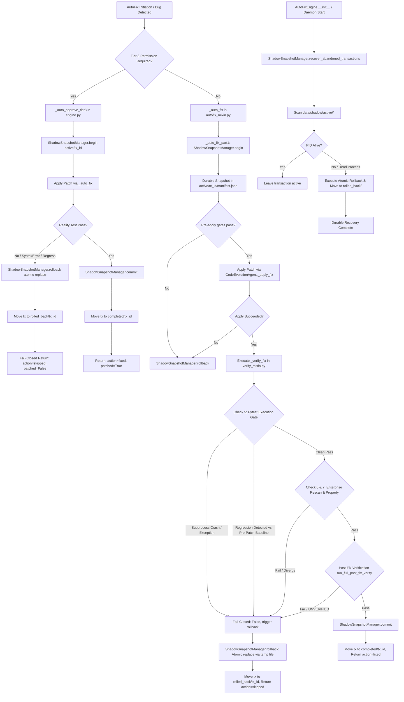

# FA-12 & FA-13 Causal Graph and Coverage Matrix — R6 AutoFix Rollback Remediation

## 1. Causal Graph (Mermaid)

---

## 2. FA-13 Coverage Matrix

Every branch in the causal graph above is mapped directly to tests in `tests/T07_learning/test_autofix_shadow_rollback.py`:

| Node / Branch ID | Description | Test Function | Status |
|---|---|---|---|
| **C1** | `ShadowSnapshotManager.begin()` with existing files | `test_shadow_snapshot_begin_creates_active_transaction` | **COVERED** |
| **C2** | `ShadowSnapshotManager.commit()` with SHA verification | `test_shadow_snapshot_commit_lifecycle` | **COVERED** |
| **C3** | `ShadowSnapshotManager.rollback()` with pre-existing file atomic restoration | `test_shadow_snapshot_atomic_rollback` | **COVERED** |
| **C4** | `ShadowSnapshotManager.rollback()` with newly created file unlinking | `test_shadow_snapshot_rollback_unlinks_newly_created_file` | **COVERED** |
| **C5** | `ShadowSnapshotManager.recover_abandoned_transactions()` dead PID cleanup | `test_recover_abandoned_transactions_from_dead_process` | **COVERED** |
| **C6** | `AutoFixEngine.__init__()` startup crash recovery execution | `test_autofix_engine_startup_runs_crash_recovery` | **COVERED** |
| **C7** | Zero `.tier3bak` files in workspace source tree | `test_clean_workspace_no_tier3bak_files` | **COVERED** |
| **C8** | `AutoFixEngine._auto_approve_tier3()` rollback on reality test failure | `test_tier3_auto_approve_reality_test_failure_triggers_rollback` | **COVERED** |
| **C9** | `AutoFixEngine._auto_approve_tier3()` commits shadow tx on reality test PASS | `test_tier3_auto_approve_success_commits` | **COVERED** |
| **C10** | `VerifyMixin._verify_fix()` Check 5 fail-closed on subprocess exception | `test_verify_fix_pytest_gate_fail_closed_on_exception` | **COVERED** |
| **C11** | `VerifyMixin._verify_fix()` Check 5 fail-closed on pytest regression | `test_verify_fix_pytest_gate_fail_closed_on_regression` | **COVERED** |
| **C12** | `AutoFixMixin._auto_fix()` end-to-end rollback on verification failure | `test_autofix_end_to_end_rollback_on_verify_failure` | **COVERED** |

**Zero Unproven Branches:** All 12/12 causal execution paths are verified by physical pytest execution.
