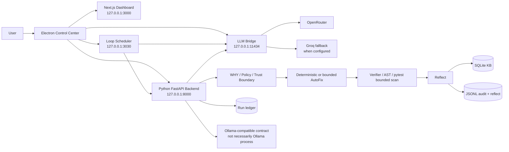
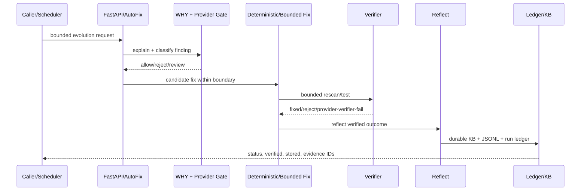

# SCP DNA — Kiến trúc hệ thống hiện tại

**Repository được đối chiếu:** [`checken1994/GA-LAB`](https://github.com/checken1994/GA-LAB)  
**HEAD:** `2137cf3abf26611f737b4d3a8e5fb51fc93346f3` (`R41`)
**Ngày đối chiếu:** 14/08/2026 (GMT+7)

## 1. Mục tiêu kiến trúc

SCP là một **Self-Correcting Pipeline** dành cho kiểm tra, giải thích, sửa có kiểm soát, xác minh và học durable. Hệ thống không coi LLM là authority cuối cùng. Một thay đổi hợp lệ phải đi qua các boundary phù hợp: evidence scan, WHY/policy, deterministic hoặc bounded fix, verifier, reflect, durable storage và run ledger.

Kiến trúc hiện tại được đóng gói cho Windows bằng Electron, nhưng logic cốt lõi vẫn nằm ở Python backend. Các sidecar TypeScript/Bun cung cấp LLM bridge và loop scheduler; dashboard Next.js hiển thị trạng thái; SQLite/JSONL giữ evidence và learning state.

## 2. Sơ đồ logical architecture

> Sơ đồ thể hiện data/control flow từ source hiện tại, không khẳng định mọi provider hoặc mọi route đều đang active trong mọi runtime mode.

## 3. Các lớp và trách nhiệm

| Lớp | Thành phần thực tế | Trách nhiệm | Boundary chính |
|---|---|---|---|
| Desktop shell | `desktop/main.cjs`, `preload.cjs` | Tạo cửa sổ, CSP, single-instance lock, khởi động/dừng child services, log desktop | `contextIsolation=true`, `sandbox=true`, production CSP tùy `SCP_DESKTOP_CSP_MODE` |
| Dashboard | Next.js app trong `dashboard/` | UI/control center, hiển thị audit/learning/evolution state | Truy cập loopback; Electron window handler chỉ allow localhost/127.0.0.1 |
| Core backend | `scp/__main__.py`, `scp/api_server.py`, `scp/api/` | FastAPI API, startup gate, auth, audit routes, health, orchestration | Mặc định bind loopback `127.0.0.1:8000`; `.env` load sớm trước API import |
| WHY/policy | `scp/meta/`, `scp/security/`, policy gate | Trả lời “Tại sao?”, kiểm soát trust boundary và tier | Deterministic safe pattern không bị weak model phủ định |
| AutoFix | `scp/autofix/` | Scan, candidate patch, apply bounded fix, rollback/verification | Post-fix scan tránh nested enterprise/mypy/pytest recursion |
| LLM gateway | `scp/llm_gateway/` | Gọi contract Ollama-compatible, task model routing, fallback | Timeout, provider fallback và bounded provider mode |
| LLM bridge | `mini-services/llm-bridge/` hoặc packaged `scp-llm-bridge.exe` | Nhận `/api/chat`, `/api/generate`, `/api/tags`; chuyển request OpenAI-compatible tới OpenRouter/Groq | Loopback bind, explicit env file, rate-limit queue, cache, timeout, recursion guard |
| Scheduler | `mini-services/loop-scheduler/` hoặc packaged scheduler | Gọi bounded audit/evolution theo chu kỳ và expose scheduler UI | Base URL trỏ backend `127.0.0.1:8000`; cần admin auth contract |
| Durable state | `data/`, SQLite, JSONL | Learning lessons, evolved patterns, audit, reflect, run ledger, rollback/evidence | Test child ledger tách theo `data_dir`; runtime data không commit |
| Distribution | `desktop/release/`, `desktop/runtime/` | NSIS/portable installer và packaged backend/sidecars | Artifact phải hash-pin; signing và second-PC install là release gates riêng | Source runtime `scp/runtime/` được version-control; packaged runtime vẫn là artifact riêng |

## 4. Process topology khi chạy desktop packaged

Theo `desktop/main.cjs`, packaged app dùng `process.resourcesPath/runtime` và khởi động bốn child services:

| Process | Packaged entry | Port/URL | Quan hệ |
|---|---|---:|---|
| Bridge | `scp-llm-bridge.exe` | `127.0.0.1:11434` | Ollama-compatible façade; upstream hiện là OpenRouter trực tiếp và Groq fallback khi có cấu hình |
| Scheduler | `scp-loop-scheduler.exe` | `127.0.0.1:3030` | Gọi backend bounded route; dashboard/scheduler surface |
| Python backend | `scp-backend.exe 8000` | `127.0.0.1:8000` | Core FastAPI và trust pipeline |
| Dashboard | packaged Next server | `127.0.0.1:3000` | Electron tải dashboard sau khi port ready |

Electron chờ dashboard tối đa 180 giây trước khi báo lỗi. Khi app thoát, `taskkill /pid /t /f` được dùng để dọn process tree.

## 5. Provider và model contract

SCP Python gọi contract Ollama-compatible tại loopback port `11434`. LLM bridge hiện **không phải Ollama server nguyên bản**: source package mô tả bridge chuyển các request Ollama-style sang OpenRouter direct; Groq là fallback provider khi được cấu hình. Model name từ SCP được map sang OpenRouter model ID qua `TASK_MODEL_MAP`; bridge vẫn trả lại model name request để giữ contract observability.

Một giới hạn đã được source ghi rõ là `stream=true` hiện là **buffered single chunk**, không phải incremental streaming thật. Đây là một ví dụ SCP ghi nhận PASS trong phạm vi contract mà không phóng đại thành capability lớn hơn.

## 6. Control flow của bounded evolution

R39 đã bổ sung `verified` và `stored` vào observability. R38 tách ledger của child process theo `data_dir`, tránh test ghi nhầm vào production ledger. Đây là hai điểm quan trọng để phân biệt “đã chạy” với “đã được verify và lưu durable”.

## 7. Security/trust boundaries

1. **Configuration boundary:** `scp/__main__.py` load env trước khi import API. `SCP_ENV_FILE` là explicit boundary cho isolated runs; nếu không có override, source còn fallback repo-root `.env`. Packaged Electron tạo config riêng trong user data.
2. **Network boundary:** backend, scheduler và bridge mặc định loopback. Host firewall policy trên PC đã được kiểm chứng restore với ba rule block/enabled sau change window.
3. **Auth boundary:** packaged R39 đã pass health `200`, missing/wrong auth `401`, correct password/token auth `200` trong change window.
4. **Renderer boundary:** Electron dùng context isolation, sandbox, single-instance lock, permission requests deny-by-default và production CSP mode.
5. **Fix boundary:** deterministic safe fixes được giữ ngoài weak LLM falsification; tier cao không được auto-relax trong production-safe candidate.
6. **Durability boundary:** SQLite KB và JSONL audit/reflect/run ledger giữ state; secrets và runtime data phải nằm ngoài Git history.

## 8. Evidence hiện có

| Evidence | Kết quả |
|---|---:|
| GitHub HEAD | R41 `2137cf3` |
| Pytest trên PC | 55 passed, 0 failed |
| Portable reality suite | 73/73 passed, 0 timeout/error |
| Safe flags runtime probe | `0,0,0,0,0`; health `200`; auth `401/401/200` |
| Evolution R39 | SUCCESS; bugs found/fixed `1/1`; verified/stored `1/1` |
| Durable state sau R39 | 6 lessons; 4 evolved patterns |
| Installer R39 isolated install | exit `0`; installed backend hash khớp R39 |

## 9. Những điểm không nên hiểu quá mức

Kiến trúc này **không chứng minh SCP bắt được tất cả tấn công AI và con người**. Nó chứng minh các boundary và flow đã được implement và một số flow đã được kiểm tra thực tế. Các khoảng trống còn lại gồm code signing, PC Windows thứ hai, adversarial corpus ngoài bộ test, provider poisoning, supply-chain tampering, long-running stress và việc promote `.env` production hiện tại từ năm dangerous flags `1` sang candidate `0`.

## References

[1]: [Electron process orchestration](https://github.com/checken1994/GA-LAB/blob/main/desktop/main.cjs)  
[2]: [Python backend entrypoint](https://github.com/checken1994/GA-LAB/blob/main/scp/__main__.py)  
[3]: [LLM bridge](https://github.com/checken1994/GA-LAB/blob/main/mini-services/llm-bridge/index.ts)  
[4]: [Loop scheduler](https://github.com/checken1994/GA-LAB/blob/main/mini-services/loop-scheduler/package.json)  
[5]: [Desktop packaging configuration](https://github.com/checken1994/GA-LAB/blob/main/desktop/package.json)  
[6]: [Build history](./SCP_BUILD_HISTORY.md)
