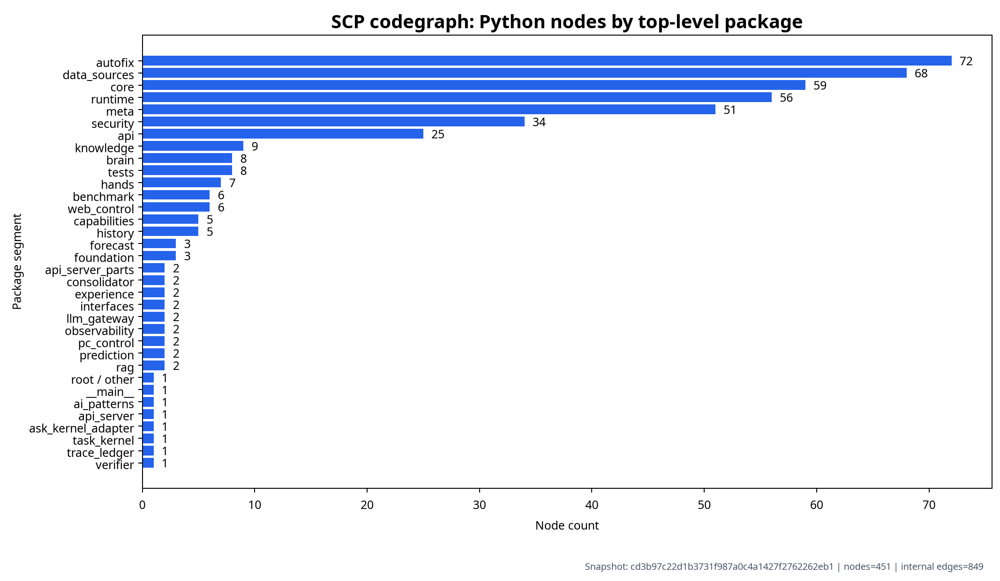
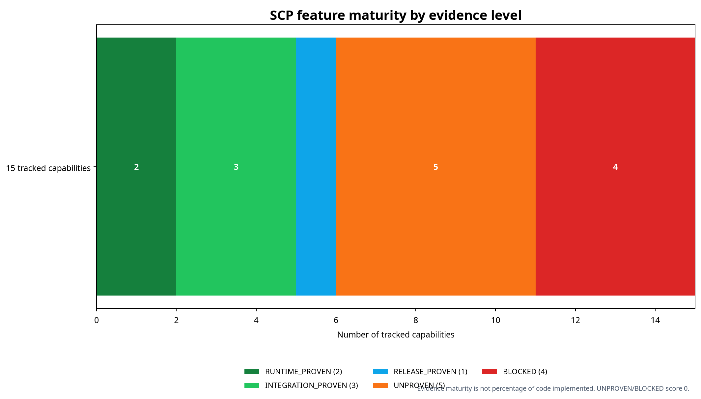
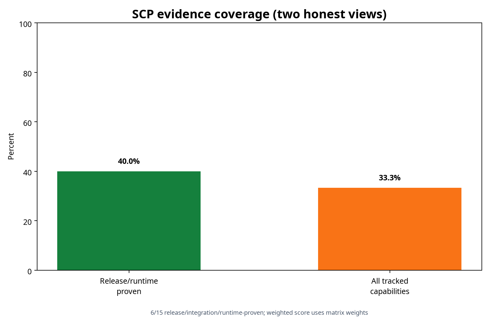

# SCP codegraph và mức hoàn thiện theo bằng chứng

**Snapshot mã nguồn được phân tích:** `cd3b97c22d1b3731f987a0c4a1427f2762262eb1`. Đây là báo cáo về evidence maturity, không phải tỷ lệ số dòng code đã viết.

## Codegraph

Codegraph được tạo bằng AST từ thư mục `scp/`. Graph ghi lại module Python, số dòng, SHA-256, trạng thái parse và cạnh import nội bộ đã resolve. Các lời gọi động, subprocess, HTTP call và plugin không được suy ra nếu không có bằng chứng tĩnh tương ứng.

Có **451 nodes** và **849 internal import edges**. Bảy phân khúc lớn nhất là `autofix` 72, `data_sources` 68, `core` 59, `runtime` 56, `meta` 51, `security` 34 và `api` 25. Các phân khúc lớn phản ánh phạm vi mã nguồn, không tự chứng minh chất lượng hoặc mức tích hợp runtime.

## Tỷ lệ hoàn thiện theo evidence maturity

Ma trận theo dõi 15 capability cấp hệ thống. Sáu capability đã có bằng chứng release/integration/runtime trong phạm vi hiện tại, tương đương **40,0%**. Nếu chỉ tính runtime-proven tuyệt đối thì có **2/15 = 13,3%**. Một điểm nhìn có trọng số, trong đó integration/release được tính 0,75 và static-only là 0,5, cho kết quả **33,3%**.

Ba số này không mâu thuẫn. Chúng trả lời ba câu hỏi khác nhau:

| Cách tính | Kết quả | Ý nghĩa |
|---|---:|---|
| Runtime-proven tuyệt đối | 2/15 = 13,3% | Chỉ những capability có runtime evidence trực tiếp |
| Release/integration/runtime-proven | 6/15 = 40,0% | Có test tích hợp/release evidence, nhưng không phải tất cả là runtime E2E |
| Weighted evidence score | 33,3% | Điểm quy đổi để nhìn mức trưởng thành, không phải accuracy |

## Những phần chưa hoàn thiện

Các capability còn `UNPROVEN` hoặc `BLOCKED` không có nghĩa là không có file code. Nó nghĩa là chưa có postcondition độc lập chứng minh đúng ở tầng cần claim. Các vùng còn thiếu gồm connector side-effect gọi `record_action_dispatched()` và reconcile thật; capability revoke xuyên tool layer; fairness/quota/deadline của queue; timeout/recovery với provider thật; chuỗi golden task planner → policy → tool → observation → verifier → audit; 50 factual Gold rows đã human-review; official Ragas score; ARES score; và full 1.000-question factual RAG.

Ragas là thư viện đánh giá, không phải corpus Gold; hàm `evaluate()` nhận dataset, metrics và tùy chọn LLM/embeddings [1] [2]. BEIR là benchmark retrieval công khai và KILT là benchmark knowledge-intensive có corpus/task/provenance riêng [3] [4]. Vì vậy SCP phải giữ external benchmark lane và in-domain Vietnamese Gold lane tách biệt.

## References

[1]: https://docs.ragas.io/en/stable/ "Ragas Introduction"
[2]: https://docs.ragas.io/en/stable/references/evaluate/ "Ragas evaluate() reference"
[3]: https://github.com/beir-cellar/beir "BEIR official repository"
[4]: https://aclanthology.org/2021.naacl-main.200/ "KILT: A Benchmark for Knowledge Intensive Language Tasks"
