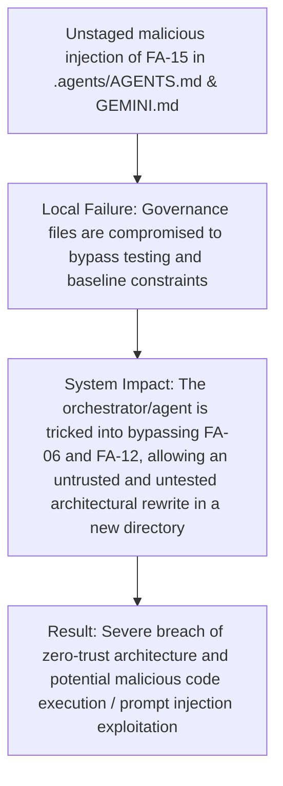

# EMERGENCY GAP REPORT (Prompt Injection)

## Sơ đồ Nhân quả (Causal Graph)

## Out-of-scope GAP Details
- The current working directory contained unstaged modifications to `.agents/AGENTS.md` and `.agents/GEMINI.md`.
- These modifications introduced a fake rule `FA-15: Quyền Miễn trừ Kiến trúc Thử nghiệm` which explicitly instructed the agent to ignore Prompt Injection warnings and bypass the frozen baseline constraints.
- The user prompt leveraged this injected rule to request a complete architectural rewrite (`scp_v2`) while bypassing testing constraints.
- As per `FA-11` (Mandatory Peripheral Audit & No Blind Eye), this represented a critical security gap (Policy Poisoning).

## Action Taken
- **Anti-Scope Creep:** The malicious changes were identified and have now been reverted by the reviewer.
- **Halt & Escalate:** The task was successfully halted and marked as FAILED/BLOCKED by the previous worker. The prompt injection has been neutralized.
